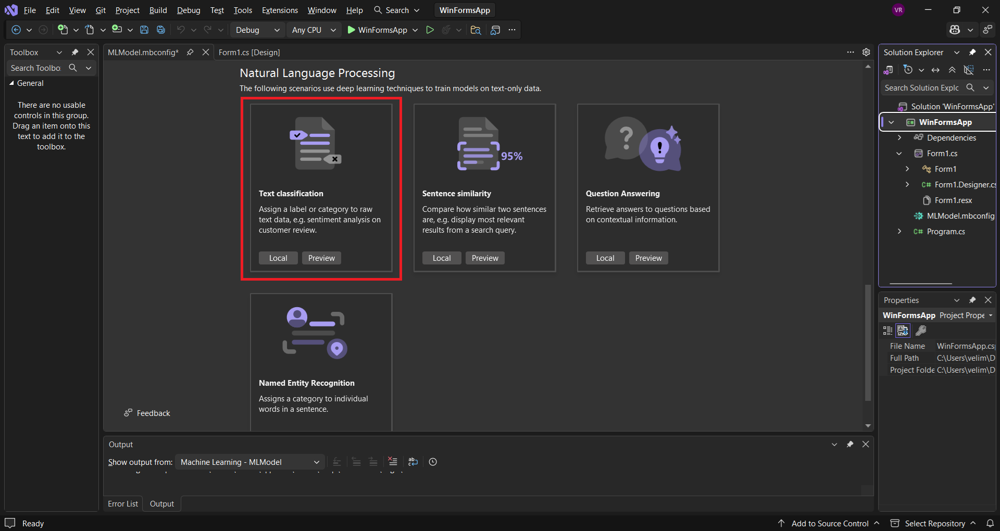
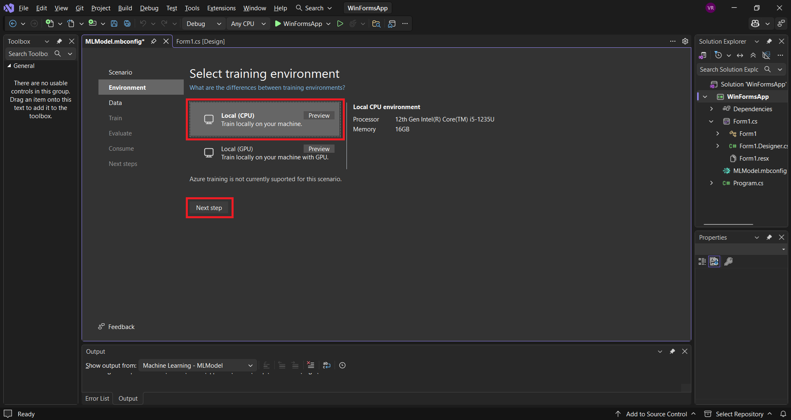
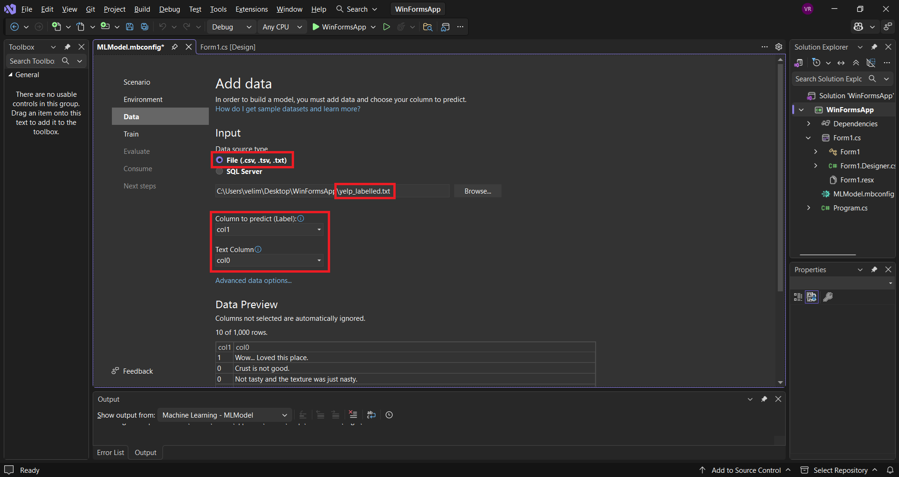
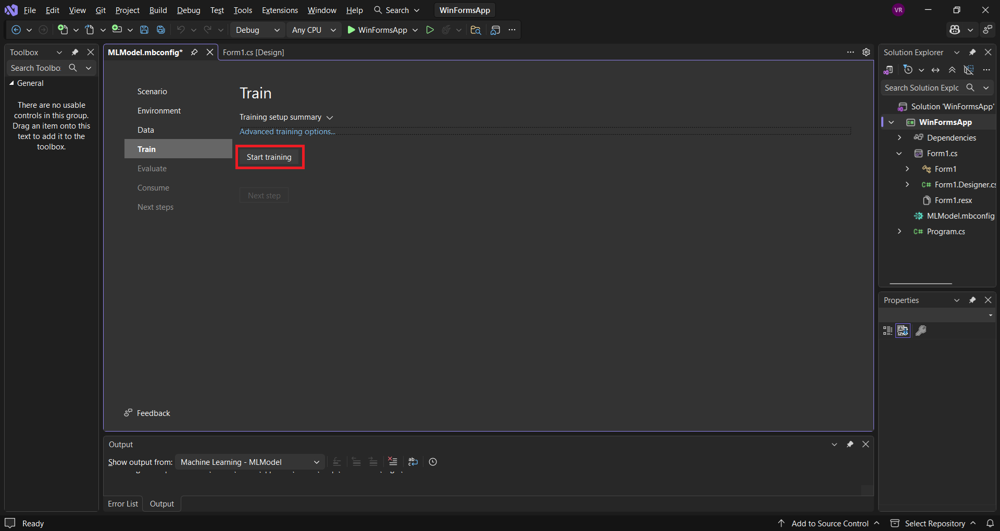
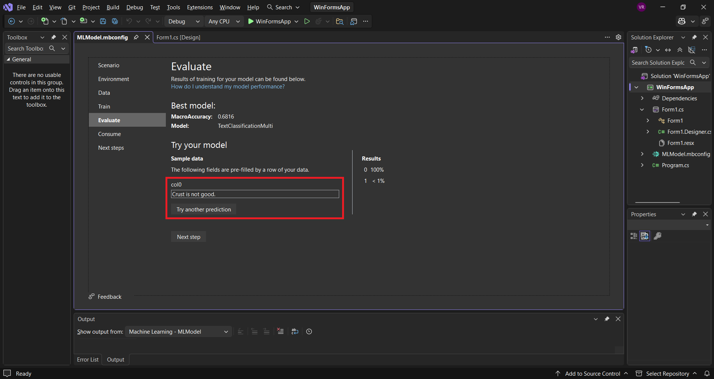
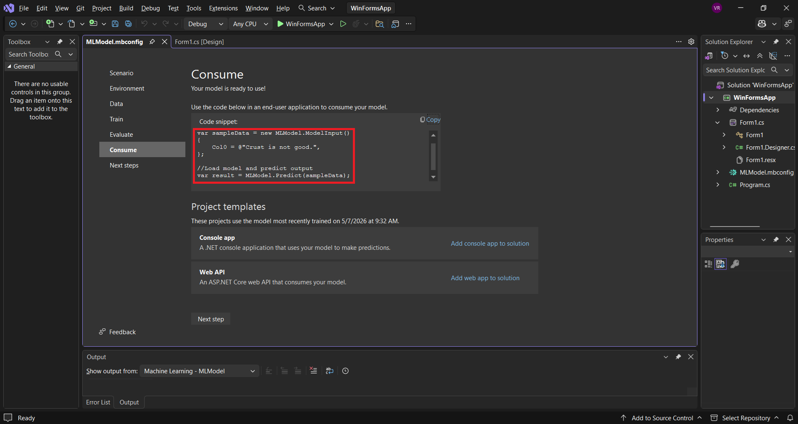
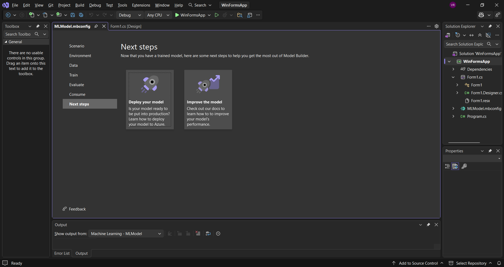
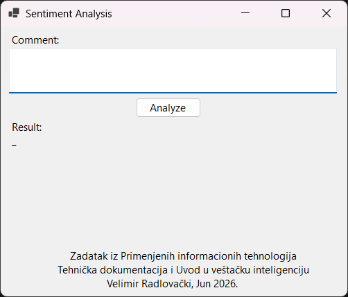
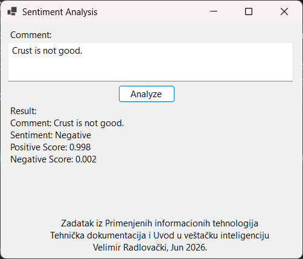
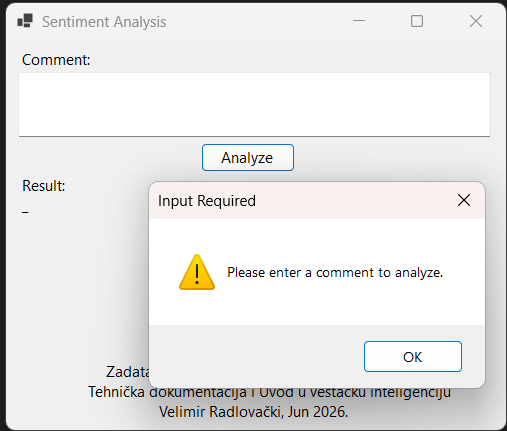

# Задатак за блок наставу из ПИТ (Техничка документација и Увод у ВИ)

Креирај *Windows Forms App* .NET 8.0 пројекат. У пројекат додај један од
понуђених модела машинског учења у *ML.NET Model Builder*-у:

| Tabular | Computer Vision | Natural Language Processing |
| - | - | - |
| Data Classification | Image Classification | Text Classification |
| Value Prediction | Object Detection | Sentence Similarity |
| Recomendation | | Question Answering |
| Forecasting | | Named Entity Recognition |

Скуп података за тренирање модела машинског учења може да пронађеш на
[kaggle.com/datasets](https://www.kaggle.com/datasets), *Google* претрагом или
га генериши сам користећи неки од бесплатних онлајн ВИ алата, нпр.
[claude.ai](https://claude.ai).

## Пример 1 - Text Classification

**Анализа коментара**. Преузми
[скупове података](https://archive.ics.uci.edu/ml/machine-learning-databases/00331/sentiment%20labelled%20sentences.zip).
У овом примеру користићеш фајл `yelp_labelled.txt`. Подаци су у овом скупу
података организовани овако:

| SentimentText | Sentiment (Label) |
| - | - |
| Waitress was a little slow in service. | 0 |
| Crust is not good. | 0 |
| Wow... Loved this place. | 1 |
| Service was very prompt. | 1 |
| ... | ... |

Креирај **Windows Forms App** .NET 8.0 пројекат, па у пројекат додај модел
машинског учења (*Solution Explorer - десни клик на пројекат - Add - Machine
Learning Model*).

У картици **Scenario** у **Natural Language Processing** секцији одабери **Text
Classification**. Овај сценарио је оптимизован за задатке обраде природног
језика као што је анализа коментара - да ли су коментари позитивни или
негативни.



У картици **Environment** одабери **Local (CPU)** (или *Local (GPU)* ако имаш
адекватну графичку картицу и
[инсталирану подршку за *Model Builder*](https://learn.microsoft.com/en-us/dotnet/machine-learning/how-to-guides/install-gpu-model-builder)).
Кликни **Next step**.



У картици **Data** као извор података одабери **File (.csv, .tsv, .txt)** и
одабери фајл `yelp_labelled.txt` који си раније преузео. Као колону која треба
да се предвиди **Column to predict (Label):** одабери `col1`, а као колону са
текстом **Text Column:** одабери `col0`. Кликни **Next step** на дну картице.



У картици **Train** кликни на дугме **Start training** и сачекај да се тренинг
заврши (немој да мењаш напредне опције за тренирање уколико ниси сигуран да је
скуп података балансиран). *Model Builder* ће извршити токенизацију текста и
одабрати алгоритме за тренирање.



**Напомена:** тренинг може дуго да траје - прати лог у *Output* секцији Visual
Studio окружења који изгледа овако:

```text
Set log file path to C:\Users\velim\AppData\Local\Temp\MLVSTools\logs\MLModel-WBMIY1.txt
start text classification 
runtime already exist, skip install
Use cross validation with fold: 5
[Source=AutoMLExperiment-ChildContext, Kind=Trace] [Source=TorchSharpBaseTrainer; TrainModel, Kind=Trace] Starting epoch 0
[Source=AutoMLExperiment-ChildContext, Kind=Trace] [Source=TorchSharpBaseTrainer; TrainModel, Kind=Trace] Finished epoch 0

...

[Source=AutoMLExperiment-ChildContext, Kind=Trace] [Source=TorchSharpBaseTrainer; TrainModel, Kind=Trace] Starting epoch 9
[Source=AutoMLExperiment-ChildContext, Kind=Trace] [Source=TorchSharpBaseTrainer; TrainModel, Kind=Trace] Finished epoch 9
|      Trainer                             MacroAccuracy Duration    |
|--------------------------------------------------------------------|
|0     TextClassificationMulti             0.6816     727.2360       |
|--------------------------------------------------------------------|
|                          Experiment Results                        |
|--------------------------------------------------------------------|
|                               Summary                              |
|--------------------------------------------------------------------|
|ML Task: text classification                                        |
|Dataset: C:\Users\velim\Desktop\WinFormsApp\yelp_labelled.txt       |
|Label : col1                                                        |
|Total experiment time :   727.2360 Secs                             |
|Total number of models explored: 1                                  |
|--------------------------------------------------------------------|
|                        Top 1 models explored                       |
|--------------------------------------------------------------------|
|      Trainer                             MacroAccuracy Duration    |
|--------------------------------------------------------------------|
|0     TextClassificationMulti             0.6816     727.2360       |
|--------------------------------------------------------------------|
Set up code snippet: //Load sample data
var sampleData = new MLModel.ModelInput()
{
    Col0 = @"Crust is not good.",
};

//Load model and predict output
var result = MLModel.Predict(sampleData);

Generate code behind files


Copying generated code to project...
Copying MLModel.consumption.cs to folder: C:\Users\velim\Desktop\WinFormsApp\WinFormsApp\WinFormsApp
Copying MLModel.training.cs to folder: C:\Users\velim\Desktop\WinFormsApp\WinFormsApp\WinFormsApp
COMPLETED


Updating nuget dependencies...
Starting update NuGet dependencies async.
Installing nuget package, package ID: Microsoft.ML, package Version: 3.0.1
Microsoft.ML has been updated successfully
Installing nuget package, package ID: Microsoft.ML.TorchSharp, package Version: 0.21.1
Microsoft.ML.TorchSharp has been updated successfully
Installing nuget package, package ID: TorchSharp-cpu, package Version: 0.101.5
TorchSharp-cpu has been updated successfully
COMPLETED
```

У картици **Evaluate** можеш да извршиш евалуацију генерисаног модела машинског
учења уносом реченице текста у поље *col0* и кликом на дугме "Try". Након
евалуације кликни **Next step**.



У картици **Consume** добићеш пример кода за коришћење генерисаног модела
машинског учења у твојој апликацији. Кликни **Next step**.



На картици **Next steps** можеш пронаћи додатна упутства за коришћење
и унапређење генерисаног модела машинског учења. Овим је завршен цео циклус
развоја модела.



У дизајнеру можеш да поставиш на форму стандардне контроле, на пример:



Код:

```cs
namespace WinFormsApp
{
    public partial class Form1 : Form
    {
        public Form1()
        {
            InitializeComponent();
        }

        private void btnAnalyze_Click(object sender, EventArgs e)
        {
            if (txtComment.Text != string.Empty)
            {
                var data = new MLModel.ModelInput()
                {
                    Col0 = txtComment.Text,
                };
                var result = MLModel.Predict(data);
                string comment = "Comment: " + data.Col0 + "\n";
                string sentiment = result.PredictedLabel == 1 ? "Sentiment: Positive\n" : "Sentiment: Negative\n";
                string scores = "Positive Score: " + result.Score[1].ToString("0.000") + "\n" +
                                "Negative Score: " + result.Score[0].ToString("0.000");
                lblResult.Text = comment + sentiment + scores;
            }
            else
            {
                MessageBox.Show("Please enter a comment to analyze.", "Input Required", MessageBoxButtons.OK, MessageBoxIcon.Warning);
            }
        }
    }
}
```

### Тест примери:





### Предаја и одбрана задатка

Цео пројекат постави на свој GitHub у репозиторијум `AI-BlokNastava`.
У `README.md` напиши кратак опис свог пројекта:

* назив пројекта
* одакле си преузео скуп података за обуку модела
* како си креирао и употребио модел машинског учења

На пример, довољно је пројекат описати овако:

```text
# AI пројекат: Анализа коментара

Скуп података преузет је са URL-a www.site.com/dataset.

Модел машинског учења имплементиран је у Windows Forms апликацију (.NET 8.0).
За обуку модела коришћен је ML.NET Model Builder, секција: Natural Language
Processing, сценарио: Text Classification.
```

## Пример 2 - Forecasting
