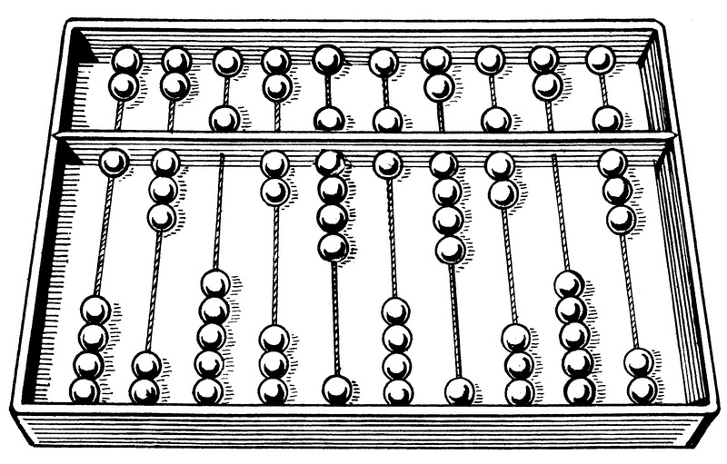
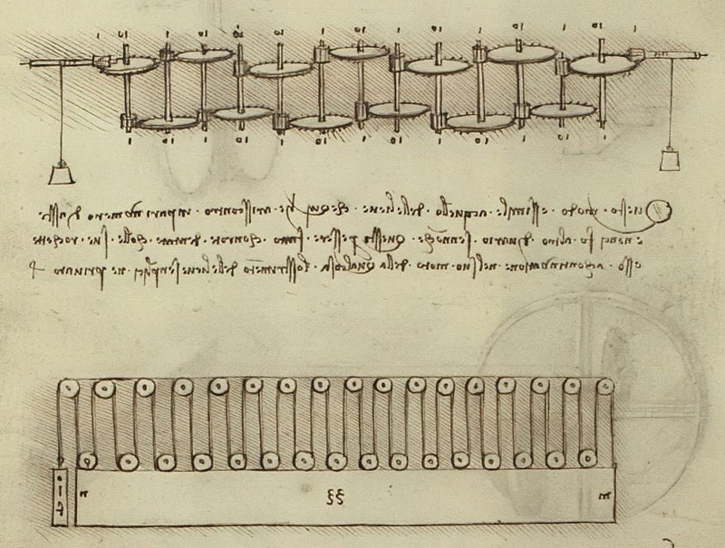
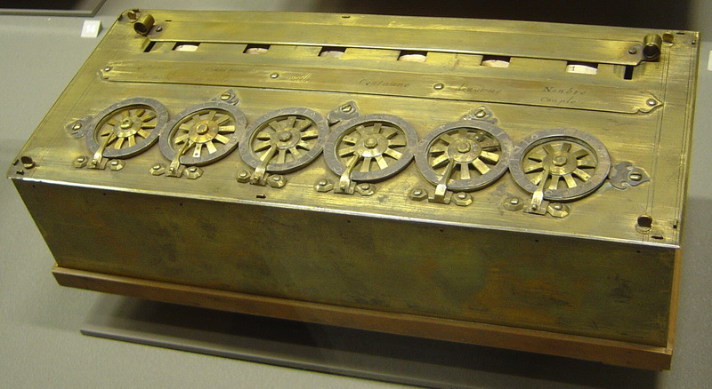
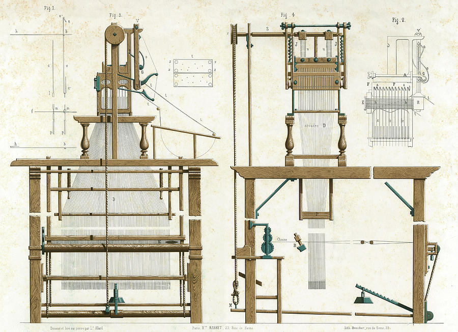
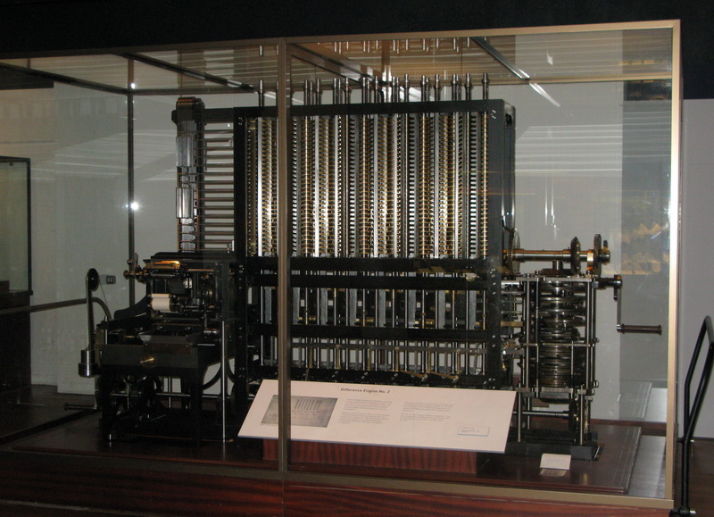
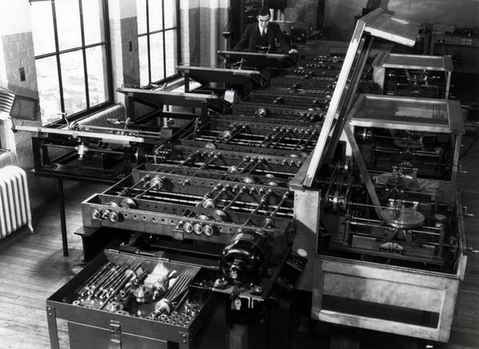
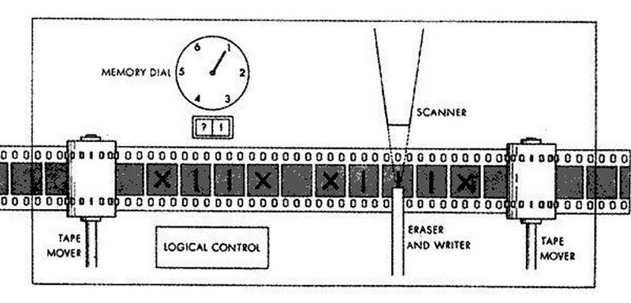
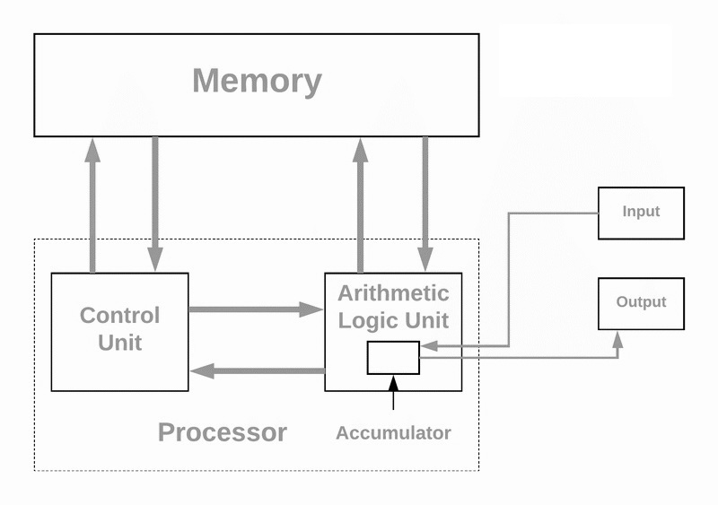

# Инсторијат развоја рачунара

## Почетак

Настанком људске цивилизације човек је морао да научи да броји и рачуна како би
могао да се бави трговином, разменом, одржавањем инвентара и сл. Древни народи
користили су разна помагала како би нешто избројали или извршили основне
аритметичке операције. **Прва справа за рачунање** настала је цца. 2500 година
пре нове ере у Вавилону и звала се Абакус. Овај изум је значајан јер је увео
позиционо означавање бројева који се и данас користи.

Индијски математичар Пингала, 200 година пре нове ере, први је описао бинарни
бројевни систем и запис бинарним кодом. 125 година пре нове ере коринћани су
направили механички уређај са зупчаницима, а двесто година касније, грчки
математичар у Александрији направио је механички уређај који понавља задату
операцију. У првој деценији нове ере, у Кини су први пут коришћени негативни
бројеви. У средњем веку развија се математика, криптографија и механика, и
почело се са израдом аналогних машина. 1493. године, Леонардно да Винчи
**скицирао је механички калкулатор** који је могао да сабира и одузима бројеве.

**Први механички калкулатор** изумео је и направио француски математичар Блез
Паскал 1642. године и назвао га аритметичка машина, а касније Паскалина.
Паскалина је могла директно да сабере два унета броја, или да их помножи
вишеструким понављањем операције сабирања. У годинама које следе, у Енглеској,
Немачкој, Италији и Француској креиране су сличне механичке машине.

## XIX век

**Прву аутоматску програмабилну машину** направио је Жозеф Мари Жакар 1804.
године. Његов разбој за ткање програмирао се бушеним картицама.

Први **механички рачунар** назван аналитичка машина, направио је Чарлс Бебиџ
у Енглеској 1822. године. Ада Бајрон Лавлејс, 1842. године, написала је
**алгоритам** за рад са аналитичком машином, који се сматра првим примером
рачунарског програмирања. Џорџ Бул је, 1854. године, описао **бинарни систем**
за симболичко и логичко расуђивање, који је постао основа за развој модерних
рачунара.

## Рани XX век

Компанија IBM је стандардизовала бушене картице као медиј за унос информација у
рачунар, 1928. године у Сједињеним Америчким Државама. Око 1930. године, такође
у САД-у, Ваневр Буш направио је први електромеханички рачунар, а у Немачкој,
Конрад Цузе направио је први бинарни механички рачунар Z1. Други светски рат
поставио је високе захтеве за обрадом података – од обимних израчунавања до
криптографије и криптоанализе. Од 1939. године па све до краја II светског рата
електронски рачунари се паралелно развијају у Немачкој, Великој Британији и
САД-у.

Велику улогу у развоју рачунара имали су и Алан Тјуринг и Џон вон Нојман.
Алан Тјуринг, енглески математичар и криптограф, сматра се оцем теоретског
рачунарства јер је направио апстрактни модел рачунара познат као Тјурингова
машина.

Џон Вон Нојман, мађарско-амерички математичар и научник, поставио је основне
принципе архитектуре рачунара.

## Задаци за проверу знања

??? question "Повежи изуме и године"

    * Прва справа за рачунање – 2500. пне
    * Први механички калкулатор – 1642.
    * Прва аутоматска програмабилна машина – 1804.
    * Први механички рачунар – 1822.
    * Први електромеханички рачунар – 1930.
