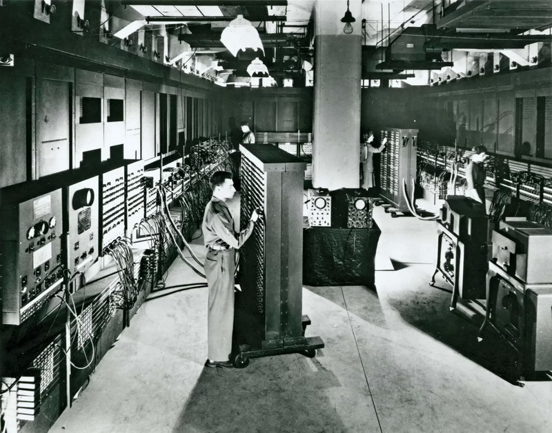
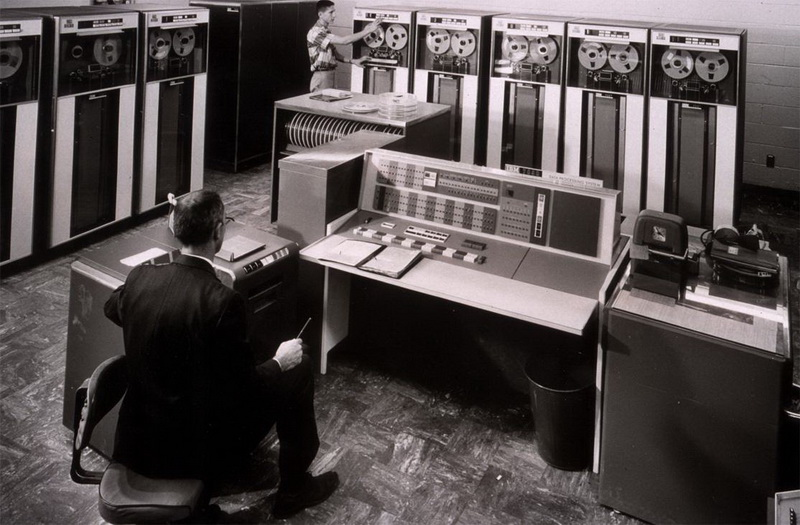
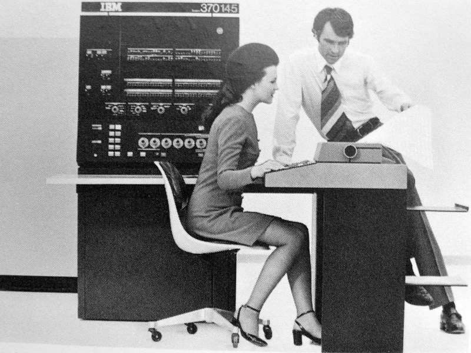
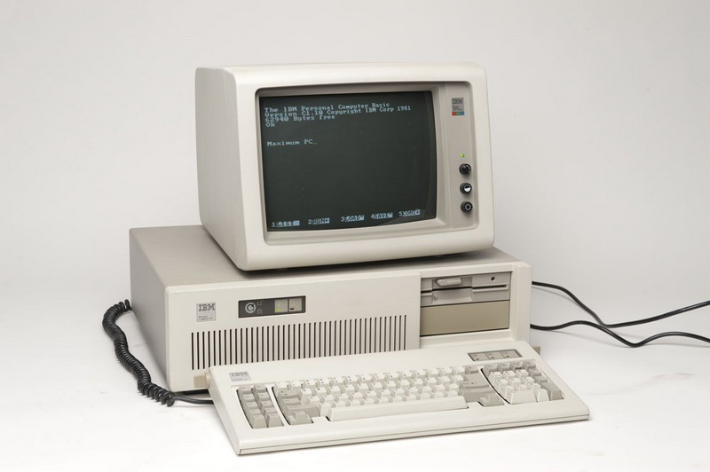
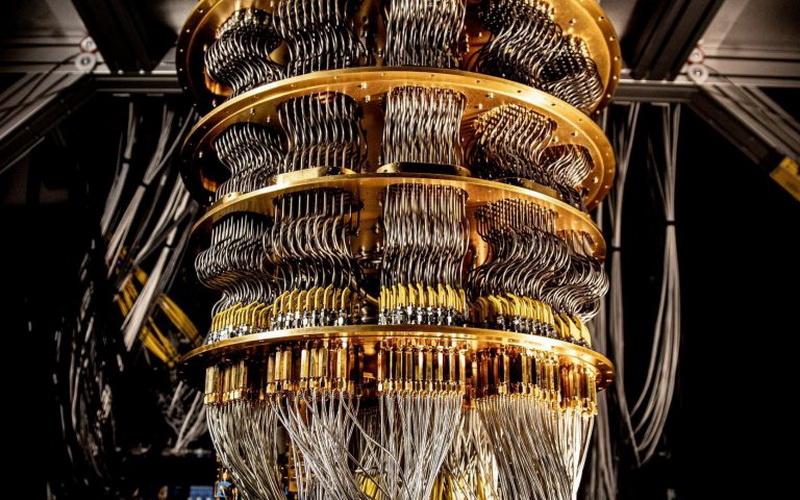

# Генерације електронских рачунара

## I генерација рачунара

Одлике:

* Технологија: електронске вакумске цеви
* Програмски језици: машински програмски језици
* Главна меморија: магнетне траке и магнетни добоши
* Улаз-излаз: папирне траке и бушене картице
* Брзина/димензије: веома спори, огромних димензија

Најпознатији рачунари прве генерације су: ENIAC (Electronic Numerical
Integrator and Computer), EDVAC (Electronic Discrete Variable Automatic
Computer), UNIVAC (енгл. Universal Automatic Computer), IBM 650, IBM 701 и др.

## II генерација рачунара

Одлике:

* Технологија: полупроводници (диоде, транзистори...)
* Програмски језици: машински и асемблерски програмски језици
* Главна меморија: магнетна језгра и магнетне траке/дискови
* Улаз-излаз: магнетне траке и бушене картице
* Брзина/димензије: бржи и мањи у односу на прву генерацију

Најпознатији рачунари друге генерације су: PDP-8, IBM 1400, IBM 7090, IBM 7094,
UNIVAC 1107, CDC 3600 и др.

## III генерација рачунара

Одлике:

* Технологија: интегрисана кола
* Програмски језици: програмски језици високог нивоа
* Главна меморија: велика магнетна језгра и магнетне траке/дискови
* Улаз-излаз: магнетне траке, тастатуре, монитори, штампачи
* Брзина/димензије: знатно бржи и мањи у односу на претходне генерације

Најпознатији рачунари треће генерације су: IBM System/360, IBM System/370,
PDP-11, NCR 395, Burroughs B6500 и др.

## IV генерација рачунара

* Технологија: микропроцесори – интеграција веома великих размера (VLSI - Very
Large-Scale Integration)
* Програмски језици: програмски језици високог нивоа
* Главна меморија: полупроводничкe меморијe
* Улаз-излаз: тастатуре, показивачки уређаји, монитори, скенери, штампачи…
* Брзина/димензије: константан раст брзине, различите димензије

Електронски рачунари четврте генерације реализовани су као персонални рачунари,
преносиви рачунари, сервери, суперрачунари, паметни телефони, таблети итд.
Рачунари који су започели четврту генерацију су IBM PC, APPLE II, Apple
Macintosh и др.

Сматра се да ће технологија пете генерације рачунара бити технологија заснована
на интеграцији ултра-великих размера (ULSI – Ultra Large-Scale Integration),
паралелној обради и вештачкој интелигенцији. Тренутно се развијају и квантни
рачунари – најпопуларнији представници пете генерације.

## Задаци за проверу знања

??? question "Повежи генерацијe и технологије електронских рачунара"

    * Прва генерација електронских рачунара – електронске вакумске цеви
    * Друга генерација електронских рачунара – полупроводници
    * Трећа генерација електронских рачунара – интегрисана кола
    * Четврта генерација електронских рачунара – микропроцесори
