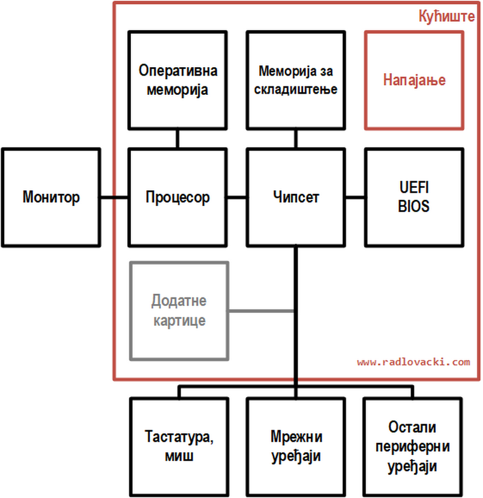

# Рачунарски систем

**Рачунарски систем** је уређај који самостално обавља обраду података
извршавајући инструкције програма. Појам **хардвер** односи се на физичке
компоненте рачунарског система. Појам **софтвер** односи се на програмске
компоненте рачунарског система.

**Архитектура** рачунарског система односи се на функционалност и организацију
система. **Конфигурација** рачунарског система односи се на хардверске
компоненте система.

## Типови рачунарских система

Савремене рачунарске системе грубо можемо поделити на: супер-рачунаре, сервере,
десктоп рачунаре, лаптоп рачунаре, таблете и паметне телефоне, рачунаре
изведене на једној плочи и уграђене рачунаре.

**Супер-рачунари** и **сервери** налазе се у дата-центрима, великим
компанијама, научно-истраживачким институтима и сл. Великих су габарита, троше
много електричне енергије и захтевају посебне услове за рад. За разлику од
осталих рачунарских система, ови рачунари имају много веће перформансе, обично
опслужују већи број корисника и обављају велики број послова истовремено и
непрекидно.

**Десктоп рачунари** су рачунари опште намене који се користе у домаћинствима,
канцеларијама, учионицама итд. Назив су добили јер се обично налазе на столу
(енгл. *desk*). Извор напајања десктоп рачунара захтева прикључак на електричну
мрежу, па ови рачунари нису преносиви, односно мобилни.

**Лаптоп рачунари**, су такође рачунари опште намене. Назив су добили јер се
током рада могу држати у крилу (енгл. *lap*). Како би били мобилни и што дуже
оперативни са независним извором напајања (батеријом), имају лошије перформансе
него десктоп рачунари сличних карактеристика.

**Таблети** и **паметни телефони** су рачунарски системи малих димензија који
током рада користе независан извор напајања (батерију). Поседују екран на додир
и један или више тастера као једини интерфејс за рад.

**Рачунари изведени на једној плочи** (енгл. *Single-Board Computers*) су
потпуно функционални рачунари који се користе као системи за развој или уградњу
у друге уређаје.

**Уграђени рачунари** (енгл. *Embedded Computers*) данас се налазе свуда, од
потрошачких паметних уређаја, до возила, индустријских постројења итд.

## Хардвер десктоп рачунара

У овој и наредним лекцијама изучаваћеш савремене персоналне десктоп рачунаре.
Персонални рачунар изведен је у кућишту, поред којег се налази тастатура, миш,
монитор, штампач и остали периферни уређаји.

У кућишту персоналног рачунара налазе се...

* напајање,
* матична плоча,
* процесор и хладњак,
* оперативна меморија,
* додатне картице (опционо) и
* меморија за складиштење

...а поред кућишта, налазе се обично следећи периферни уређаји:

* тастатура,
* миш,
* монитор,
* микрофон и звучници (или слушалице са микрофоном)
* штампач, скенер или мултифункцијски уређај,
* мрежни уређаји (свич, приступна тачка, рутер…) итд.

Савремени рачунарски систем можеш посматрати и кроз следећу поједностављену
блок шему:

## Задаци за проверу знања

??? question "Шта је рачунарски систем? Шта је хардвер, а шта софтвер?"

    Рачунарски систем је уређај који самостално обавља обраду података
    извршавајући инструкције програма. Хардвер представља физичке компоненте
    рачунарског система, а софтвер програмске.

??? question "На шта се односи архитектура, а на шта конфигурација рачунарског система?"

    Архитектура рачунарског система односи се на функционалност и организацију
    система, а конфигурација на хардверске компоненте система.

??? question "Повежи типове рачунарских система са њиховим карактеристикама."

    * Супер-рачунари и сервери - опслужују више корисника и обављају више
    послова истовремено и непрекидно
    * Десктоп рачунари - рачунари опште намене који нису преносиви
    * Лаптоп рачунари - преносиви рачунари опште намене
    * Таблети и паметни телефони - рачунари малих димензија са екраном на додир
    * Рачунари изведени на једној плочи - користе се као развојни системи
    * Уграђени рачунари - уграђују се у уређаје, возила и индустријска
    постројења

??? question "Шта се налази у кућишту савременог десктоп рачунара?"

    У кућишту савременог десктоп рачунара налази се напајање, матична плоча,
    процесор и хладњак, оперативна меморија, додатне картице (опционо) и
    меморија за складиштење.

??? question "Наведи основне периферне уређаје."

    Основни периферни уређаји су тастатура, миш, монитор, микрофон и звучници
    или слушалице са микрофоном, штампач, скенер или мултифункцијски уређај и
    разни мрежни уређаји као на пример свич, приступна тачка или рутер.
