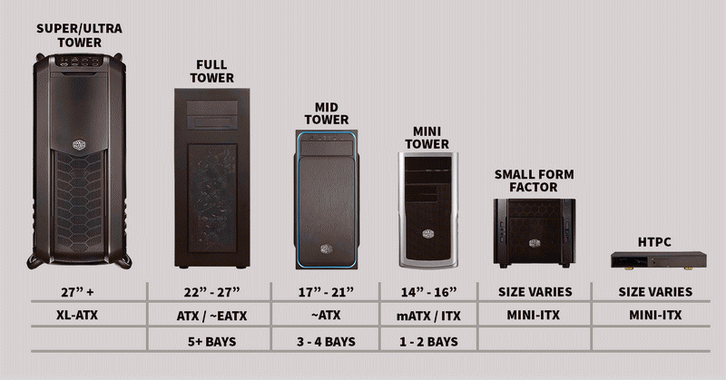
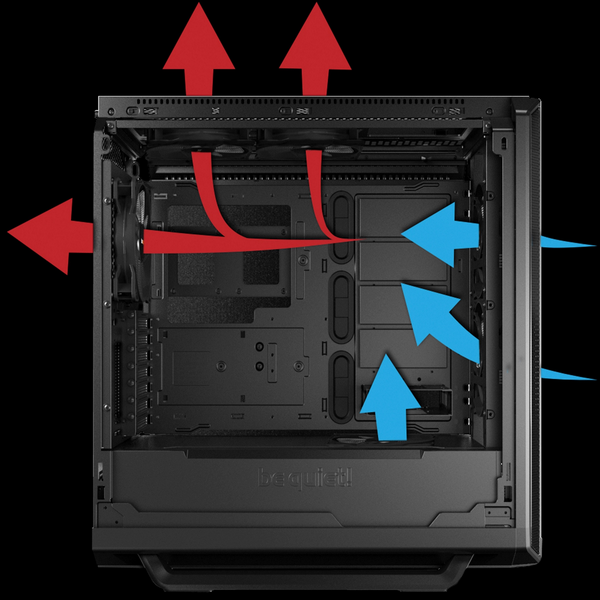
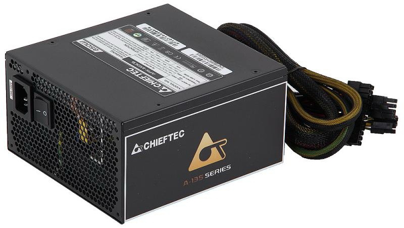
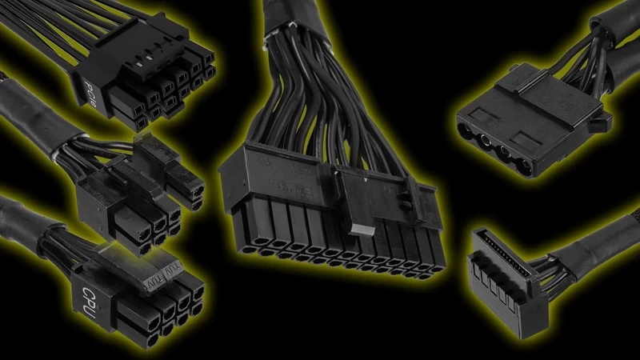

# Кућиште и напајање

## Кућиште рачунара

Кућиште рачунара (енгл. *Computer Case*, *Chassis*) служи за уградњу унутрашњих
компоненти рачунара. Кућишта се израђују према дефинисаним стандардима што је и
најбитнији фактор приликом одабира кућишта (више о стандардима учићеш у лекцији
о матичним плочама). Кућишта могу бити различитих величина са различитим
унутрашњим распоредом. При њиховој изради користе се челик или алуминијум и
пластика.

Основна функција кућишта је уградња унутрашњих компоненти и њихова заштита од
физичких оштећења, прашине, влаге и електромагнетних зрачења. Битна одлика
приликом дизајна кућишта је проток ваздуха, који се остварује вентилаторима и
вентилационим отворима који помажу у расипању топлоте, као и унутрашњом
организацијом места за уградњу компоненти и организацијом каблова.

Кућишта имају отворе и/или лежишта за уградњу унутрашњих компоненти, па
приликом одабира кућишта требаш да водиш рачуна о величини и броју уређаја који
требају бити уграђени (нпр. број и величина уређаја за складиштење, величина
графичке картице и сл.). Естетика (облици, стаклени панели, RGB осветљење и
сл.) не треба да буде кључни разлог приликом одабира кућишта.

Кућишта долазе са I/O (улазно/излазним) конекторима који омогућују лак приступ
USB или другим портовима и аудио прикључцима за повезивање периферних уређаја
па требаш обратити пажњу и на стандарде конектора на кућишту.

## Јединица напајања

Јединица напајања (*PSU – Power Supply Unit*) обезбеђује електричну енергију
одговарајућих карактеристика компонентама у кућишту. Она претвара наизменичну
струју напона 230V из електричне дистрибутивне мреже у једносмерну струју
напона +12V, +5V и +3.3V.

Снага напајања изражава се у ватима \[W\], што указује на максималну количину
енергије коју напајање може да испоручи компонентама. Због тога, напајање треба
да одабереш на основу захтева за снагом компоненти које ће напајати. Ефикасност
напајања представља меру колико ефикасно се претвара наизменична струја у
једносмерну (колики су губици у виду топлоте), на шта указују оцене ефикасности
попут 80 PLUS сертификата (Bronze, Silver, Gold, Platinum и Titanium).

Колика снага напајања је заправо довољна? У неком "просечном" рачунарском
систему компоненте могу да имају следеће потребе за напајањем:

| Компонента                      | Потрошња \[W\] |
|---------------------------------|----------------|
| Процесор                        | 50 - 150       |
| Матична плоча                   | 25 - 80        |
| Оперативна меморија (по модулу) | 2 - 5          |
| Графичка картица                | 25 - 350       |
| Додатне картице (по картици)    | 5 - 20         |
| Хард диск                       | 15 - 30        |
| SSD                             | 1 - 15         |
| CD/DVD                          | 15 - 30        |

За конкретан случај посети
[страницу са калкулатором напајања](https://www.newegg.com/tools/power-supply-calculator).

Модерна напајања имају уграђене безбедносне функције као што су заштита од
високог напона (OVP), заштита од ниског напона (UVP), заштита од прекомерне
струје (OCP) и заштита од кратког споја (SCP) чиме се смањује могућност оштећена
компоненти.

Напајање треба изабрати и на основу фактора облика кућишта (нпр. ATX, mATX, SFX
и др.) и потребних конектора за компоненте. Конектори који долазе из напајања
обично су:

* 20-пински или 24-пински конектор (за матичну плочу)
* 4-пински до 8-пински EPS12V конектор (за процесор)
* 6-пински или 8-пински PCI-E конектор (за графичку картицу)
* SATA конектор (за меморије за складиштење)
* Molex конектор (за меморије за складиштење)
* ~~Berg конектор (за флопи диск драјвове)~~

## Питања за проверу знања

??? question "Која је основна функција кућиште рачунара?"

    Основна функција кућишта рачунара је уградња унутрашњих компоненти и њихова
    заштита од физичких оштећења, прашине, влаге и електромагнетних зрачења.

??? question "Шта обезбеђује јединица напајања?"

    Јединица напајања обезбеђује електричну енергију одговарајућих
    карактеристика компонентама у кућишту.
