# Матична плоча

Матична плоча (енгл. *Mainboard*, *Motherboard*) је вишеслојна штампана плоча
која повезује хардверске компоненте рачунара и утиче на њихову брзину и
ефикасност у раду. На матичној плочи налазе се:

* лежиште за процесор,
* слотови за меморију,
* системски чип(ови),
* BIOS/UEFI и батерија,
* магистрале и експанзиони слотови и
* разни конектори.

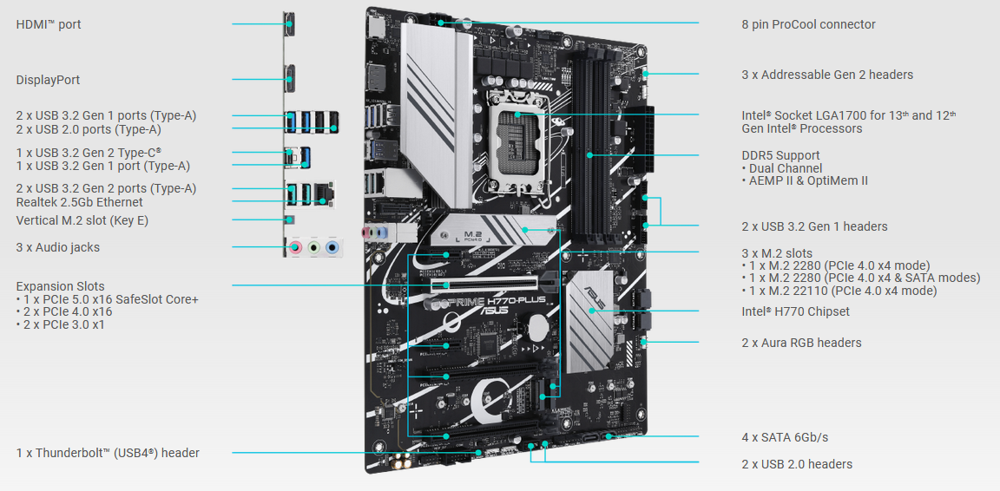

Фактор облика матичне плоче (енгл. *Form Factor*) односи се на величину и облик
плоче и распоред различитих компоненти на плочи. Током година било је много
варијација фактора облика, а најпознатији су ATX (Advanced Technology eXtended)
и Micro-ATX у десктоп рачунарима и ITX у тин-клијентима.

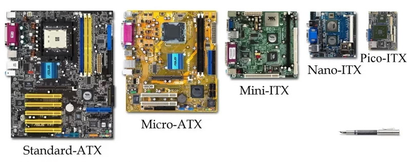

## Лежиште за процесор

Лежиште за процесор (енгл. *Socket*) обезбеђује механичку и електричну везу
између процесора и матичне плоче. У употреби су LGA (енгл. *Land Grid Array*) и
ређе PGA (енгл. *Pin Grid Array*) типови лежишта.

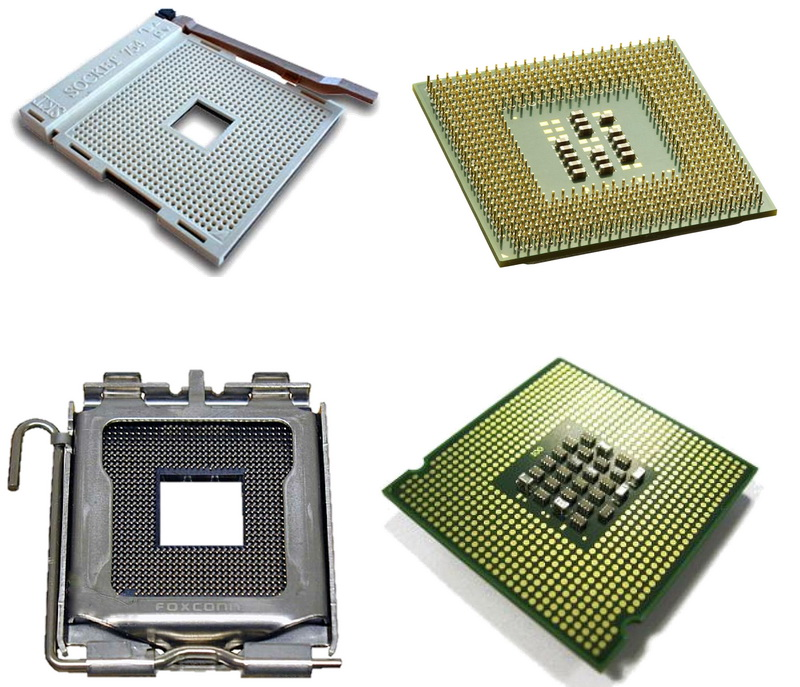

## Слотови за меморију

Слотови за меморију (енгл. *Memory Slots*, *RAM slots*) обезбеђују механичку и
електричну везу између меморијских модула и матичне плоче. Обично их има два
или више.

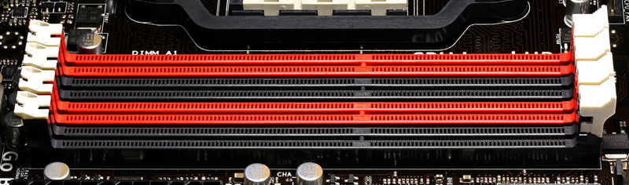

## Чипсет

Чипсет (енгл. *Chipset*) омогућују комуникацију између различитих компонената
рачунара и контролише њихов рад. Данас је то један чип, (*PCH – Platform
Controller Hub*), док су на старијим матичним плочама постојала два чипа
(*Northbridge* и *Southbridge*). Поред главног PCH чипа, на матичној плочи могу
да постоје и додатни чипови, на пример за мрежни интерфејс, за аудио интерфејс
итд.

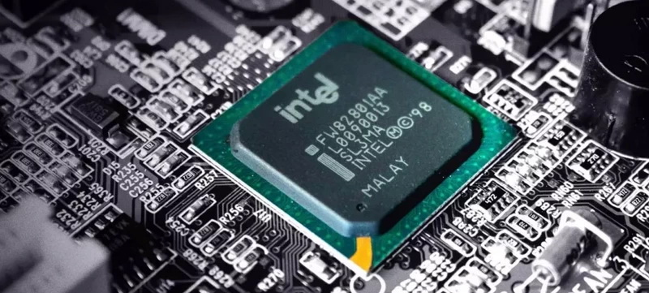

Његова улога јаснија је на упрошћеној блок шеми савременог рачунарског система:

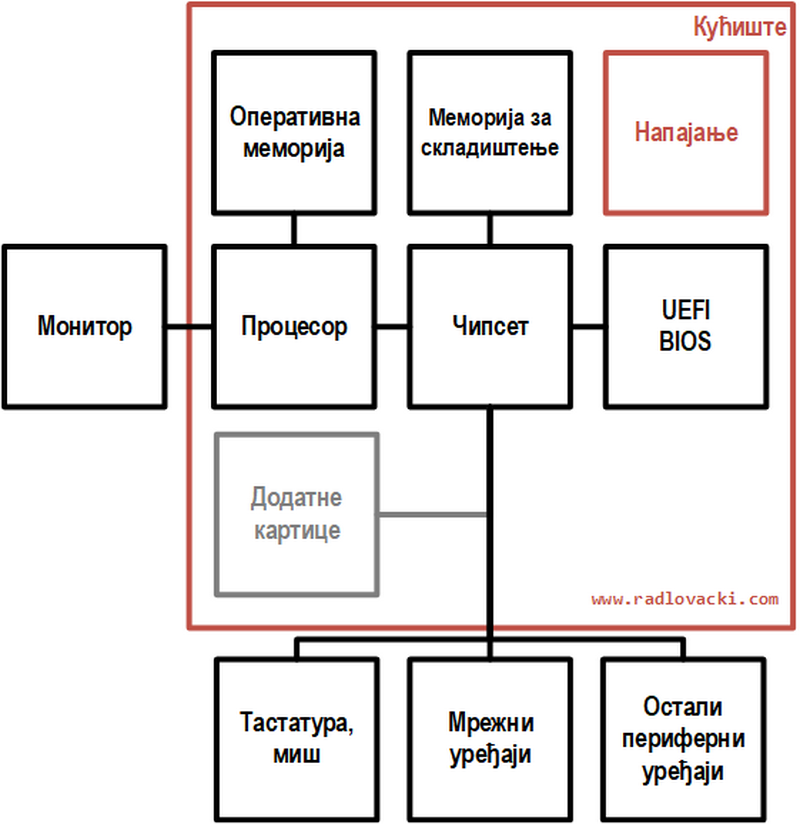

## BIOS / UEFI и батерија

BIOS (енгл. *Basic Input Output System*) тј. UEFI (енгл. *Unified Extensible
Firmware Interface*) је меморијски чип (ROM) у којем се налази софтвер и подаци
који омогућавају тестирање хардвера, системска подешавања и почетак рада
система. Батерија пружа константно електрично напајање за BIOS/UEFI, које је
потребно за функционисања часовника и датума и чување података о системским
подешавањима.

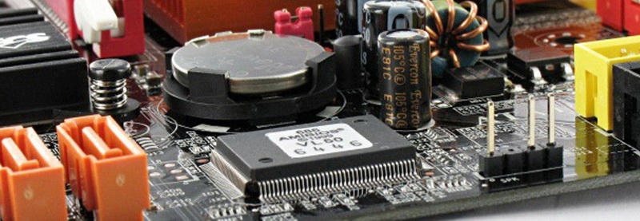

## Магистрале и екпанзиони слотови

Магистрала (енгл. *Bus*) представља скуп електричних веза између компонената
матичне плоче. То су обично процесорске магистрале, меморијска магистрала,
PCI-E магистрала, USB магистрала итд.

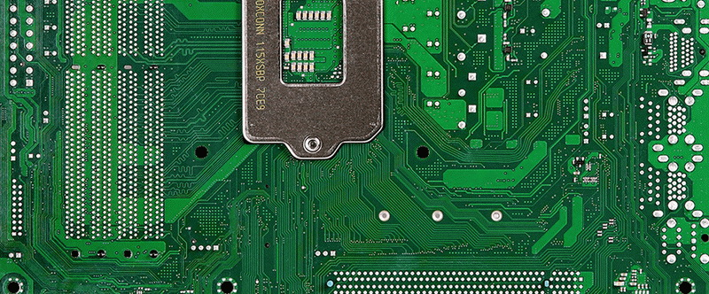

Експанзиони слотови (енгл. *Expansion Slots*) обезбеђују механичку и електричну
везу између додатних картица и матичне плоче. Данас су највише присутне
варијанте PCI-E слотова, док су се раније користили ISA, PCI и AGP слотови.

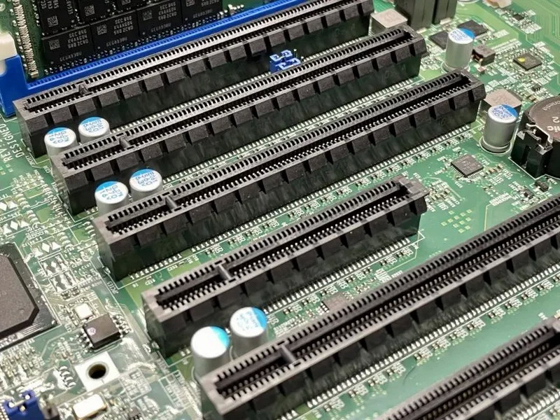

## Конектори

Конектори на матичној плочи обично су: конектори за напајање плоче, конектори
за вентилаторе, конектори за контроле на кућишту рачунара, конектори за уређаје
за складиштење и др.

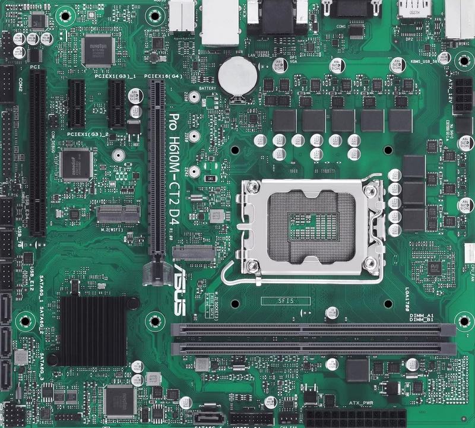

Конектори на полеђини кућишта који долазе са матичне плоче обично су: PS/2
конектори за тастатуру и миша, USB конектори и конектори од интегрисаних
уређаја (графички, мрежни и звучни адаптер) и др.

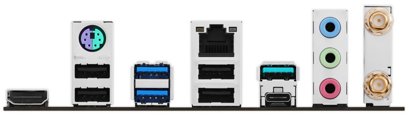

## Питања за проверу знања

??? question "Која је улога матичне плоче у рачунарском систему?"

    Матична плоча повезује хардверске компоненте рачунарског система и утиче на
    њихову брзину и ефикасност у раду.

??? question "Која је улога лежишта за процесор, слотова за меморију и експанзионих слотова на матичној плочи?"

    Њихова улога је да обезебеде механичку и електричну процесора, меморије и
    додатних картица са матичном плочом.

??? question "Која је улога чипсета на матичној плочи?"

    Чипсет омогућују комуникацију између различитих компонената рачунара и
    контролише њихов рад.

??? question "Шта је BIOS/UEFI и чему служи батерија на матичној плочи?"

    BIOS/UEFI је меморијски чип у којем се налази софтвер и подаци који
    омогућавају тестирање хардвера, системска подешавања и почетак рада система.
    Батерија пружа константно електрично напајање за BIOS/UEFI, које је потребно за
    функционисања часовника и датума и чување података о системским подешавањима.

??? question "Који се конектори налазе на матичној плочи, а који на полеђини кућишта?"

    Конектори на матичној плочи обично су: конектори за напајање плоче, за
    вентилаторе, за контроле на кућишту, за уређаје за складиштење и др.
    Конектори на полеђини кућишта који долазе са матичне плоче обично су: PS/2
    конектори за тастатуру и миша, USB конектори и конектори од интегрисаних
    уређаја (графички, мрежни и звучни адаптер) и др.
