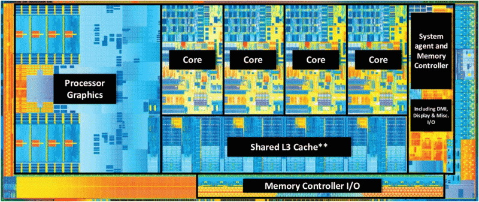
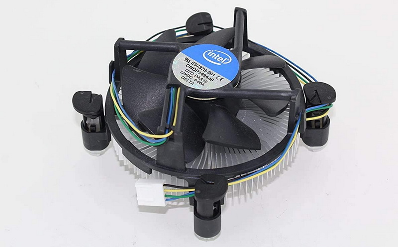
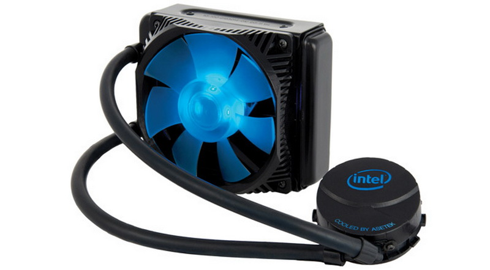

# Процесор

Централна процесорска јединица (енгл. *Central Processing Unit - CPU*),
микропроцесор или процесор, је електронска компонента која извршава инструкције
програма и изводи операције над подацима. Као што је речено у претходној
лекцији, процесори се производе у PGA или LGA пакетима, изузев процесора који
се директно леме на матичну плочу (нпр. у лаптоп рачунарима), који долазе у BGA
(енгл. *Ball Grid Array*) пакетима.

## Делови процесора

Основи делови процесора су:

* **регистри података** који служе за смештање података,
* **аритметичко-логичка јединица** која врши аритметичке и логичке операције
над подацима,
* **статусни регистар** који служи за смештање резултата обраде и
* **сегментни**, **индексни** и **показивачки регистри** који се користе за рад
са различитим типовима података и при комуникацији меморијом.

Раније је процесор био чип у којем се налази само једно процесорско језгро.
Данас се у процесору обично налази: више процесорских језгара, кеш меморија,
контролер меморије, графички процесор и интерфејс, PCIe интерфејс, PCH интефејс
и др.

Захваљујући оваквом степену интеграције компонената елиминисана су многа "уска
грла" у систему и могући проблеми са компатибилношћу.

## Брзина процесора

Основна карактеристика процесора је његова брзина која зависи од:

* брзине радног такта [MHz],
* броја језгара (1, 2, 4, 8...),
* количине кеш меморије [KB],
* скупа подржаних инструкција и
* ширине и брзине магистрала.

Перформансе, односно брзина процесора може се изразити у MIPS (енгл. *Million
Instructions Per Second*) или FLOPS (енгл. *Floating Point Operations Per
Second*).

## Типови процесора

За персоналне десктоп рачунаре доминантна су два произвођача процесора:

* **Intel** (Core i9, Core i7, Core i5, Core i3, Pentium, Celeron)
* **AMD** (Ryzen Threadripper, Ryzen, Athlon, A-Series, FX)

У лаптоп рачунарима обично се налазе „мобилне“ верзије процесора са слабијим
перформансама, али знатно мањом потрошњом електричне енергије. У серверским
рачунарима присутни су серверски процесори Intel Xeon и AMD EPYC. У паметним
телефонима и таблетима користе се процесори RISC архитектуре, конкретно ARM
процесори које производе разни произвођачи (Atmel, Broadcom, Qualcomm, Samsung,
Apple и др.).

Треба напоменути да је компанија Apple одступила од досадашње праксе и почела
са производњом рачунара заснованих на ARM процесорима (Apple M1, M2, M3, M4),
који су се показали као веома озбиљни конкуренти Intel и AMD процесорима.

## Хлађење

Проток струје између електронских компоненти ствара топлоту, а компоненте
рачунара раде боље на нижим температурама. Ако се топлота не уклони, рачунар
може да ради спорије, да се ресетује или искључи. Због тога је императив да се
рачунарске компоненте хладе активним или пасивним решењима за хлађење. Активна
решења захтевају додатну потрошњу енергије - алуминијумски или бакарни хладњаци
са вентилаторима...

...или водено хлађење:

Најчешће се активни хладњаци налазе на процесору и графичком процесору (на
графичкој картици), а пасивни на системским чиповима матичне плоче мада то није
строго правило. Вентилатори се често налазе и у напајању и на самом кућишту
рачунара, ради боље циркулације ваздуха кроз кућиште.
