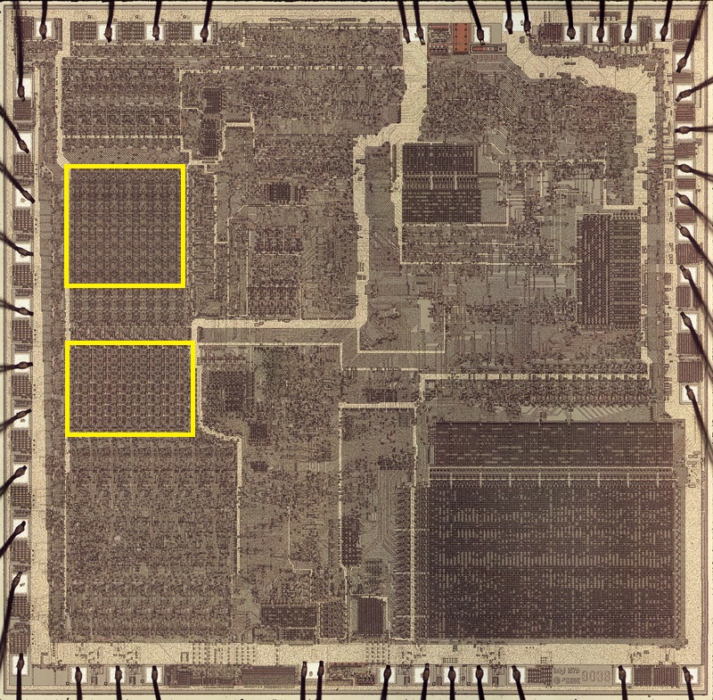
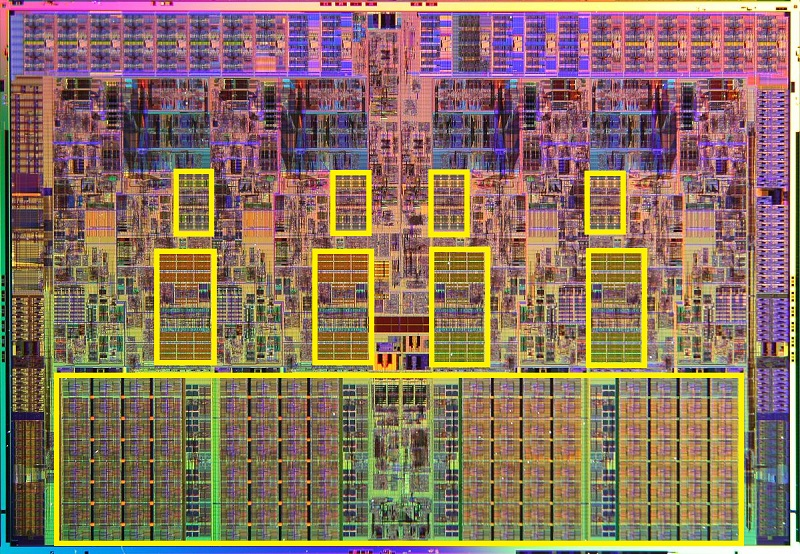
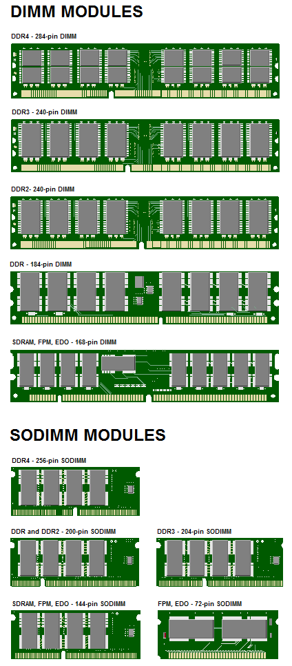
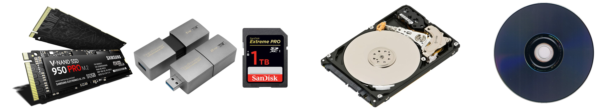

# Меморије

Меморија у рачунару користи се за чување података **привремено** (током рада,
док има електричне енергије) или трајно (и по губитку електричне енергије).
Меморију у рачунару можеш посматрати хијерархијски:

1. **Регистри процесора** – капацитет: најмањи, брзина: највећа, цена:
најскупља
2. **Кеш меморија процесора** – капацитет: мали, брзина: велика, цена: скупа
3. **Оперативна меморија** – капацитет: средњи, брзина: средња, цена: средња
4. **Електронска меморија за складиштење** – капацитет: велик, брзина: мала,
цена: мала
5. **Магнетна меморија за складиштење** – капацитет: највећи, брзина: најмања,
цена: најмања

Из списка изнад можете закључити да је капацитет меморије обрнуто сразмеран
брзини и цени. Најмање има најбрже и најскупље меморије, односно, највише има
најспорије и најјефтиније меморије.

## Регистри процесора

{ width="160", align=right }

Налазе се у оквиру процесорског језгра (на истој силицијумској плочи са осталим
компонентама процесора). Служе за чување података потребних процесору током
извршавања програма.

## Кеш меморија процесора

{ width="240", align=right }

Кеш меморија је ултрабрза меморија која се уграђује у процесор и носи ознаке:
L1, L2 и L3 (у старијим рачунарским системима налазила се у засебним чиповима).
Користи се да убрза приступ често коришћеним локацијама у оперативној меморији,
тако што се у њој чувају често коришћени подаци и инструкције. Када процесор
треба да приступи одређеним подацима, прво проверава кеш. Ако су подаци већ ту
чита их из брзог кеша, а ако нису, онда мора да приступи оперативној меморији,
која је знатно спорија.

## Оперативна меморија

{ width="240", align=right }

Оперативна меморија чува програме који се извршавају и податке који се при томе
користе. Назив "меморија са случајним приступом" тј. RAM (Random Access Memory)
потиче од особине да се после приступа једном меморијском регистру може
приступити било ком другом (историјски посматрано, у првим рачунарима то није
било могуће). Време приступа сваком меморијском регистру је исто, односно,
време приступа је константно, а приступ може бити у циљу читања или уписа.

Поред капацитета, битна карактеристика оперативне меморије је њена брзина, на
коју утичу радна фреквенција, латенција, пропусни опсег итд. Радна фреквенција
одређује колико брзо се подаци преносе; латенција представља кашњење пре него
што меморија одговори на захтев; а пропусни опсег је количина података која се
може пренети у јединици времена.

Обично се у десктоп рачунарима користе DIMM (Dual In-line Memory Module), а у
лаптоп SO-DIMM (Small Outline Dual In-line Memory Module) модули. У савременим
рачунарима користе се DDR SDRAM (Double Data Rate Synchronous Dynamic Random
Access Memory) модули типа...

* **DDR5**, од 2021. године,
* **DDR4**, од 2014. године,
* **DDR3**, од 2007. године,
* **DDR2**, од 2001. године и
* **DDR**, од 1998. године.

У серверима се користе специјализовани DIMM модули са имплементираним ECC
(Error-Correcting Code) механизмом.

## Меморија за складиштење

За разлику од претходних типова, меморија за складиштење чува програме и
податке и по губитку електричне енергије, па се зато назива и постојана
меморија.

У почетку користиле су се **меморије са магнетним записом** HDD (Hard Disk
Drive) и са "уклоњивим" дисковима (дискетама) Floppy, Jaz и Zip Disk Drive.
Развојем **меморија са оптичким записом**, CD, DVD и Blu-ray, меморије са
магнетним записом са уклоњивим дисковима нестали су из употребе. Како се
повећавао квалитет и капацитет **флеш меморија**, тако су престајале да се
користе меморије са оптичким записом.

Данас је главни уређај за складиштење обично SSD (Solid State Drive), а ређе
HDD. SSD дискови долазе у две варијанте: SATA SSD, који користи старији
интерфејс, и NVMe SSD, који користи бржи PCIe интерфејс и постиже знатно боље
перформансе. Као преносиве меморије користе се само флеш меморије у виду USB
флеш и SD Card меморија. Меморије са оптичким записом данас се ретко користе.
