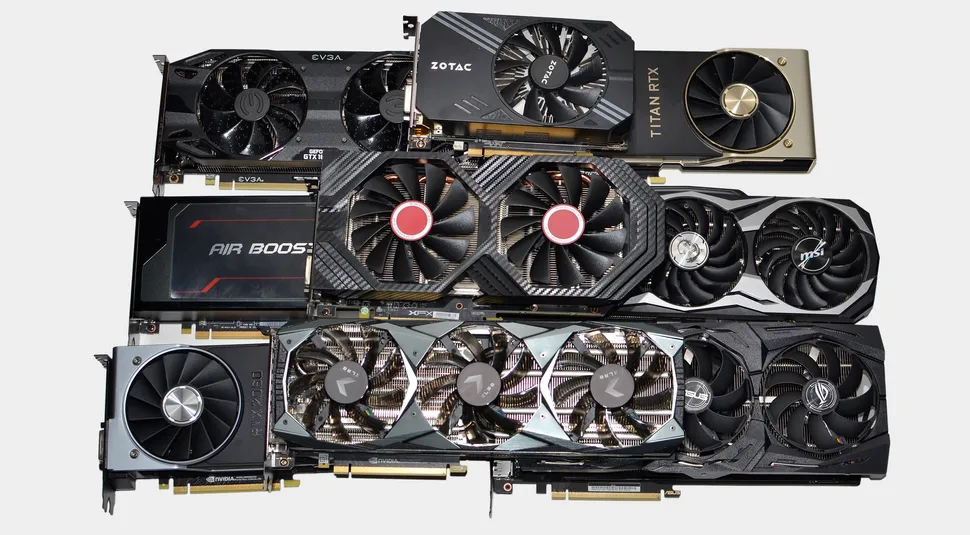

# Остале интерне компоненте

Поред напајања, матичне плоче, процесора, оперативне меморије и меморија за
складиштење, унутар кућишта се могу наћи и компоненте у слотовима за додатне
картице. У савременим рачунарима ти слотови су типа PCIe, док су се у старијим
рачунарским системима користили и AGP, PCI и ISA слотови. PCIe стандард
дефинише типове слотова на основу броја “трака” (*lane*) на магистрали: x16,
x8, x4 и x1, што значи да различите компоненте у слотовима захтевају различит
број трака. Неке од компоненти које се могу наћи у слотовима за додатне картице
су:

* Графички адаптери
* Аудио адаптери
* Мрежни адаптери
* Адаптери за бежичне и блутут мреже
* ТВ/радио тјунер адаптери
* Адаптери за снимање видеа
* Адаптери за експанзију портова
* Рајзери и сплитери

## Графички адаптер

Основна улога графичког адаптера је да генерише низ излазних слика на монитор
рачунара. Градички адаптери могу бити изведени као:

* графички процесори **интегрисани у склопу процесора** (*integrated GPU*) -
уграђују се у савремене процесоре (*Intel UHD Graphics*, *AMD Radeon
Graphics*), користе системску меморију и довољни су за свакодневне послове,
репродукцију видео-садржаја и мање захтевне игре.
* графички адаптери **интегрисани на матичној плочи** (*on-board*) - некада су
били уобичајени, а данас се ретко користе јер су замењени iGPU-има.
* **графичке картице** (*discrete, dedicated*) - засебне хардверске компоненте
које се прикључују у PCI Express x16 слот, имају сопствени графички процесор,
меморију и систем хлађења. Поред рада са рачунарском графичком, тренд је да се
графичке картице користе и за обраду неграфичких података, нпр. извођење
комплексних прорачуна, рударење крипто-валута, рад са моделима машинског учења
и др.

Основни делови графичке картице су:

* **Графички процесор** тј. графичка процесорска јединица (GPU) је процесор
специјално намењен и оптимизован за рад са рачунарском графичком. Неке од
његових одлика су радни такт језгра (GHz), број пиксел шејдера и др.
* **Видео меморија** (VRAM) чији се капацитет изражава у GB, служи за
складиштење графичких објеката и базира на DDR технологији (GDDR).
* **Video BIOS** садржи фирмвер који управља графичком картицом и омогућује
комуникацију са осталим хардверским и софтверским компонентама рачунарског
система.
* Застарели **RAMDAC** (*RAM Digital-to-Analog Converter*) претвара дигиталне
сигнале у аналогне за потребе старијих монитора који користе аналогни улаз.

На графички адаптер могу се прикључити уређаји са различитим типовима конектора:

* **HDMI** (High-Definition Multimedia Interface),
* **USB-C** (са DisplayPort режимом),
* **DP** (Display Port),
* и застарели **DVI** (Digital Visual Interface), **VGA** (Video Graphics
Array) и ређе **VIVO** (Video In Video Out) за S-Video, Composite video и
Component video. 
