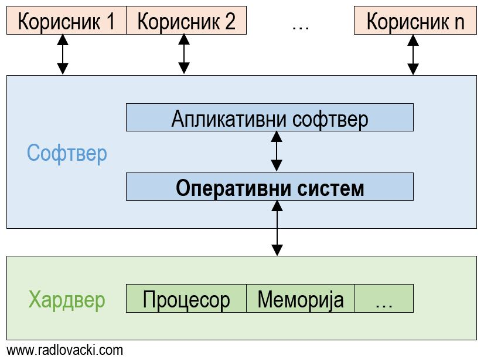

# Софтвер

Софтвер (*Software*) чине сви програми који се извршавају на рачунару. Софтвер,
дакле, представља програмску компоненту рачунарског система. Програми могу с
једне стране да управљају радом рачунаром, а са друге да врше обраду података.
Тако се према намени софтвер дели на две групе:

* **системски софтвер** – сви програми, програмски пакети и сл. који
омогућавају функционисање и коришћење рачунарског система и
* **апликативни софтвер** – сви програми, програмски пакети и сл. који су
намењени решавању конкретних проблема и задатака корисника.

## Системски софтвер

Системски софтвер дели се на оперативне системе, језичке преводиоце и услужне
програме. Укратко: оперативни систем чини колекција програма која омогућује
коришћење рачунарског система; језички преводиоци претварају програмски код у
неком програмском језику у извршне програме; и услужни програми помажу у
одржавању, оптимизацији и анализи рачунарског система.

### Оперативни систем

Оперативни систем управља ресурсима рачунарског система. Поред тога корисницима
обезбеђује интерфејс за рад у виду командне линије (*CLI – Command-Line
Interface*) и/или графичког корисничког интерфејса (*GUI – Graphical User
Interface*). Додатно, омогућава покретање других програма.

Неке од основних функција оперативних система су:

* управљање процесором,
* управљање меморијом,
* управљање осталим хардверским компонентама и периферним јединицама,
* управљање подацима и програмима,
* откривање и отклањање грешака и др.

Основни део оперативног система назива се кернел тј. језгро оперативног
система. Кернел је увек присутан у оперативној меморији док се остали делови
оперативног система учитавају по потреби.

Најзаступљенији оперативни систем за персоналне рачунаре је Windows, за којим
следе Linux и macOS. Најзаступљенији оперативни системи за паметне телефоне и
таблете су Android и iOS.

**Microsoft Windows** је вишекориснички и вишепрограмски оперативни систем.
Темељи се на коришћењу графичког корисниког интерфејса у којем се програми
извршавају у прозорима (*windows*), а команде реализују кликом миша. Верзија
Windows-а за серверске системе зове се Microsoft Windows Server.

**Linux** представља слободан софтвер отвореног кода. Настао је као бесплатна
алтернатива оперативног система UNIX. Име "Linux" је заправо назив кернела, а
остали делови овог оперативног система производ су GNU и других пројеката
отвореног кода – тако је пун назив овог оперативног ситема **GNU/Linux**.
Отворени код допринео је реализацији многобројних "дистрибуција" овог
оперативног система за персоналне и/или серверске рачунарске системе, међу
којима су најпознатије: Debian, Ubuntu, Mint, Arch, Fedora и др. (проверите
[distrowatch.com](https://distrowatch.com/)). Тако постоји и више врсти
графичких корисничких интерфејса за Linux, који нису обавезан део оперативног
система.

**macOS** (првобитно Mac OS X тј. OS X) је серија графичких оперативних система
за Apple Mac рачунарe. Језгро овог оперативног система бaзирано је на језгру
оперативног система FreeBSD – још једног бесплатног клона оперативног система
UNIX.

**Android** је оперативни систем за мобилне уређаје компаније Google заснован
на Linux кернелу, првенствено дизајниран за мобилне уређаје са екраном
осетљивим на додир, као што су паметни телефони и таблети. Графички кориснички
интерфејс заснован је на директној манипулацији објектима на екрану у виду
додира као и унос текста помоћу виртуелне тастатуре.

**iOS** је оперативни систем за мобилне уређаје компаније Apple. Првобитно је
развијен за iPhone, а касније и за iPod, iPad и друге производе компаније Apple
– није дозвољено покретање iOS оперативног система на хардверу других
произвођача.
