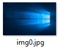

# Графички софтвер и лиценце

**Графички софтвер** представља програм или колекцију програма који омогућавају
кориснику креирање и манипулацију графичким садржајима на рачунару. Статичка
рачунарска графика може се поделити у две категорије: растерску и векторску.
Тако су и многи софтвери фокусирани искључиво или на растерску или на векторску
графику, мада неки на интересантан начин комбинују елементе обе категорије.

**Софтверска лиценца** је правни документ којим је регулисано коришћење и
дистрибуција софтвера. Као и за сваки други, тако и за графички софтвер,
софтверска лиценца омогућава кориснику да користи једну или више копија неког
софтвера на такав начин да штити права аутора (софтвер је заштићен ауторским
правима, осим ако није у јавном домену). Софтверске лиценце се могу поделити
на: власничке и лиценце слободног и отвореног кôда. Власничке лиценце могу бити
и у *freeware* или *shareware* форми.

Одређени графички софтвер добија се инсталацијом оперативног система Windows
или куповином одређеног хардвера. Такав софтвер нам може послужити за основну
обраду слика. За комплекснију обраду слика неопходан је софтвер попут Adobe
Photoshop или GIMP. Комплексна обрада слика излази из домена овог наставног
предмета.

## Графички формати

**Формат датотеке** представља начин на који се информације кодирају за
складиштење у датотеци. Формати датотека могу бити власнички или слободни,
затворени или отворени итд. Власнички формати дизајнирани су од стране
одређених компанија, организација или индивидуа и заштићени су ауторским
правима. Супротно власничким форматима, слободни формати су у јавном домену. За
затворене формате датотека не постоји јавно доступна документација и њихове
шеме за кодирање информација представљају пословну тајну. Отворени формати су
доступни свима и обично добро документовани од стране организација за
стандардизацију.

Екстензија датотеке представља суфикс одвојен тачком од имена датотеке,
указујући на формат датотеке.

На примеру видимо датотеку типа JPEG чије је име `img0` и екстензија `jpg`.

Екстензија помаже оперативном систему да асоцира датотеке одређеног формата са
одређеним софтвером – на пример датотеке са екстензијом `.txt` асоцира са
софтвером Notepad, датотеке са екстензијом `.docx` асоцира са софтвером Word
итд.

Windows подразумевано не приказује екстензије за познате формате датотека, мада
то можемо да мењамо искључивањем опције Hide extensions for known file types.

Графички формати представљају стандардизован начин за складиштење дигиталних
слика. Постоји стотине графичких формата, а све их грубо можемо поделити на растерске компресоване (лосслесс цомпрессион), растерске не-компресоване (лоссy цомпрессион) и векторске (како се у оквиру овог предмета нећемо бавити векторском графиком, разматраћемо само растерске формате).
У зависности од дубине боја, растерски формати могу бити:

* Monochrome (1 bit – бела или црна)
* Greyscale (8 bit – 256 нијанси од беле до црне)
* Color (8-bit – 256 нијанси боја)
* High color (16-bit – 65.536 боја)
* True color (24-bit – 16.777.216 боја)
* Deep color (30-bit до 48-bit – више од милијарду боја)

Поред дубине боја, графичке формате карактеришу и модели палета боја (најчешће
RGB и CMYK), могућност анимације, могућност провидности (транспарентности) и
др.

Најпознатији компресовани растерски формати су:

* JPEG (Joint Photographic Experts Group) је најчешће коришћен формат у
дигиталној фотографији и на world wide web-у. Подржава Greyscale и True color
дубине боја и величину датотеке смањује до 10 пута без видљивих губитака на
квалитету (у зависности од степена компресије величину датотеке може смањити
и више од 10 пута).
* TIFF (Tagged Image File Format) се најчешће користи у дигиталној штампи.
Подржава дубине боја до 48-бита.

Најпознатији не-компресоване растерски формати су:

* BMP (Bitmap) је формат често коришћен у Windows оперативном систему.
* GIF (Graphics Interchange Format) је формат лимитиран са 256 боја али
подржава провидност и анимације.
* PNG (Portable Network Graphics) је слободан отворени формат и најбоља замена
за BMP и GIF формате. Подржава различите дубине боја до 32-бита, провидност и
анимације.

Из свега наведеног може се закључити да величина датотеке не зависи само од
димензија дигиталне слике у пикселима већ и од графичког формата, дубине боја и
степена компресије слике.
