# Креирање школског Microsoft налога

Када си од предметног наставника добио податке за свој школски Microsoft налог,
на свом рачунару (а не на телефону), у прегледачу отвори следећи линк:

[https://www.microsoft365.com/](https://www.microsoft365.com/)

Отвориће се следећа страница:

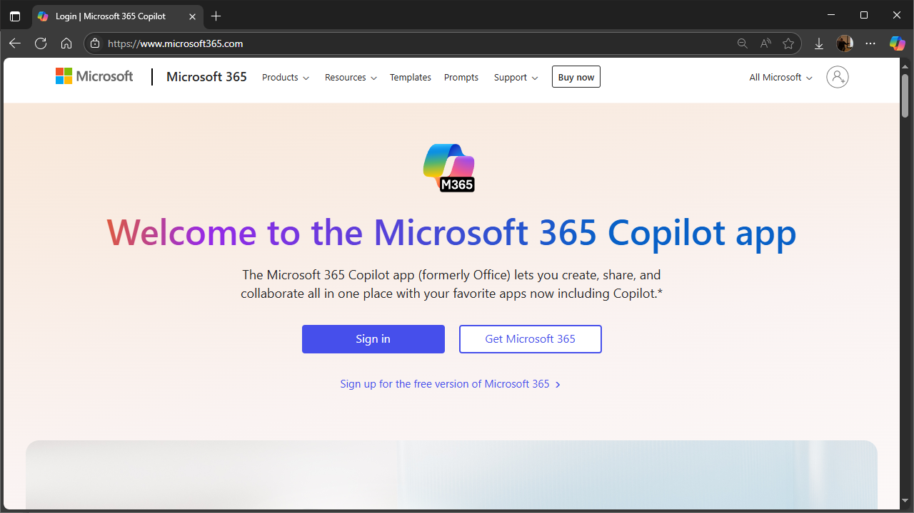

Кликни на **Sign in**. Отвориће се следећа страница:

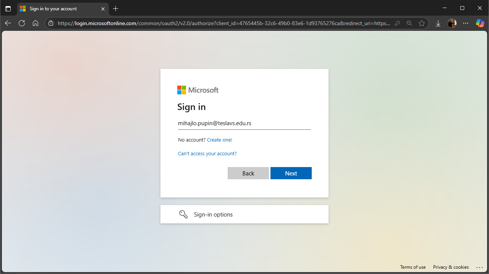

Унеси свој налог у формату `ime.prezime@teslavs.edu.rs`, па кликни **Next**.
Отвориће се следећа страница:

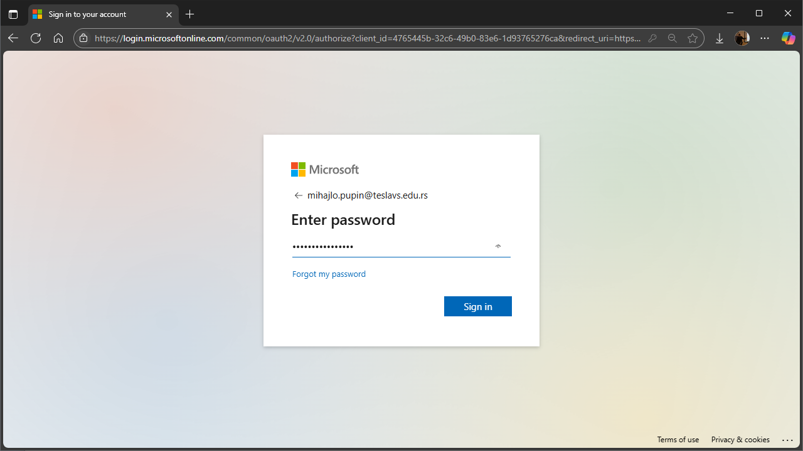

Унеси привремену лозинку коју си добио од наставника, па кликни **Next**.
Отвориће се следећа страница:

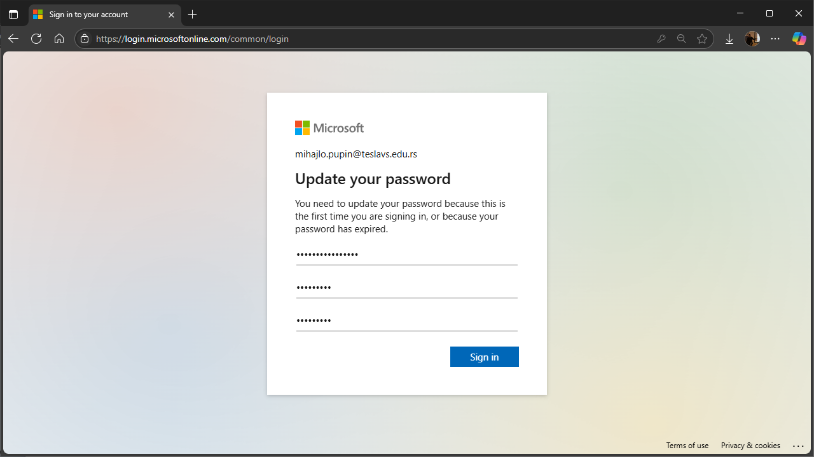

На овој страници унеси привремену лозинку коју си добио од наставника, па затим
своју лозинку коју си смислио и **коју треба да запамтиш!!!** (лозинка мора да
има најмање 8 карактера, међу којима мора да буде употребљено макар једно мало
слово, велико слово, број и знак). Потврди своју лозинку и кликни **Sign in**.
Отвориће се следећа страница:

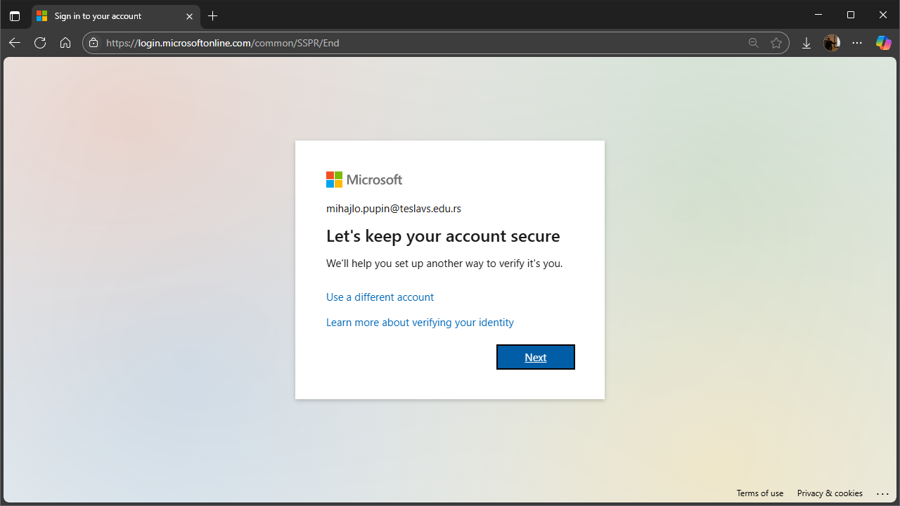

Кликни **Next**. Отвориће се следећа страница:

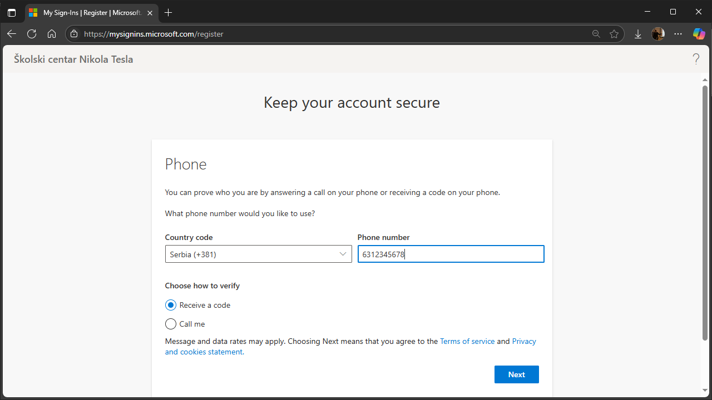

У пољу *Country code* одабери `Serbia (+381)`, па у пољу *Phone number* унеси
свој број телефона без почетне нуле. Важно је да унесеш исправан број телефона,
јер ће ти ускоро стићи SMS са кодом за верификацију.

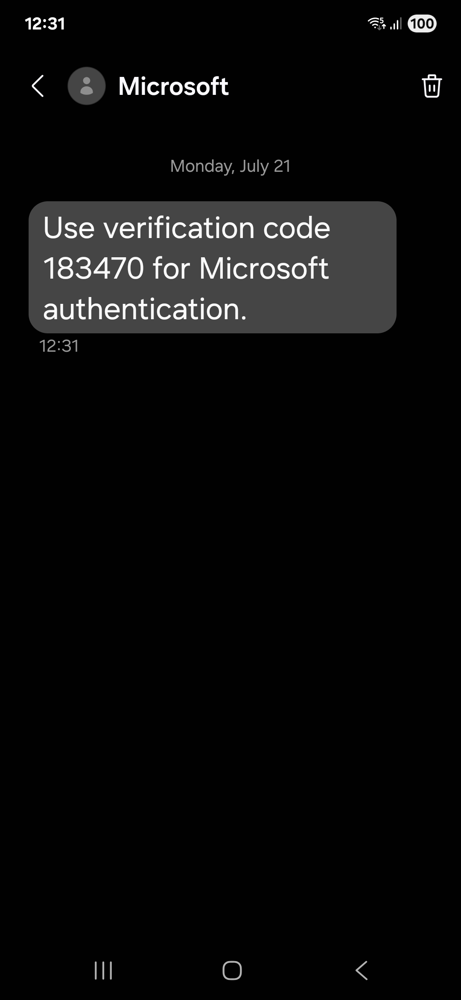

Кликни **Next**. Отвориће се следећа страница:

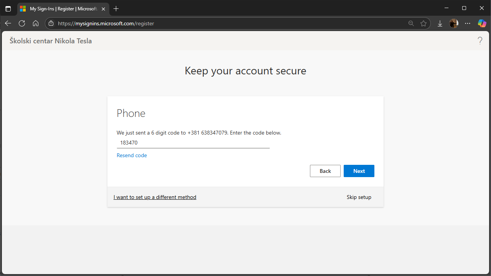

Унеси шестоцифрени верификациони кôд па кликни **Next**. Отвориће се следећа
страница:

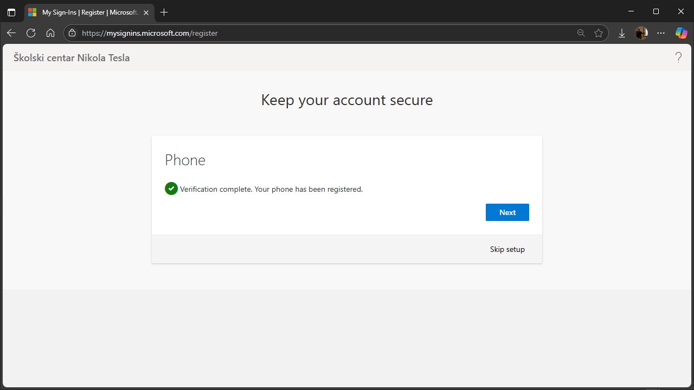

Кликни **Next**. Отвориће се следећа страница:

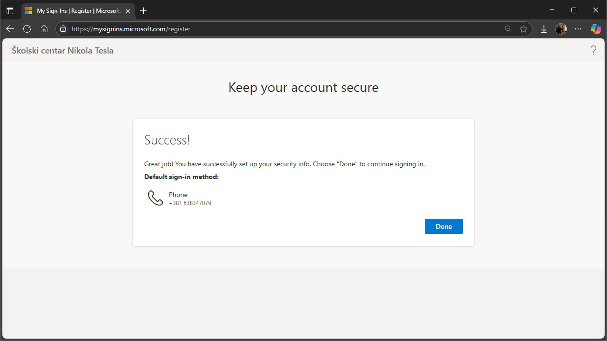

Кликни **Done**. Отвориће се следећа страница:

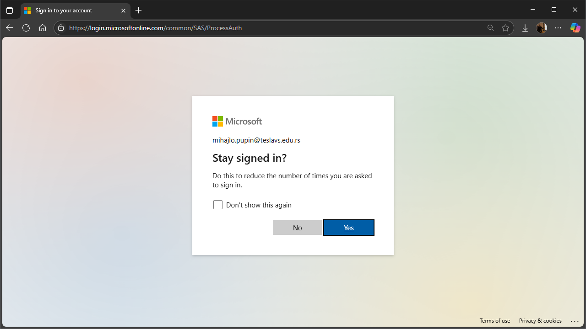

Кликни **Yes**. Отвориће се следећа страница:

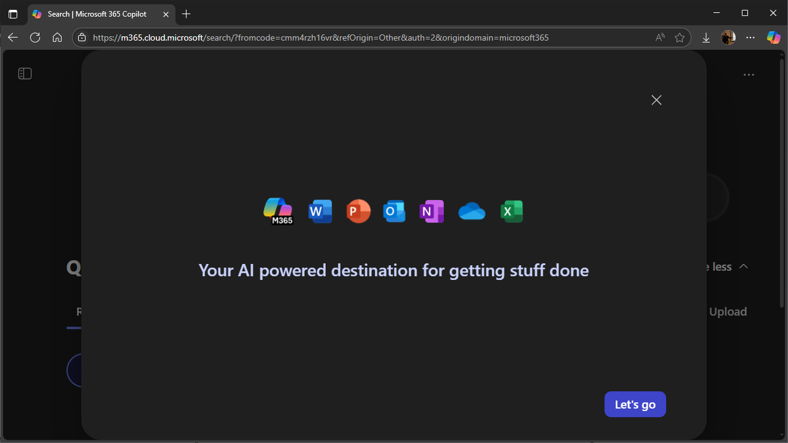

Кликни **X** да затвориш уводну анимацију. У горњем левом углу странице кликни
на икону за приказ менија и кликни на **Apps**. Страница треба да изгледа
овако:

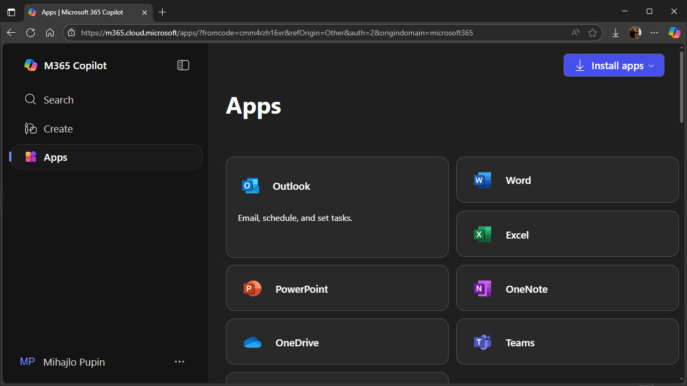

Кликни на **Outlook**. Онлајн верзија апликације Outlook изгледа овако:

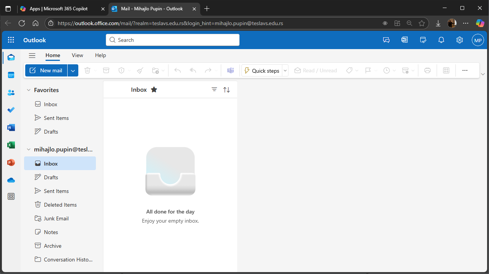

Кликни на **New mail**, па пошаљи мејл на `velimir.radlovacki@teslavs.edu.rs`.
Као наслов напиши своје име и презиме, а у тексту поруке напиши:

> Поштовани наставниче,
>
> Успешно сам активирао свој школски налог.
>
> Срдачан поздрав,
>
> *Име Презиме*
