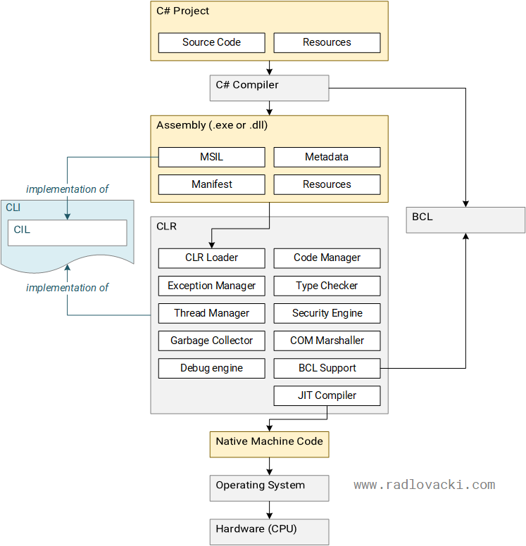

# Увод

## C# и .NET

Програмски језик C# настао је 2000. године у компанији Microsoft као део .NET
Framework развојне платформе за Windows оперативне системе. C# је језик опште
намене са јаком типизацијом, слично као и програмски језик C, али C# подржава
више парадигми: императивну, декларативну, функционалну, генеричку,
објектно-оријентисану и компонентски-оријентисану парадигму.

До сада си сигурно дошао у ситуацију да је неопходно да инсталираш или ажурираш
неку верзију развојне платформе .NET Framework или .NET чак и ако се ниси бавио
програмирањем или имао инсталирано развојно окружење Visual Studio. Шта је .NET
и зашто је неопходно инсталирати .NET???

.NET је развојна платформа компаније Microsoft за развој различитих типова
апликација, укључујући десктоп, веб, мобилне, клауд и друге типове апликације.
Дизајнирана је да поједностави развој пружајући конзистентан и свеобухватан
скуп библиотека и алата за програмере. .NET подржава више програмских језика,
укључујући C#, VB.NET и F#.

**.NET Framework** платформа настала је почетком 2000-их. Првобитни фокус био
је на развоју Windows десктоп апликације, али се касније проширио и на веб
апликације, веб сервисе и друге врсте софтвера искључиво за Windows оперативне
системе. Каже се да је платформа монолитна јер један велики оквир пружа све што
је неопходно за развој и извршавање апликација. Битне верзије .NET Framework
платформе су: 1.0, 2.0, 3.5, 4.0, 4.5 и последњe 4.7.2, 4.8 и 4.8.1.

**.NET Core** платформа настала је 2016. године као нови вишеплатформски оквир
отвореног кода. Дизајниран је да елиминише ограничења .NET Framework платформе
и обезбеди модуларнију и свестранију платформу за развој апликација.
Међуплатформска компатибилност омогућава програмерима да праве апликације које
раде на ширем спектру оперативних система - Windows, MacOS и различитим
дистрибуцијама оперативног система Linux. Каже се да је платформа модуларна јер
је могуће укључити само неопходне библиотеке и компоненте, што доприноси бољим
перформансама и бржим извршавањем. Битне верзије .NET Core платформе су: 1.0,
1.1, 2.0, 2.1 и 2.2.

**.NET** платформа је наследник .NET Framework и .NET Core настала 2019.
године, почевши од верзије 5.0, а значајне верзије су 6.0 (LTS), 7.0, 8.0 (LTS)
и 9.0.

C# програми извршавају се у оквиру *.NET*-а. Шта то значи? Зар се програми не
извршавају у оперативном систему? У I и II разреду развијао си апликације у
програмском језику C које се извршавају у оквиру оперативног система:

Како би се превазишао проблем са компатибилношћу - да старији програми не могу
да функционишу на новијим верзијама оперативних система и обрнуто - осмишљен
је још један слој под називом *.NET Framework*. Захваљујући том слоју,
функционалност апликације више не зависи од оперативног система:

## Од изворног кода до извршавања програма

Данас је .NET Framework саставна компонента Windows-а која садржи општу језичку
извршну платформу **CLR** (The Common Language Runtime) и библиотеку основних
класа **BCL** (The Base Class Library) која садржи око 13000 класа, 4500
вредносних типова и 1500 интерфејса. CLR представља имплементацију опште
језичке инфраструктуре **CLI** (Common Language Infrastructure) - међународног
стандарда за развој окружења у којима различити програмски језици и библиотеке
раде заједно.

Поједностављено објашњење било би да током **компајлирања** C# компајлер
преводи твој изворни кôд и ресурсе у `.exe` или `.dll` склоп...

...а током **извршавања** склоп се учитава у CLR који га преводи у машински
извршни кôд и предаје оперативном систему на извршавање (у процесору):

Кôд који се предаје CLR-у назива се **управљив кôд**, супротно од компајлираног
машинског кода који се назива **неуправљив кôд**. И компајлер за време
компајлирања, и CLR за време извршавања, референцирају и користе BCL.

### Компајлирање (Compile Time)

Један C# пројекат обично садржи изворни кôд и одређене ресурсе. C# компајлер
компајлира изворни код са ресурсима у склоп (**Assembly**) - датотеку са
екстензијом `.exe` или `.dll`. Склоп није "обична" извршна датотека, као она
коју си добијао компајлирањем C кода - она захтева постојање .NET Framework-а
да би могла да се изврши! Основни делови склопа су:

* Мајкрософтов посреднички језик **MSIL** (Microsoft Intermediate Language),
који се често назива само посреднички језик **IL** (Intermediate Language).
MSIL представља имплементацију општег посредничког језика **CIL** (Common
Intermediate Language), дефинисаног у оквиру CLI стандарда. MSIL је заправо
кôд којег генерише компајлер на основу изворног кода, а који је независан од
процесора.
* Метаподаци (**Metadata**) описују типове, чланове, референце итд.
* Манифест (**Manifest**) садржи информације о склопу, о референцираним
склоповима и коришћеним датотекама.
* Ресурси (**Resources**) могу бити стрингови, бинарни фајлови, слике и други
ресурси.

### Извршавање (Runtime)

Приликом извршавања, склоп се учитава у CLR који се састоји из:

1. компоненти за **извршавање и управљање кодом**:
    * **CLR Loader**, учитава склопове и иницијализује метаподатке,
    * **Type Checker**, валидира типове и спречава небезбедне конверзије,
    * **Code Manager**, надгледа извршавање кода и руковање метаподацима,
    * **Exception Manager**, обрађује изузетке током извршавања,
2. компонента за **безбедност**:
    * **Security Engine**, спроводи безбедност приступа коду и верификује
    интегритет кода,
3. компоненте за **управљање меморијом и нитима**:
    * **Garbage Collector**, управља меморијом чишћењем некоришћених објеката,
    * **Thread Manager**, управља извршавањем нити и паралелним извршавањем,
4. компоненте за **интероперације и отклањање грешака**:
    * **COM Marshaller**, омогућава интеракцију са COM компонентама,
    * **Debug Engine**, обезбеђује отклањање грешака и праћење изузетака,
5. компонента за **везу са библиотеком класа**:
    * **BCL Support**, обезбеђује везу са .NET библиотеком основних класа,
6. и на крају компонента за **компајлирање**:
    * **JIT Compiler**, компајлира MSIL у машински кôд за дефинисани тип
    процесора.

Интероперабилност језика је једна од главних .NET карактеристика. Пошто је MSIL
кôд произведен од стране компајлера у складу са заједничком спецификацијом
типова **CTS** (Common Type Specification), он може да сарађује са кôдом
написаним на више од двадесет CTS-компатибилних програмских језика попут
Managed C++, F# и Visual Basic .NET.
