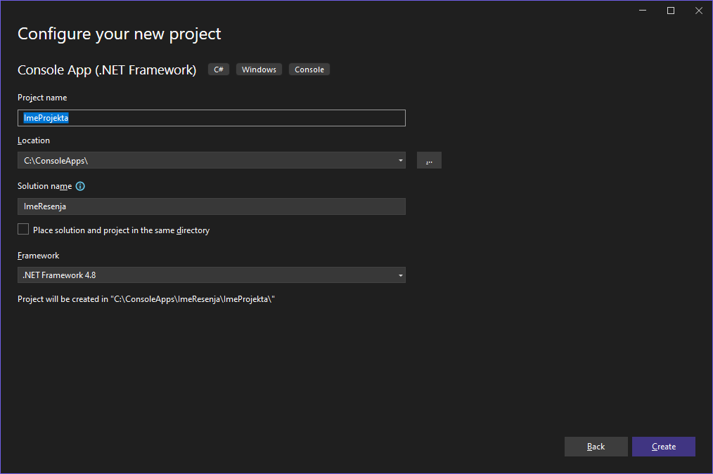

# Припрема окружења и израда пројекта

## Припрема радног окружења

Интегрисано развојно окружење *Visual Studio Community Edition* инсталирао си
још на почетку првог разреда. Ако из неког разлога то ниси урадио, упутство за
преузимање и инсталацију налази се у лекцији
[Microsoft Visual Studio IDE](https://petlja.org/sr-Latn-RS/kurs/11231/2/7977),
курса "Програмирање I за информатичке профиле у електротехничким школама".

Тада, приликом инсталације, одабрао си радни пакет `Desktop development with
C++`. Да би омогућио развојном окружењу да креира и ради са C# *.NET Framework*
пројектима, потребно је да у Start менију пронађеш и покренеш **Visual Studio
Installer** и кликнеш на дугме `Modify`:

За наставни предмет Програмирање у III разреду довољно је да одабереш радни
пакет `.NET Desktop Development`.

Од наставника веб-програмирања и наставника других стручних предмета добићеш
информације о осталим неопходним радним пакетима за њихове предмете. Када си
одабрао `.NET Desktop Development`, кликни `Modify`, па кликни `Yes` како би
дозволио развојном окружењу *Visual Studio* да направи промене. Када се процес
преузимања и инсталације додатних фајлова заврши, радно окружење биће спремно
за нове пројекте у програмском језику C#.

На почетку наставног предмета Програмирање у III разреду креираћеш конзолне
апликације, а на крају, апликације са графичким корисничким интерфејсом за
*Windows*. Покрени развојно окружење Visual Studio и кликни на `Create a new
project`:

Одабери `Console App (.NET Framework)` и кликни `Next` (да би брже пронашао
овај тип пројекта у комбинованим оквирима, можеш одабрати `C#`, `Windows` и
`Console`):

Унеси име пројекта, локацију на којој ћеш сачувати пројекат, име решења које
може бити исто као и име пројекта (решење је контејнер за један или више
пројеката), одабери *.NET Framework* верзију и кликни `Create`:

Развојно окружење биће одмах спремно за рад:

