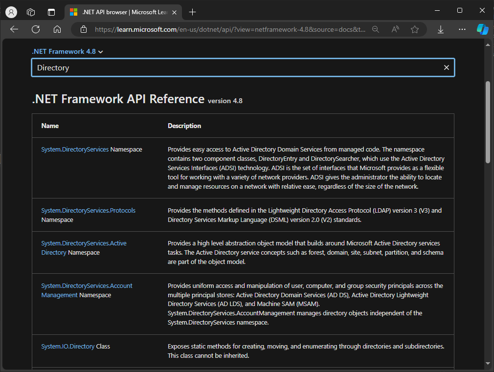
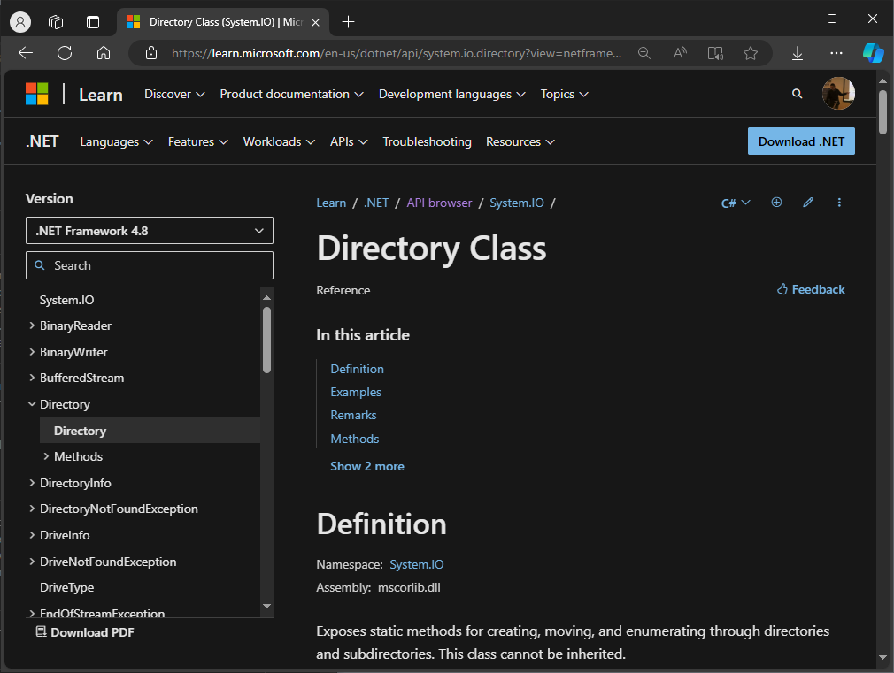
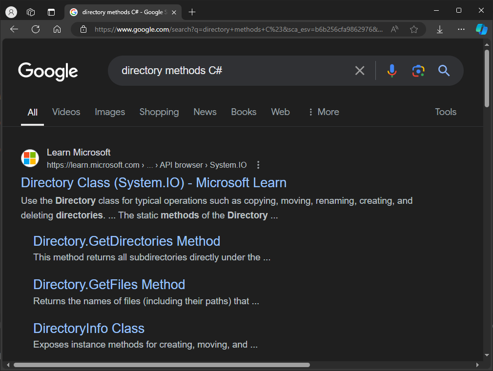

# Метода Main, класа Program и именски простори

У претходној лекцији креирао си *Console App* пројекат, где је *Visual Studio*
сâм написао статичку методу `Main()` без повратног типа, односно типа `void`,
чији је једини параметар низ стрингова `args`. Метода `Main()` налази се у
класи `Program`, која се налази у именском простору (енгл. *namespace*) који
носи назив твог пројекта. Класа `Program` у *Console App (.NET Framework)*
пројектима је класа из које почиње извршавање програма, а метода `Main()` у
класи `Program` представља улазну тачку твоје апликације. Изнад, у заглављу,
иницијално је додато пет именских простора `System`,
`System.Collections.Generic`, `System.Linq`, `System.Text` и
`System.Threading.Tasks`:

```cs
using System;
using System.Collections.Generic;
using System.Linq;
using System.Text;
using System.Threading.Tasks;

namespace MojProjekat
{
    internal class Program
    {
        static void Main(string[] args)
        {
        }
    }
}
```

Као и у програмском језику C, метода `Main()` може бити типа `int`, али онда
мора да враћа целобројну вредност.

```cs
static int Main(string[] args)
{
    return 0;
}
```

Такође, метода `Main()` може да буде без повратног типа и без параметара...

```cs
static void Main()
{
}
```

...или целобројног типа без параметара:

```cs
static int Main()
{
    return 0;
}
```

Метода `Main()` има написан модификатор `static`, што значи да припада класи
`Program`, а не и објектима те класе. Пошто је метода `Main()` статичка, обично
је корисно да се и други чланови који користе методу `Main()` такође декларишу
као статички, што омогућава њихово коришћење без инстанцирања објекта класе
`Program`. Више о статичким члановима класе учићеш касније. Метода `Main()` је
имплицитно приватна (иако није наведен модификатор `private`), а може да је
учиниш јавном навођењем модификатора `public`. О приватним и јавним члановима
класа учио си у уводном поглављу, а много више ћеш учити у наредним лекцијама.

Како ћеш дефинисати методу `Main()` зависи од твојих потреба. Требаш се
запитати:

* Да ли апликација треба да враћа неку вредност оперативном систему? Ако не
треба, користи тип `void`, а ако треба, користи `int`.
* Да ли апликација треба да обрађује улазне параметре из конзоле које је навео
корисник? Ако треба, користи улазни параметар `string[] args`, а ако не треба,
немој да користиш параметре. Ако метода `Main()` прихвата аргументе, они се
могу користити за конфигурисање понашања апликације на основу уноса корисника
из конзоле.
* Да ли метода `Main()` треба да буде јавна? Ако треба, користи модификатор
приступа `public`, а ако не треба, немој да користиш модификатор приступа.

Класа `Program` је место где се поставља почетна логика програма. За "већу"
апликацију, препоручљиво је да се логика распореди у више класа и метода, а
да класа `Program` садржи само кôд за иницијализацију и покретање апликације.

Именски простори омогућавају да се кôд организује у логичке групе, што олакшава
проналажење и одржавање кода. Када различити делови кода имају исте називе
класа или других типова, именски простор омогућава да се ти називи раздвоје и
избегну конфликти.

У пројекту којег си направио, класа `Program` је део именског простора који
носи назив твог пројекта, а у заглављу су укључени именски простори из
*.NET Framework* библиотеке класа, односно из *BCL*-а. Укључени именски простори
на почетку су написани бледим фонтом, јер још увек ниси написао никакав кôд.

```cs
using System;                     // Блед фонт
using System.Collections.Generic; // Блед фонт
using System.Linq;                // Блед фонт
using System.Text;                // Блед фонт
using System.Threading.Tasks;     // Блед фонт

namespace MojaAplikacija
{
    internal class Program
    {
        static void Main(string[] args)
        {
            
        }
    }
}
```

И да их избришеш, програм би се компајлирао. Слично је било у програмском
језику C - могао си да компајлираш празан програм који има написану функцију
`main()` без икаквих заглавља.

Када почнеш да користиш методе из библиотеке класа, на пример методу за испис
текста у конзолу `WriteLine()`, из класе `Console`, која се налази у именском
простору `System`...

```cs
using System;                     // Фонт више није блед!
using System.Collections.Generic; // Блед фонт
using System.Linq;                // Блед фонт
using System.Text;                // Блед фонт
using System.Threading.Tasks;     // Блед фонт

namespace MojaAplikacija
{
    internal class Program
    {
        static void Main(string[] args)
        {
            Console.WriteLine("Hello, World!");
        }
    }
}
```

...фонт којим је исписано `using System;` више није блед. То значи да можеш да
обришеш све остале укључене именске просторе...

```cs
using System;

namespace MojaAplikacija
{
    internal class Program
    {
        static void Main(string[] args)
        {
            Console.WriteLine("Hello, World!");
        }
    }
}
```

...и да ће се програм успешно компајлирати.

Логично је питање: "Како да знам у ком именском простору се налази класа која
садржи потребну методу или неког другог члана класе?" Именски простори
*.NET Framework* библиотеке класа су организовани по "областима". На пример,
ако развијаш апликацију која треба да шаље и прима податке преко мреже, онда ће
ти вероватно требати класе из именског простора `System.Net`, или ако развијаш
апликацију у којој треба да имплементираш неке безбедносне процедуре попут
криптографског шифровања и дешифровања, онда ће ти вероватно требати класе из
именског простора `System.Security` или `System.Security.Cryptography` итд.

Број именских простора и класа у *.NET Framework* библиотеци је огроман, па
нема смисла ни покушати да се све представе на једном месту попут овог. Због
тога треба увек да користиш званичну документацију и опцију за претрагу.
Приступ сајту на којем се чува документација је бесплатан, не захтева креирање
налога, нити пријављивање и лако се користи.

На пример, ако је задатак да напишеш кôд којим се манипулише директоријумима на
диску, јасно је да је термин за претрагу `Directory`. Покрени интернет
прегледач и отвори сајт [learn.microsoft.com](https://learn.microsoft.com/), па
одабери `Product documentation`, па `.NET`. У дну кликни на `.NET API browser`.
Одабери .NET верзију коју користиш (нпр. *.NET Framework 4.8*) и у пољу за
претрагу унеси термин за претрагу `Directory`:



Видећеш да су прва четири резултата именски простори за рад са активним
директоријумом, што те не занима, али су већ пети и шести резултат претраге...

* `System.IO.Directory` Class, Exposes static methods for creating, moving, and
enumerating through directories and subdirectories.
* `System.IO.DirectoryInfo` Class, Exposes instance methods for creating,
moving, and enumerating through directories and subdirectories.

...класе у којима можеш пронаћи све неопходно за рад са директоријумима:



Ако укуцаш у неки претраживач, нпр. Google, кључне речи `directory methods C#`,
добићеш резултат претраге који ће те одвести до исте странице:



Зашто је добро да се навикнеш на коришћење званичне документације? Званична
документација је редовно ажурирана и одражава најновије промене и побољшања у
*.NET* екосистему. Ово је посебно важно јер *.NET* технологија континуирано
еволуира. Садржај на званичном сајту је креиран и прегледан од стране стручњака
из компаније *Microsoft*, што значи да су информације тачне и поуздане.
Документација често садржи детаљне примере кода, упутства и сценарије коришћења
који помажу програмерима да боље разумеју како да примене одређене функције и
библиотеке у својим пројектима. Коришћење званичне документације помаже у
одржавању конзистентности у учењу и примени стандарда у коду, што је важно за
тимски рад и развој већих пројеката.
