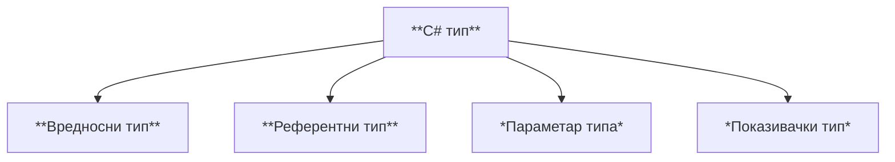
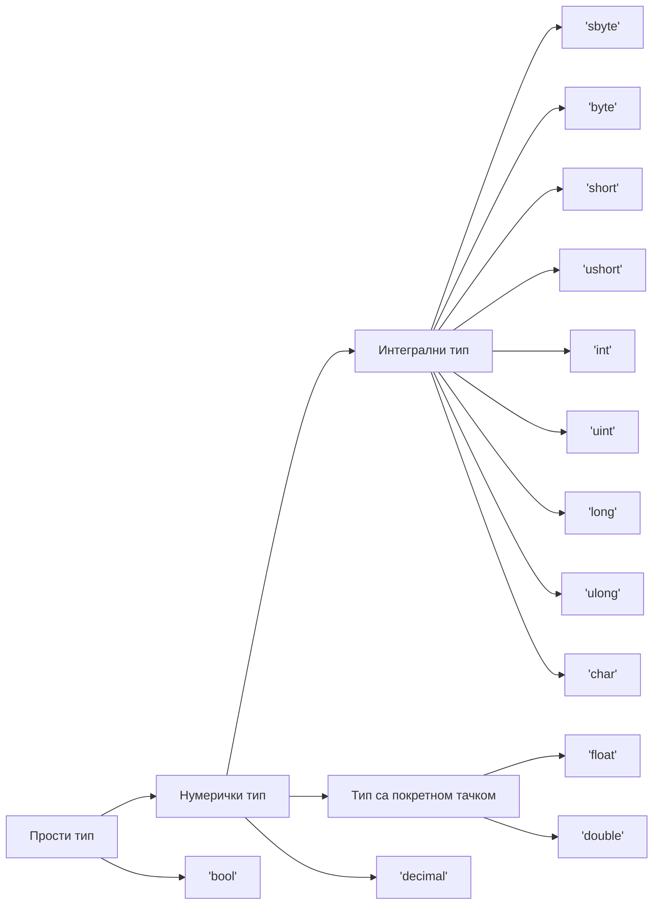

# Вредносни типови података

## C# типови података

Програмски језик C# поседује више уграђених типова података који се могу
поделити на **вредносне** и **референтне** типове. Променљива вредносног типа
садржи инстанцу тог типа. Променљива референтног типа садржи референцу на
инстанцу тог типа. Вредносни и референтни типови могу бити генерички са једним
или више параметара типа. Подржан је и показивачки тип (у небезбедном коду) и
њега у овом курсу нећеш користити.



## Вредносни типови

Вредносни типови могу се поделити на оне који **не могу да имају вредност
`null`** (енгл. *non nullable*) и оне који **могу да имају вредност `null`**
(енгл. *nullable*). Ако је `T` вредносни тип, онда вредносни типови који могу
да имају вредност `null` могу бити било који вредносни тип записан као `T?`.
На пример:

```cs
int x = 10;
int? y = null;
```

Вредносни типови који не могу да имају вредност `null` могу бити структурни или
енумерацијски. **Структурни типови** могу бити структуре (`struct`), прости
типови или типови торке (енгл. *tuple*). **Енумерацијски тип** може бити само
типа енумерације (`enum`).

Хијерархија простих типова приказана је следећим дијаграмом:



У овој лекцији фокус ће бити на простим вредносним типовима. Са осталим
типовима упознаћеш се у наредној лекцији и касније, током III и IV разреда,
по потреби.

## Логички тип

У програмском језику C логичку вредност "нетачно" представљао си нулом, а
логичку вредност "тачно" бројем различитим од нуле - обично јединицом. Логички
тип података дефинисан је тек у верзији C99 у заглављу `stdbool.h` и њега ниси
до сада користио.

Логички тип података `bool` у програмском језику C# је један од основних
уграђених типова. Вредности, односно литерали логичког типа `bool` могу бити
`true` (тачно) или `false` (нетачно). Ови литерали обично представљају
резултате операција са логичким операторима, операторима поређења или
релационим операторима. Њих ћеш и даље често користити у контролним изразима
наредби `if`, `do`, `while` и `for` или у условном оператору `?:`.

Литералима `true` и `false` можеш да иницијализујеш променљиву `bool` типа...

```cs
bool x = true;
Console.WriteLine(x ? "Da" : "Ne"); // Da
bool y = false;
Console.WriteLine(y ? "Da" : "Ne"); // Ne
```

...или да проследиш `bool` вредност:

```cs
Console.WriteLine(true ? "Da" : "Ne");  // Da
Console.WriteLine(false ? "Da" : "Ne"); // Ne
```

## Интегрални типови

У програмском језику C, целобројне вредности представљао си типом `int` са или
без модификатора `signed`, `unsigned`, `short` и `long`. У програмском језику
C# нема таквих модификатора. Означене и неозначене вредности у различитим
опсезима представљају се типовима из следеће табеле:

| Тип      | $[bit]$   | Опсег                                                        |
|----------|-----------|--------------------------------------------------------------|
| `sbyte`  | 8         | $-128\ldots 127$                                             |
| `byte`   | 8         | $0\ldots 255$                                                |
| `short`  | 16        | $-32768\ldots 32767$                                         |
| `ushort` | 16        | $0\ldots 65535$                                              |
| `int`    | 32        | $-2147483648\ldots 2147483647$                               |
| `uint`   | 32        | $0\ldots 4294967295$                                         |
| `long`   | 64        | $-9223372036854775808\ldots 9223372036854775807$             |
| `ulong`  | 64        | $0\ldots 18446744073709551615$                               |
| `nint`   | 32 или 64 | вредност зависи од платформе                                 |
| `nuint`  | 32 или 64 | вредност зависи од платформе                                 |

И даље ћеш за представљање целобројних вредности у задацима најчешће користити
тип `int`, тј. означене 32-битне целобројне променљиве и константе.

Целобројни литерали могу се задавати у декадном, хексадекадном и бинарном
бројевном систему. На пример, целобројни литерал `123` у декадном систему може
се записати као `0x7B` у хексадекадном, односно као  `0b_0111_1011` у бинарном
бројевном систему. Карактер `_` назива се сепаратор цифара (енгл.
*digit separator*). Може се користити у било ком бројевном систему и не утиче
на вредност литерала.

Тип целобројног литерала одређује се по следећим правилима:

* Ако литерал нема суфикс, онда је првог типа од наведених типова чијим опсегом
вредности може да се представи: `int`, `uint`, `long` или `ulong`.
* Ако литерал има суфикс `U` или `u`, онда је првог типа од наведених типова
чијим опсегом вредности може да се представи: `uint` или `ulong`.
* Ако литерал има суфикс `L` или `l`, онда је првог типа од наведених типова
чијим опсегом вредности може да се представи: `long` или `ulong`.
* Ако литерал има суфикс `UL`, `Ul`, `uL`, `ul`, `LU`, `Lu`, `lU` или `lu`,
онда је типа `ulong`.

У програмском језику C знаковним типом `char` представљао си карактере кодиране
ASCII кодом. Знаковне вредности, означене или неозначене, чувале су се у
меморијским локацијама величине једног бајта, односно 8 бита. Због ограниченог
броја карактера дефинисаних ASCII кодом, користио си само карактере енглеског
алфабета.

Знаковним типом `char` у програмском језику C# представљају се 16-битни Unicode
UTF-16 карактери, од `U+0000` до `U+FFFF`. То значи да сада можеш користити и
латиничне или ћириличне карактере српске азбуке. Подразумевана вредност `char`
типа је `\0`, односно карактер `U+0000`.

Иако у програмском језику C# типови `char` и типови `short` или `ushort`
међусобно "личе", практично се знатно разликују. Операције над операндима типа
`char` могу да дају различите резултате у односу на операције над операндима
типа `short` или `ushort`. Тип `char` подржава операторе поређења, релационе
операторе и инкремент и декремент операторе. Примена аритметичких или битских
оператора над операндима типа `char` резултоваће вредностима типа `int`.

Вредност типа `char` можеш навести као:

* знаковни литерал (нпр. `'j'`),
* Unicode прелазну секвенцу (нпр. `'\u006A'`) која се састоји од секвенце `\u`
након које следе четири хексадекадне цифре које представљају кôд карактера,
* хексадекадну прелазну секвенцу (нпр. `'\x006A'`) која се састоји од секвенце
`\x` након које следе четири хексадекадне цифре које представљају кôд
карактера, или
* кастовањем вредности кода карактера (нпр. `(char)106`).

Unicode табелу можеш пронаћи на веб-сајту
[wikipedia.org](https://en.wikipedia.org/wiki/List_of_Unicode_characters)
или многим другим веб-сајтовима. Табела са специфичним латиничним и ћириличним
карактерима српске азбуке
[дата је у прилогу](../07/unicode_karakteri.md).

Секвенце знаковних вредности најчешће ћеш користити за формирање стрингова.

## Типови са покретном тачком и тип decimal

Реалне бројеве, односно бројеве са покретном тачком у програмском језику C
представљао си типовима `float`, `double` или `long double`. Слично, у
програмском језику C# можеш користити следеће типове:

| Тип       | $[B]$ | Опсег                                               | Прецизност    |
|-----------|-------|-----------------------------------------------------|---------------|
| `float`   | 4 B   | $±1.5\times{10^{−45}}\ldots ±3.4\times{10^{38}}$    | ~6-9 цифара   |
| `double`  | 8 B   | $±5.0\times{10^{−324}}\ldots ±1.7\times{10^{308}}$  | ~15-17 цифара |
| `decimal` | 16 B  | $±1.0\times{10^{-28}}\ldots ±7.9228\times{10^{28}}$ | ~28-29 цифара |

Вероватно се питаш зашто се у програмском језику C# тип `decimal` не сврстава у
типове са покретном тачком заједно са типовима `float` и `double`, већ се
наводи као посебан нумерички тип? Тип `decimal` се не сматра типом са покретном
тачком као `float` и `double` из неколико разлога:

* тип `decimal` је дизајниран да обезбеди високу прецизност за финансијске
прорачуне. Он користи фиксну тачку са 28 цифара после зареза. Ова прецизност је
неопходна за избегавање грешака заокруживања приликом рада са великим износима
новца;
* нуди прецизнију контролу над заокруживањем у односу на `float` и `double`,
што је важно за финансијске прорачуне где је неопходно да се осигура да се
сваки износ тачно забележи и обрачуна;
* компатибилан је са типом `decimal` у *SQL Server*-у, што олакшава размену
података између C# апликација и база података;
* има низ посебних операција које нису доступне `float` и `double` типовима,
као што су `Scale`, `Precision` и `Round`;
* обично се имплементира коришћењем хардверске подршке за фиксну тачку, што га
чини ефикаснијим од `float` и `double` типова за операције корисне за
манипулацију и форматирање децималних вредности.

Тип реалног литерала одређује се по следећим правилима:

* Ако литерал нема суфикс, или има суфикс `d` или `D`, онда је типа `double`.
* Ако литерал има суфикс `f` или `F`, онда је типа `float`.
* Ако литерал има суфикс `m` или `M`, онда је типа `decimal`.

Приликом записа реалних вредности можеш користити и научну нотацију, где уместо
реалног броја (нпр. `0.0000000012`) редом наводиш мантису, карактер `е` или `E`
и експонент (нпр. `1.2e-9` или `1.2E-9`).
