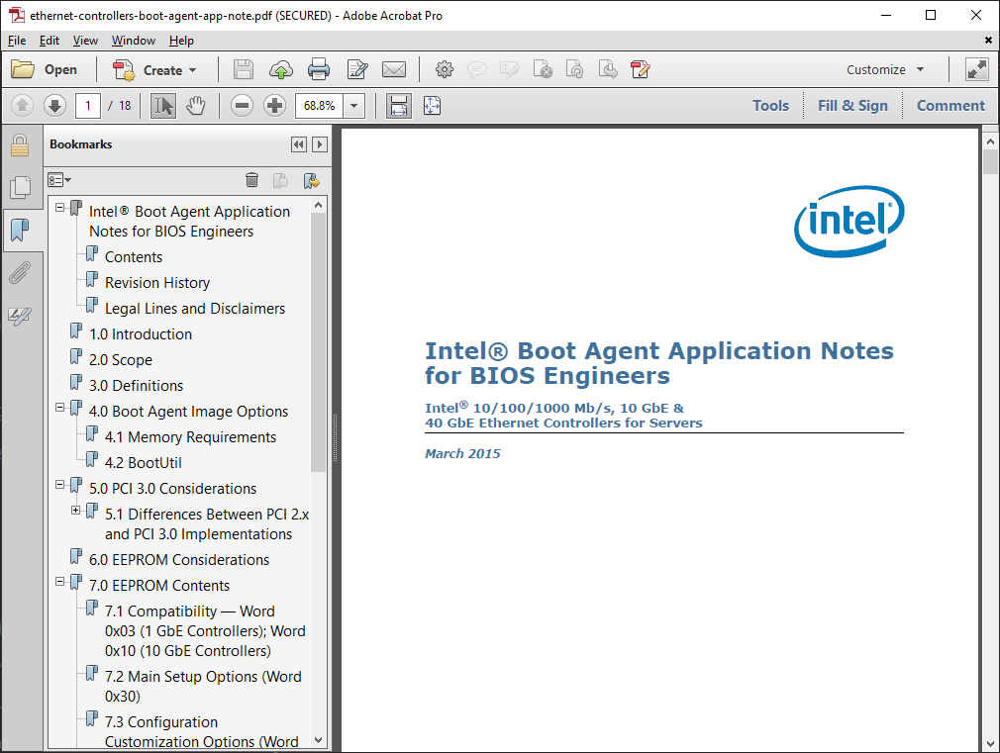
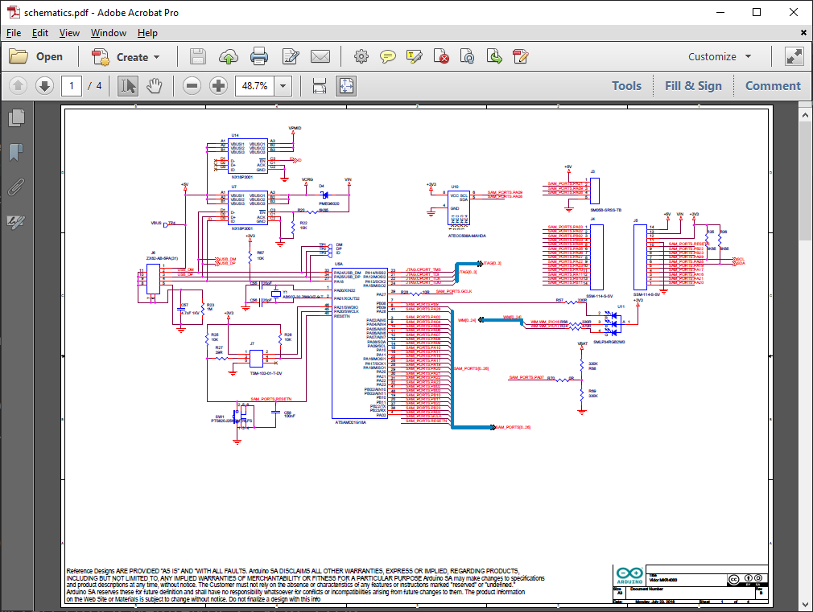
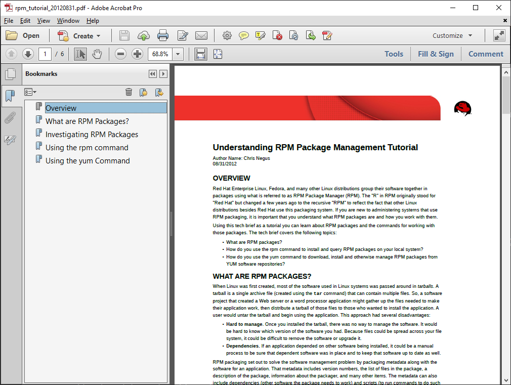
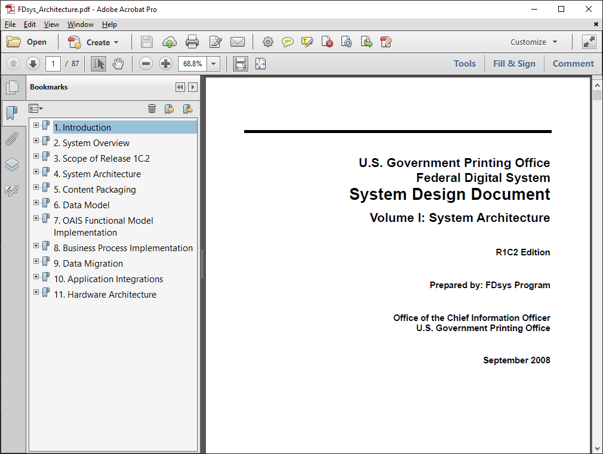

# Кориснички и пројектно оријентисана документација

У софтверском инжењерству и информационим технологијама, техничка документација
се може поделити на два основна типа:

1. **кориснички оријентисану документацију** (екстерна документација),
    * Бела књига (White Paper)
    * Технички лист (Datasheet)
    * Примене и напомене (Application Notes)
    * Туторијал (Tutorial)
    * Водич за брзи почетак (Quick Start Guide)
    * Упутство за корисника (User’s Guide)
    * Често постављана питања – FAQ (Frequently Asked Questions)
    * Исправке (Errata)
    * Технички референтни приручник (Technical Reference Manual)
    * Схеме (Schematics)
    * Упутство за сервисирање (Service Manual)
2. **пројектно оријентисану документацију** (интерна документација).
    * План пројекта (Project Plan / Project Charter)
    * План управљања ризицима (Risk Management Plan)
    * План издавања (Release Plan)
    * Спецификација захтева (Software Requirements Specification – SRS)
    * Документ о дизајну (Design Document)
    * Документација генерисана из изворног кода (Source Code Generated Documentation)
    * Спецификација тестирања (Test Specification)
    * Извештај о тестирању (Test Report)
    * Дневник измена (Change Log / Revision History)

Ова подела зависи од тога коме је документација намењена — крајњем кориснику
или члановима тима који развијају, тестирају или одржавају производ.

## Кориснички оријентисана документација

Корисничка документација има за циљ да помогне крајњим корисницима у
разумевању, инсталацији, коришћењу и одржавању софтверског производа или
хардверског уређаја. У ову категорију спадају:

### Бела књига (White Paper)

Документ који на високом нивоу објашњава концепт, технологију или производ.
Често се користи у маркетиншке и стратешке сврхе и намењен је доносиоцима
одлука.

### Технички лист (Datasheet)

Софтверски технички лист је документ који пружа техничке спецификације и друге
релевантне информације о софтверском производу. Он помаже корисницима да
разумеју могућности софтвера и омогућава доношење информисаних одлука у вези
са његовом куповином или интеграцијом.

### Упутство за корисника (User’s Guide)

Детаљан приручник који објашњава како се производ користи — укључујући
инсталацију, покретање и функције.

### Технички референтни приручник (Technical Reference Manual)

Дубља и детаљнија техничка документација намењена искуснијим корисницима или
програмерима, која описује архитектуру, интерфејсе, опције конфигурације и
друге напредне функције.

### Примене и напомене (Application Notes)

Кратки документи који показују како се производ може применити у конкретним
ситуацијама. Обично садрже примере, дијаграме и савете.

### Исправке (Errata)

Документ који садржи информације о познатим грешкама у производима или
документацији, као и упутства за њихово отклањање или заобилажење.

### Схеме (Schematics)

Технички цртежи или дијаграми који приказују структуру уређаја или система –
најчешће у хардверској документацији.

### Упутство за сервисирање (Service Manual)

Документација намењена техничарима и сервисерима која описује процедуре
поправке, тестирања и одржавања производа.

### Туторијал (Tutorial)

Кратак, често корак-по-корак водич који помаже корисницима да науче како да
користе одређене функције производа кроз практичан пример.

### Водич за брзи почетак (Quick Start Guide)

Кратко упутство намењено новим корисницима, које описује основне кораке
потребне за почетак рада са производом.

### Често постављана питања – FAQ (Frequently Asked Questions)

Документ који садржи одговоре на најчешћа питања корисника. Помаже у брзом
решавању уобичајених проблема и недоумица.

## Пројектно оријентисана документација

Ова документација је намењена члановима пројектног тима — развојним инжењерима,
дизајнерима, тестерима, менаџерима — и користи се унутар организације која
развија производ. Њена сврха је да осигура разумевање, организацију и праћење
пројекта.

### Спецификација захтева (Software Requirements Specification – SRS)

Документ који дефинише шта систем треба да ради. Укључује функционалне и
нефункционалне захтеве, ограничења, и услове пројекта.

### Документ о дизајну (Design Document)

Опис архитектуре и структура система, укључујући модуле, класе, интерфејсе,
алгоритме и односе међу компонентама.

### Спецификација тестирања (Test Specification)

План тестирања, укључујући тест сценарије, услове, улазне податке и очекиване
резултате, који ће омогућити проверу исправности система.

### Документација генерисана из изворног кода (Source Code Generated Documentation)

Аутоматски генерисани документациони фајлови на основу коментара у коду, нпр.
Doxygen (за C/C++), Javadoc (за Java), или XML документација (у C#). Служи
програмерима да боље разумеју интерфејсе и функционалност компоненти.

### План пројекта (Project Plan / Project Charter)

Документ који дефинише обим, циљеве, ресурсе, рокове и фазе пројекта. Користи
се за управљање пројектом.

### План управљања ризицима (Risk Management Plan)

Идентификује потенцијалне ризике у пројекту, њихову вероватноћу и утицај, као и
стратегије ублажавања.

### План издавања (Release Plan)

Дефинише шта ће бити укључено у свако издање софтвера, када ће бити објављено и
под којим условима.

### Извештај о тестирању (Test Report)

Документ који садржи резултате извршених тестова, мерења или анализа, и
представља доказ да производ испуњава техничке и функционалне захтеве.

### Дневник измена (Change Log / Revision History)

Праћење свих промена у коду, документацији или функционалности у току развоја и
одржавања производа. На пример...

| ID | Desctiption         | Requester   | Date Raised | Decision | Comment                 |
|----|---------------------|-------------|-------------|----------|-------------------------|
| 04 | ...                 | ...         | ...         | ...      | ...                     |
| 03 | Change login UI...  | Jennifer... | 03.09.2025. | Denied   | Schedule impact 1 week! |
| 02 | Add 2FA...          | Mary...     | 02.09.2025. | Pending  | Budget impact 5000$!!!  |
| 01 | Add Google login... | James...    | 01.09.2025. | Approved | No budget impact.       |

## Закључак

Познавање различитих врста документације је неопходно за рад у софтверском
инжењерству. Корисничка документација служи крајњим корисницима и мора бити
јасна и разумљива, док је пројектна документација намењена развојном тиму и
мора бити технички прецизна, логично организована и усклађена са захтевима и
стандардима.
