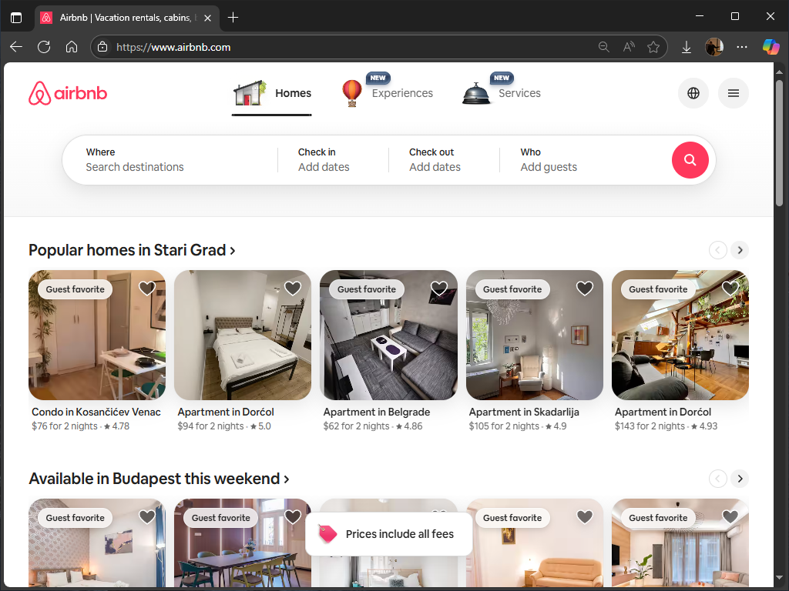
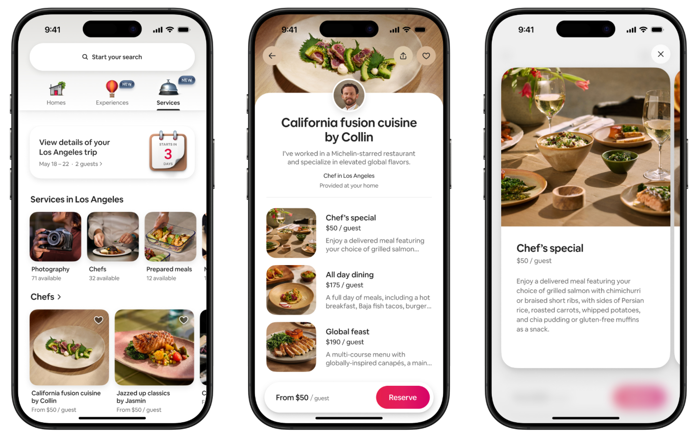
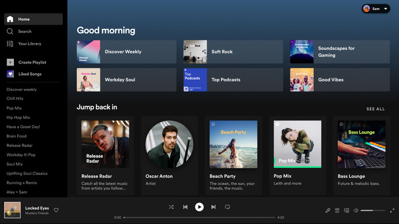
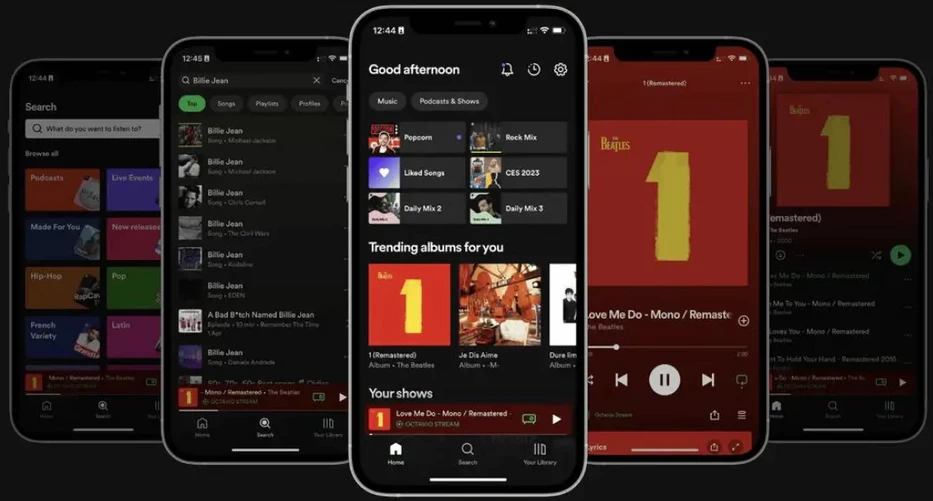
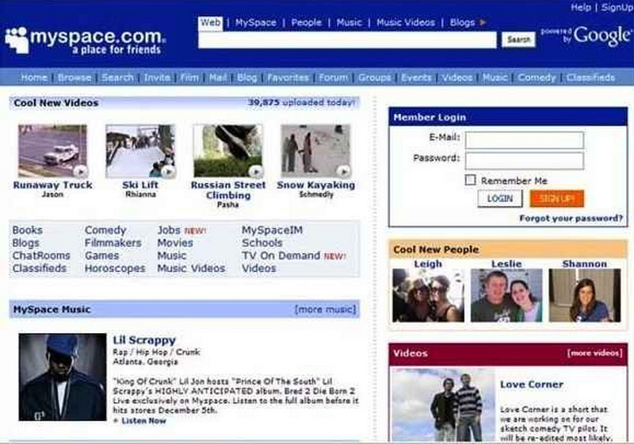
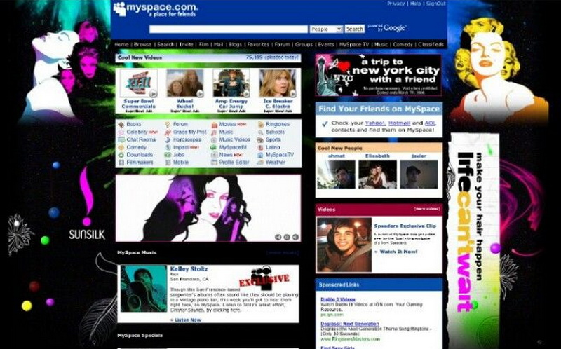

# Значај UI/UX дизајна у дигиталном свету

У свету у коме је дигитална технологија постала саставни део свакодневног
живота, корисници очекују да дигитални производи буду једноставни за употребу,
визуелно привлачни и функционални. Добар UI/UX дизајн је кључан за испуњавање
тих очекивања и има директан утицај на успех веб-сајта, мобилне апликације,
софтвера или било ког другог дигиталног производа.

UX дизајн одређује како се корисник осећа током интеракције са производом – да
ли је процес логичан, брз, једноставан или збуњујућ. UI дизајн утиче на то како
корисник види и контролише интерфејс – да ли је изглед пријатан, да ли су боје
усклађене и да ли су дугмад и менији лако доступни. На пример, ако апликација
за наручивање хране има леп изглед (добар UI), али је процес наручивања
збуњујући (лош UX), корисник ће вероватно одустати и прећи на другу апликацију.
Са друге стране, чак и ако је апликација савршено функционална (добар UX), њен
застарео или неуредан изглед (лош UI) може створити утисак непоузданости и
одбити кориснике пре него што јој уопште дају шансу.

## Како UI/UX дизајн утиче на успех производа?

## Стварање позитивног првог утиска

Први утисак је често визуелни. Истраживања показују да корисници у првих
неколико секунди формирају мишљење о дигиталном производу. Професионалан и
привлачан дизајн одмах ствара осећај кредибилитета и квалитета, док неуредан
изглед може трајно одбити корисника.

## Повећање задовољства и лојалности корисника

Једноставност и функционалност су кључне – корисници желе да што лакше и брже
постигну свој циљ. Добар дизајн смањује фрустрацију и повећава позитивне
емоције током употребе. Задовољан корисник ће се вероватније поново вратити,
остављати позитивне оцене и препоручивати производ другима. Тако се гради
лојалност.

На пример, корисници остају верни апликацијама као што је Gmail, делом
захваљујући добро осмишљеном и стално унапређиваном UI/UX дизајну који им
омогућава да ефикасно управљају својим имејловима.

## Стицање конкурентске предности

На препуном дигиталном тржишту, производ са интуитивнијим и пријатнијим
дизајном има огромну предност. Ако два производа нуде исту функционалност
по истој цени, корисници ће увек изабрати онај који је лакши и лепши за
коришћење.

На пример, веб апликација за продају карата која нуди лакше филтрирање по
датуму и цени имаће предност над конкуренцијом која нема ту функционалност,
иако обе нуде исте карте по истој цени.

## Успешан пример: Airbnb

Airbnb је успео да изгради поверење милиона људи у процесу изнајмљивања
смештаја од непознатих особа, великим делом захваљујући врхунском UI/UX
дизајну.

Кључне предности:

* **Чист и модеран интерфејс**: Користи пуно празнoг простора и квалитетне
фотографије које су у фокусу.
* **Логична навигација**: Процес претраге, филтрирања и резервације је
интуитиван и води корисника корак по корак.
* **Јасни позиви на акцију** (енгл. *Call to Action*): Дугмад попут "Резервиши"
или "Контактирај домаћина" су истакнута и јасна.
* **Интерактивна мапа**: Омогућава корисницима да визуелно истраже локацију
смештаја у односу на знаменитости.

Врхунски дизајн је кључан разлог зашто Airbnb има високу стопу повратка
корисника и ужива огромно поверење широм света.

## Успешан пример: Spotify

Spotify, апликација за стримовање музике, пружа изузетно корисничко искуство
које задржава кориснике сатима.

Кључне предности:

* **Персонализација**: Алгоритми за препоруку музике (нпр. плејлисте "Discover
Weekly") чине да се сваки корисник осећа посебно.
* **Једноставна навигација**: Лако је претраживати, креирати плејлисте и
управљати библиотеком песама.
* **Визуелна доследност**: Исти дизајн и функционалности на свим уређајима
(десктоп, мобилни, веб) стварају беспрекорно искуство.
* **Промишљен UI**: Тамна тема (dark mode) је идеална за дуготрајно слушање јер
смањује напрезање очију.

Захваљујући овим елементима, корисници не само да проводе пуно времена на
платформи, већ је и активно препоручују другима.

## Неуспешан пример: MySpace

MySpace је доминирао светом друштвених мрежа пре Facebook-а, али је постепено
изгубио кориснике, највише због лошег корисничког искуства.

Кључни проблеми:

* **Преоптерећен и хаотичан интерфејс**: Странице су биле претрпане
информацијама, што је отежавало сналажење.
* **Недоследан визуелни идентитет**: Корисницима је било дозвољено да драстично
мењају изглед својих профила (боје, позадине, музика), што је довело до
визуелног хаоса и неуједначеног искуства.
* **Тешка навигација**: Проналажење садржаја и пријатеља било је неинтуитивно.

Корисници су масовно прелазили на Facebook, који је у то време нудио знатно
чистије, једноставније и пријатније корисничко искуство.

## Неуспешан пример: Редизајн Snapchat-а

У 2018. години, Snapchat је објавио редизајн који је изазвао огромно
незадовољство корисника. Главна промена је била спајање приватних порука и
јавних објава пријатеља на један екран, док су објаве медијских кућа премештене
на други.

Последице:

* **Масовно незадовољство**: Преко 1,2 милиона људи потписало је петицију
тражећи да се врати стари дизајн.
* **Пад броја корисника**: По први пут у историји компаније, број дневних
активних корисника је почео да опада.
* **Финансијски губитак**: Вредност акција компаније Snap Inc. пала је више
милијарди долара.

Разлози за неуспех:

* **Игнорисање корисничких навика**: Редизајн је потпуно занемарио устаљене
обрасце које су корисници годинама развијали.
* **Недостатак тестирања**: Очигледно је да промене нису довољно тестиране са
стварним корисницима пре објаве.
* **Губитак контроле**: Корисници су се осећали фрустрирано јер им је
навигација постала збуњујућа и теже су проналазили садржај који их занима.

## Закључак

UI/UX дизајн нису само "улепшавања", већ стратешки алати који директно утичу на
то да ли ће дигитални производ успети или пропасти. Добар дизајн повећава
задовољство корисника, гради поверење и лојалност, и на крају, доноси пословни
успех. У наредној лекцији, упознаћеш се детаљније са основним принципима и
концептима који стоје иза успешног UI/UX дизајна.

## Задаци за проверу знања

**1. Анализа успешног примера**: Апликација Instagram

Анализирај мобилну апликацију Instagram, коју вероватно добро познајеш.
Размисли о њој из угла дизајнера.

<iframe width="800" height="430" src="https://www.youtube.com/embed/7wbnqYRz6jE?si=49UwamD6az1pdA8j" title="YouTube video player" frameborder="0" allow="accelerometer; autoplay; clipboard-write; encrypted-media; gyroscope; picture-in-picture; web-share" referrerpolicy="strict-origin-when-cross-origin" allowfullscreen></iframe>

Питања за анализу:

1. Први утисак и UI (Изглед):
    * Какав је визуелни изглед апликације када је први пут отвориш? Да ли
    делује модерно, чисто, претрпано?
    * Који елементи (боје, иконе, фонтови) доприносе том утиску?
2. Функционалност и UX (Искуство):
    * Колико је лако обавити најчешће радње (нпр. објавити слику, погледати
    причу, послати поруку)?
    * Да ли је навигација кроз главне делове апликације (Feed, Reels, Explore,
    Profile) интуитивна? Зашто?
3. Утицај на корисника и лојалност:
    * На који начин дизајн апликације утиче на то да се корисници стално враћају?
    (нпр. бесконачно скроловање, реакције на објаве, персонализовани садржај).
    * Како се осећаш док користиш апликацију? Да ли је искуство пријатно или
    фрустрирајуће?
4. Повезаност са успехом:
    * Како добар UI/UX дизајн помаже Instagram-у да задржи милијарде корисника и
    буде успешнији од многих конкурентских апликација?

**2. Анализа неуспешног примера**: Пронађи веб сајт који је, по твом мишљењу,
пример лошег UI/UX дизајна. То може да буде сајт који има застарео дизајн, ружне
боје и комбинације фонтова, веб технологије које вишу нису подржане, навигацију
која је непрегледна и/или нелогична, дизајн који није прилагођен за приказ на
паметним телефонима и таблетима итд.

Покушај да одговориш на следећа питања:

1. Први утисак и UI (Изглед):
    * Какав осећај овај визуелни изглед ствара код тебе као посетиоца? Да ли ти
    улива поверење?
    * Који су највећи проблеми у визуелном дизајну?
2. Функционалност и UX (Искуство):
    * Опиши пут корисника који покушава да пронађе информације на сајту. Које су
    главне препреке и фрустрације на том путу?
    * Да ли је сајт функционалан? Да ли испуњава свој основни циљ?
3. Утицај на корисника и лојалност:
    * Како се осећаш након коришћења овог сајта?
    * Да користио овај сајт поново или би радије тражио алтернативу? Зашто?
4. Последице неуспеха:
    * Како лош UI/UX дизајн утиче на репутацију власника сајта?
    * На које начине овај сајт наноси штету пословању?

??? note "Тачни/очекивани одговори"

    Одабрао сам сајт аутобуске станице

    1.  **UI:** Сајт делује непрофесионално и непоуздано. Комбинација боја је
    напорна за очи и чини текст нечитким.
    2.  **UX:** Процес проналаска реда вожње је превише компликован и дуг.
    Немогућност куповине карте је огроман пропуст. Недостатак информација о
    ценама чини сајт бескорисним за планирање путовања.
    3.  **Утицај:** Корисник би се осећао фрустрирано, изгубљено и вероватно
    би одустао. Сигурно не би користио сајт поново и тражио би алтернативне
    начине за добијање информација.
    4.  **Последице:** Сајт нарушава репутацију аутобуске станице, која делује
    застарело и небрижно према својим путницима. Не постоји могућност онлајн
    продаје, чиме се повећавају трошкови за директну продају на шалтеру.

**3. Креативни изазов**: Предложи побољшања неуспешног примера!

На основу анализе лошег примера, укратко предложи два конкретна побољшања...

* једно UI побољшање и
* једно UX побољшање.

??? note "Тачни/очекивани одговори"

    1. **UI побољшање:** Увео би чисту, белу позадину са тамно сивим текстом
    и једном наглашеном бојом (нпр. плавом) за дугмад и линкове, како би сајт
    изгледао професионално и читко.
    2. **UX побољшање:** На почетну страницу би поставио велики и видљив
    претраживач реда вожње са пољима 'Полазак из', 'Долазак у' и 'Датум', како
    би корисник брзо могао да пронађе информације. Сигурно би имплементирао
    онлајн куповину карата након одабраног путовања.
