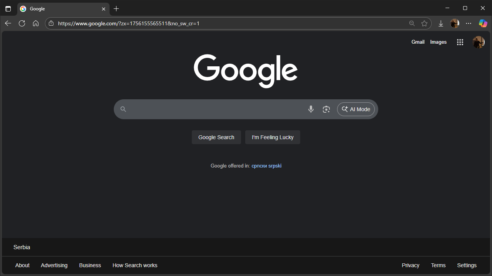
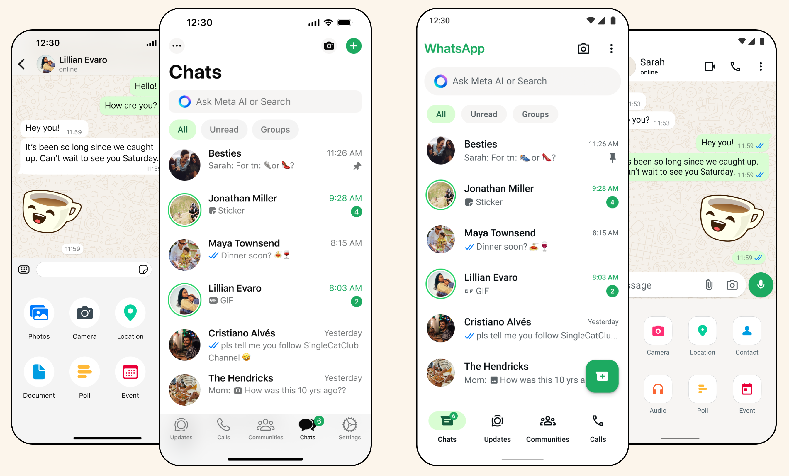
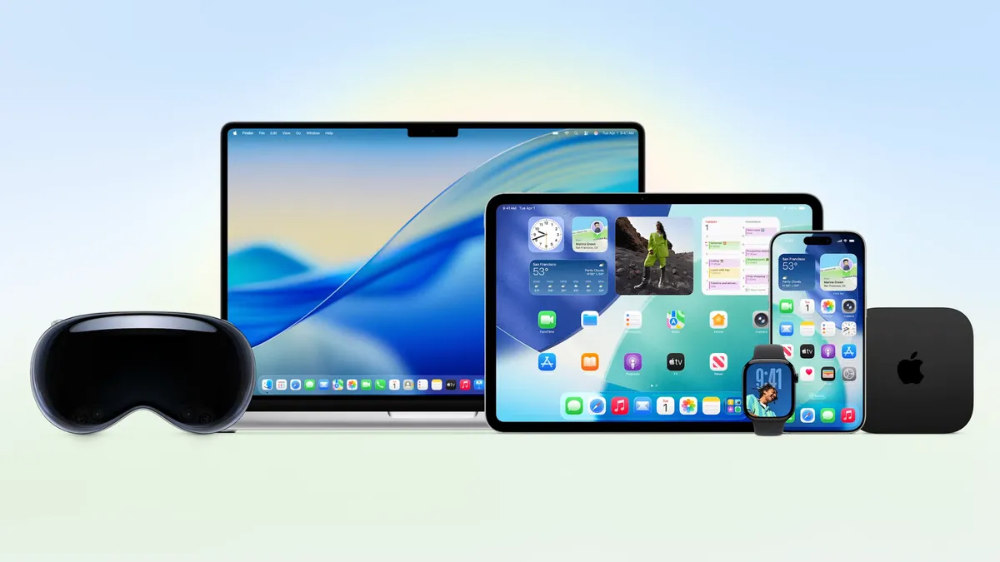
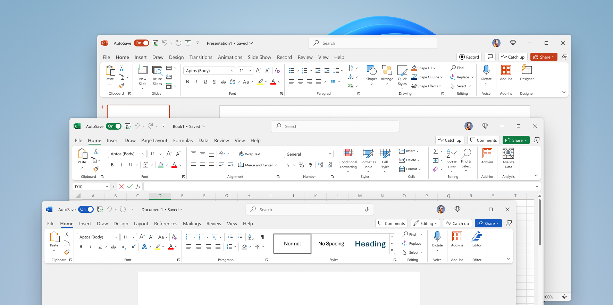
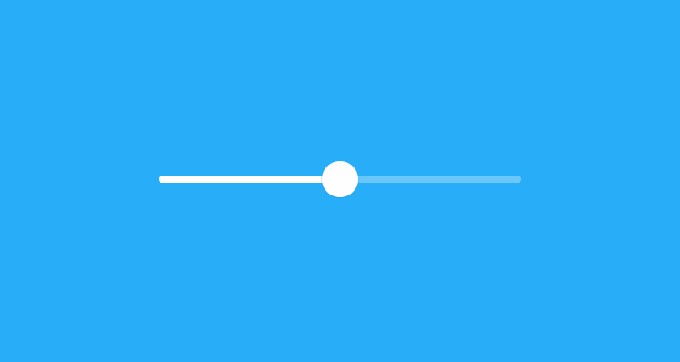
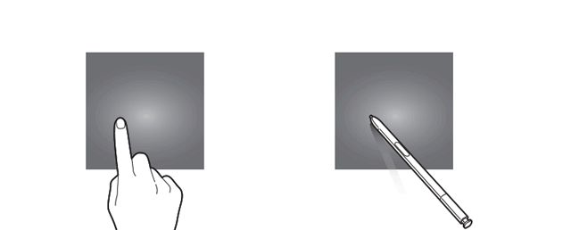
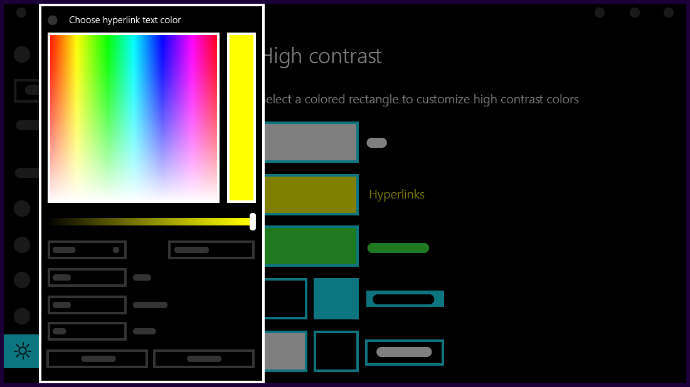

# Основни принципи и концепти UI/UX дизајна

У претходним лекцијама упознао си се са разликом између UI и UX дизајна, као и
са њиховим значајем у дигиталном свету. Сада је време да научиш кључне принципе
који стоје иза успешног дизајна дигиталних производа. Ови принципи представљају
темељ сваког доброг UI/UX дизајна и без обзира на технологију или врсту
производа, примена ових принципа ће увек довести до бољег корисничког искуства.

Замисли принципе UI/UX дизајна као правила саобраћаја – не постоје случајно,
већ су настали на основу дугогодишњег искуства и проучавања људског понашања.
Као што поштовање саобраћајних правила омогућава безбедну и ефикасну вožњу,
тако и поштовање принципа дизајна омогућава стварање производа који су лаки,
пријатни и ефикасни за коришћење.

## 1. Једноставност (Simplicity)

Принцип једноставности подразумева елиминисање свега што није неопходно и
фокусирање на суштину. Једноставан дизајн не значи сиромашан или досадан, већ
јасан, чист и фокусиран на оно што је заиста важно кориснику.

**Зашто је једноставност важна?** **Смањује когнитивно оптерећење** јер
корисник не мора да размишља о томе како да користи производ. **Убрзава учење**
јер нови корисници брже усвајају начин коришћeњa. **Смањује грешке** јер мање
елемената имплицира и мање места за грешке. **Побољшава фокус** јер се корисник
концентрише на главни циљ, а не на навигацију.

**Како постићи једноставност?** **Правило 80/20:** фокусирај се на 20%
функционалности које користи 80% корисника. **Прогресивно откривање:** прикажи
само оно што је тренутно потребно. **Белине:** користи празан простор да
"одмориш" корисникове очи. **Ограничи избор:** превише опција може збунити
корисника.

Примери једноставности су бројни. **Google претрага** је најпосећенији сајт на
свету и има минималистички дизајн са фокусом на једну главну функцију:



* Једно централно поље за претрагу
* Минимум текста и визуелних елемената
* Јасно обележена дугмад за акцију
* Фокус на главну функционалност

**WhatsApp**, упркос богатим функционалностима, има чист и једноставан
интерфејс:



* Јасна подела на ћаскања, позиве и статусе
* Минимална употреба боја и икона
* Интуитивне иконе за главне функције

> *Једноставност је врхунска софистицираност*
>
> Леонардо да Винчи

## 2. Доследност

Доследност значи да се исти елементи понашају на исти начин кроз цео производ.
Када корисник једном научи како нешто функционише, то знање треба да буде
применљиво свуда.

**Визуелна доследност** подразумева:

* исте боје за исте типове елемената,
* јединствену типографију кроз цео производ и
* доследну употребу икона и илустрација.

**Функционална доследност** подразумева:

* да се дугмад понашају исто где год се појаве,
* да навигација функционише на исти начин на свим страницама и
* да исте акције имају исте резултате.

**Језичка доследност** подразумева:

* јединствен тон и стил писања,
* доследну терминологију и
* исте називе за исте концепте.

Примери доследности у дизајну производа најбоље се уочавају у Apple екосистему,
јер ако си Научио да користиш iPhone, лако ћеш се сналазити на iPad-у или
Mac-у.



Још један пример доследности био би канцеларијски пакет Microsoft Office, у
којем се иста логика коришћења и распоред алатки провлачи кроз Word, Excel и
PowerPoint:



> *Consistency is one of the most powerful usability principles: when things
> always behave the same, users don't have to worry about what will happen.*
>
> Jakob Nielsen

## 3. Интуитивност

Интуитиван дизајн је такав да корисник инстинктивно зна како да га користи, без
инструкција или размишљања. Ослања се на устаљене конвенције и природне људске
рефлексе.

**Како постићи интуитивност?** **Користи познате шаблоне:** ослони се на оно
шта корисници већ знају. **Природни мапинг:** Повежи контроле са њиховим
ефектима на логичан начин. **Визуелни хинтови:** користи боје, облике и
величине да наговестиш функционалност. **Тренутна повратна информација:**
покажи резултат акције одмах.

Примери интуитивности могу бити корпа за отпатке тј. **Recycle bin** која
представља универзални концепт за брисање...

<figure markdown="span">
    { align=center }
</figure>

...**клизач за јачину звука** који визуелно представља концепт "више-мање"...

<figure markdown="span">
    { align=center, width="480" }
</figure>
...и **свајп гестови** који представљају природни покрет на екранима на додир:

<figure markdown="span">
    { align=center, width="480" }
</figure>

> *Ease of use may be invisible, but its absence sure isn't.*
>
> Dribbble

## 4. Прилагођеност кориснику

Дизајн треба да буде креиран са корисником у центру пажње, а не на основу
претпоставки или личних преференција дизајнера. Кључни аспекти дизајна
прилагођеног кориснику су:

* **Познавање циљне групе**: Ко су корисници? Какве су им навике и потребе?
* **Контекст коришћења**: Где, када и зашто се производ користи?
* **Доступност**: Производ треба да буде користан за све, укључујући особе са инвалидитетом
* **Културне разлике**: Поштовање различитих култура и језика

Примери прилагођености кориснику

* **Instagram Stories** - Прилагођено навикама младих да деле тренутне моменте:
* **Spotify персонализација** - Алгоритми који се прилагођавају музичком укусу:

> *People ignore design that ignores people.*
>
> Frank Chimero

## 5. Приступачност

Добар дизајн мора бити доступан свима, укључујући особе са различитим врстама
инвалидитета или ограничења. Основни принципи приступачности су:

* **Видљивост**: Довољан контраст боја, читљиви фонтови
* **Чујност**: Алтернативи за аудио садржај
* **Моторика**: Могућност коришћења без миша или прецизних покрета
* **Когниција**: Јасан и разумљив садржај

Примери приступачности

**Висок контраст боја** за особе са проблемима вида:



**Alt текстови** за слике које читачи екрана могу да прочитају:

```html

```

> *Accessibility is all about removing barriers and providing the benefits of
> technology for everyone.*
>
> Steve Ballmer

## 6. Хијерархија и организација

Добра визуелна хијерархија води корисникове очи кроз садржај логичним
редоследом и истиче најважније елементе. Технике за стварање добре хијерархије
подразумевају исправно коришћење:

* **величина** - већи елементи привлаче више пажње,
* **боја** - контрасти истичу важне елементе,
* **тајпфејса** - различите величине и тежине фонтова,
* **позиција** - горњи део екрана се прво уочава и
* **белина** - празан простор око важних елемената.

> *Visual hierarchy controls the delivery of the experience.*
>
> The Interaction Design Foundation

## Вежба 1: Анализа принципа у пракси

Отвори веб-сајт или мобилну апликацију коју често користиш и анализирај је кроз
призму принципа које си управо научио. **Изабери производ** - то може бити
Instagram, YouTube, Gmail, Netflix или било која друга платформа. **Попуни
табелу** оценивањем сваког принципа од 1-5:

| Принцип                 | Оцена | Објашњење | Предлог побољшања |
| ----------------------- | ----- | --------- | ----------------- |
| Једноставност           |       |           |                   |
| Доследност              |       |           |                   |
| Интуитивност            |       |           |                   |
| Прилагођеност кориснику |       |           |                   |
| Приступачност           |       |           |                   |
| Хијерархија             |       |           |                   |

Пример анализе мобилне апликација YouTube:

| Принцип                 | Оцена | Објашњење                              | Предлог побољшања            |
| ----------------------- | ----- | -------------------------------------- | ---------------------------- |
| Једноставност           | 4     | Јасне иконе и једноставна навигација   | Мање оптерећен почетни екран |
| Доследност              | 5     | Исти дизајн кроз целу апликацију       | Без примедби                 |
| Интуитивност            | 5     | Play дугме, like/dislike су јасни      | Без примедби                 |
| Прилагођеност кориснику | 5     | Персонализоване препоруке              | Без примедби                 |
| Приступачност           | 3     | Титлови постоје али нису увек доступни | Више опција за приступачност |
| Хијерархија             | 4     | Јасне категорије и важност видеа       | Боље истицање нових садржаја |

## Вежба 2: Редизајн лоших примера

Пронађи пример лошег дизајна (може бити стари веб-сајт, застарела апликација
или било који дигитални производ који се тешко користи).

**Идентификуј проблеме** - који принципи су нарушени? **Додели приоритете** -
који је највећи проблем? **Предложи решење** - како би "поправио" највећи
проблем? **Скицирај идеју** односно побољшану верзију на папиру или дигитално.

Пример редизајна застарелог веб-сајт локалне библиотеке:

* Превише текста без јасне хијерархије.
* Застарелe боје и типографија.
* Тешко је пронаћи информације о радном времену.

Решење:

* Додати јасне секције са иконама.
* Истакнути најважније информације (радно време, локацију, контакт).
* Користити модерније боје и фонтове.
* Додати претрагу књига.

## Вежба 3: Игра принципа

У групама од 3-4 ученика, **свака група бира једну од понуђених категорија:**

* Веб или мобилна апликација у вези превоза путника
* Веб или мобилна апликација у вези продаје робе
* Веб или мобилна апликација у вези образовања
* Веб или мобилна апликација у вези доставе

**За сваки принцип, групе наводе:**

* један добар пример у одабраној категорији,
* један лош пример у одабраној категорији и
* једну креативну идеју како да се побољша лош пример.

Свака група представља своје налазе (5 минута по групи)

## Вежба 4: UI/UX детектив

Постани детектив принципа дизајна! Твој задатак је да пронађеш и документујеш
примере добре и лоше примене принципа.

1. **За наредних 15 минута**, прегледај 3-5 различитих веб-сајтова или
апликација.
2. **Фотографиши или сними екран** примера где уочиш:
   * Изузетно добру примену неког принципа
   * Очигледно нарушавање неког принципа
3. **Направи "извештај детектива"** у овом формату:

ИЗВЕШТАЈ УИ/УКС ДЕТЕКТИВА

Случај #1: Одличан пример једноставности

* Локација: [назив сајта/апликације]
* Докази: [опис шта си видео]
* Разлог успеха: [зашто мислиш да је добар]

Случај #2: Кршење принципа доследности

* Локација: [назив сајта/апликације]
* Докази: [опис шта си видео]
* Предложена казна: [како би поправио]

## Питања за дискусију

1. **Која апликација или сајт те највише фрустрира** када је користиш? Зашто?
2. **Која апликација је толико добро дизајнирана** да заборавиш да је користиш?
3. **Да можеш да промениш једну ствар** на својој омиљеној апликацији, шта би то било?
4. **Који принцип сматраш најважнијим** и зашто?
5. **Да ли си приметио разлику** у навикама коришћења између старијих чланова породице и вршњака?

Када будеш дизајнирао или анализирао било који дигитални производ, постављај себи ова питања:

## Чек-листа принципа

**За сваки екран/страницу:**

☐ **Једноставност**: Да ли могу да уклоним нешто а да не утичем на функционалност?
☐ **Доследност**: Да ли се ови елементи понашају као слични елементи у другим деловима?
☐ **Интуитивност**: Би ли моја бака знала како да ово користи без објашњења?
☐ **Прилагођеност**: Да ли ово решава стварни проблем циљне групе?
☐ **Приступачност**: Може ли ово да користи неко са нарушеним видом/слухом?
☐ **Хијерархија**: Да ли је јасно шта је најважније на овом екрану?

## Закључак

Принципи UI/UX дизајна нису строга правила, већ водичи који помажу да створиш
боље корисничко искуство. Најважније је да разумеш логику иза сваког принципа и
да их прилагодиш специфичностима свог пројекта и корисника.

Запамти:

* **Једноставност** - мање је више
* **Доследност** - исто понашање свуда  
* **Интуитивност** - природно и очекивано
* **Прилагођеност** - фокус на кориснику
* **Приступачность** - за све кориснике
* **Хијерархија** - јасна организација

У наредним поглављима ћеш детаљно учити како да ове принципе примениш у пракси.

## Домаћи задатак: Недељни дизајн дневник

У наредних 7 дана, води дневник својих дигиталних искустава.

Формат дневника: може да изгледа овако:

**Дан 1 - [датум]**

* Највише времена сам провео на: [апликација/сајт]
* Најбоље искуство: [опис зашто]
* Најгоре искуство: [опис зашто]
* Принцип дана: [који принцип си најчешће уочио/нарушен]

До краја недеље ћеш развити "дизајнерско око" и почећеш аутоматски да уочаваш
добре и лоше примере дизајна око себе.
