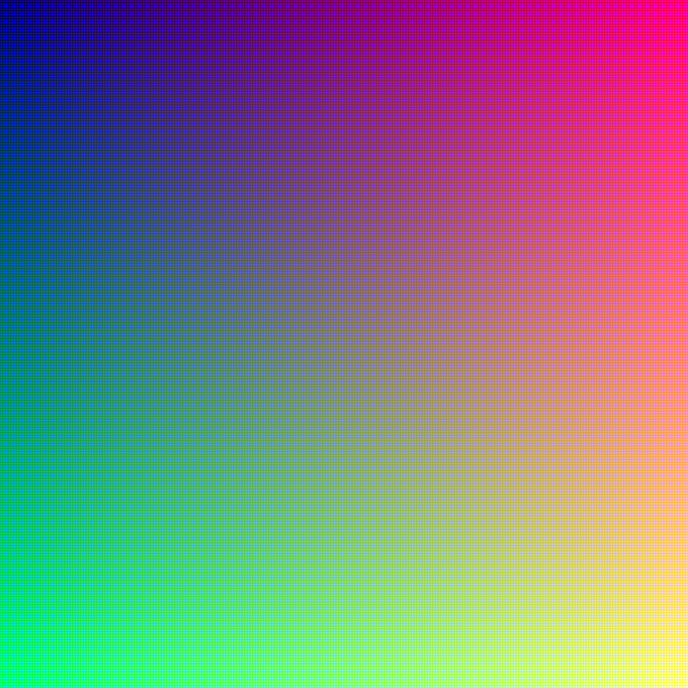
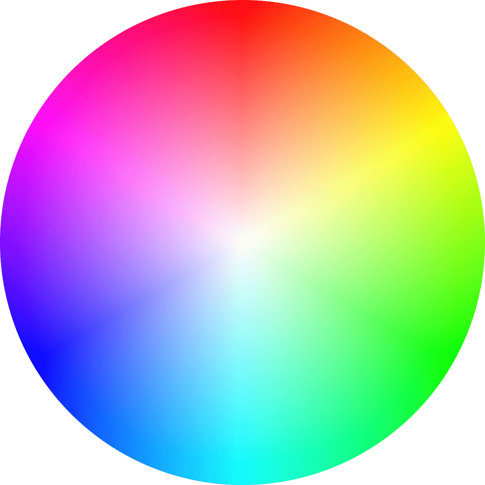

# Боје

Боје су један од најважнијих визуелних елемената у дизајну интерфејса. Оне не
утичу само на естетику интерфејса, већ имају и функционалну улогу - усмеравају
пажњу корисника, истичу важне елементе интерфејса, дефинишу хијерархију
садржаја, преносе емоционалну поруку бренда и граде његов идентитет. Да би
дизајнер умео да користи боје на прави начин, потребно је да разуме како боје
настају, како се комбинују и како се приказују на различитим уређајима.

У природи, боје настају као резултат мешања светлости различитих таласних
дужина. У уметности се традиционално говори о примарним бојама (црвеној, жутој
и плавој), из којих се мешањем добијају све остале боје. Мешањем две примарне
боје добијају се секундарне боје (наранџаста, зелена и љубичаста), а
комбинацијом примарних и секундарних добијају се терцијарне боје. Ова
класификација је корисна за разумевање основних принципа колорита, али у
UI дизајну примењују се други модели.

## Основни појмови о бојама

У рачунарским системима најважнији је **RGB модел** (*Red, Green, Blue*), који
се користи на екранима тј. мониторима и дисплејима мобилних уређаја. RGB модел
се заснива на адитивном мешању боја светлости. То значи да се боје добијају
додавањем светлости три основне компоненте: црвене, зелене и плаве. Када се све
три компоненте прикажу у пуној јачини, добија се бела боја, а када су све
искључене, приказује се црна.

У RGB моделу свака од три компоненте представља се једним бајтом, односно са 8
бита. Пошто једним бајтом може да се представи 256 различитих вредности (од 0
до 255), значи да црвена компонента има 256 могућих интензитета, зелена такође
256, и плава 256. Комбинацијом три компоненте, укупан број могућих боја износи
256 × 256 × 256 = 16.777.216 боја - више од 16 милиона боја! Зато се често каже
да је једна боја у RGB систему представљена са 24 бита (8 бита × 3 компоненте),
па се овај начин приказа назива 24-битна боја (*true color*).



Неке од основних RGB комбинација су:

* црна = (0, 0, 0)
* бела = (255, 255, 255)
* црвена = (255, 0, 0)
* зелена = (0, 255, 0)
* плава = (0, 0, 255)
* сива = (128, 128, 128)
* жута = (255, 255, 0)
* цијан (плавозелена) = (0, 255, 255)
* магента (ружичасто-љубичаста) = (255, 0, 255)

Ови примери показују да мешањем две примарне боје у RGB систему настају
секундарне боје, нпр. црвена + зелена = жута. Значи, у дигиталном окружењу
примарне боје су црвена, зелена и плава, а не црвена, жута и плава као у
традиционалном сликарству. Управо због тога што RGB модел одговара начину на
који светлост функционише, он је основа за све што видимо на екранима.

Некада се у дизајну или програмирању додаје и четврта компонента — алфа канал
(A), којом се одређује провидност боје. Тада свака боја има 4 бајта (по 8 бита
за R, G, B и A), па се оваква боја назива 32-битна боја.

У савременим апликацијама и веб дизајну често се користе и **HSL** (*Hue,
Saturation, Lightness*) и **HSV** (*Hue, Saturation, Value*) модели, јер
омогућавају интуитивније подешавање боја. Уместо да се ради са три нумеричке
вредности као у RGB систему, HSL модел омогућава да се подешава:

* *Hue* тј. нијанса која представља положај боје у кругу од 0° до 360°, где је
0° црвена, 120° зелена и 240° плава боја, а остале боје се налазе између ових
тачака,
* *Saturation* тј. засићеност која описује интензитет боје, од сиве 0%, до пуне
боје 100%,
* *Lightness* тј. осветљеност која означава колико је боја светла или тамна, од
црне 0%, преко нормалне боје 50% до беле 100%.



Поред RGB модела, у дизајну се користе и други модели боја. **CMYK** модел
(*Cyan, Magenta, Yellow, Key/Black*) користи се у штампи и заснива се на
субтрактивном мешању боја, где се светлост одузима (апсорбује) од беле
позадине. За разлику од RGB-а који почиње од црне и додаје светлост, CMYK
почиње од беле и одузима боје да би се добиле тамније нијансе. Зато је RGB
модел погодан за екране, а CMYK за материјале који се штампају.

## Навођење боја

У UI дизајну боје можеш наводити на више начина. Нпр. у веб дизајну боје можеш
наводити по **називу** тј. по CSS типу података `<named-color>`, где постоји 16
стандардних боја и још око додатних 150 назива. На пример:

```css
body {
    background-color: lightblue;
}
h1 {
    color: navy;
}
p {
    color: darkred;
}
```

Стандардне `<named-color>` вредности су:

<table>
    <tr>
        <td style="background: black; text-align: center;"><code>black</code></td>
        <td style="background: maroon; text-align: center;"><code>maroon</code></td>
        <td style="background: green; text-align: center;"><code>green</code></td>
        <td style="background: navy; text-align: center;"><code>navy</code></td>
    </tr>
    <tr>
        <td style="background: silver; text-align: center;"><code>silver</code></td>
        <td style="background: red; text-align: center;"><code>red</code></td>
        <td style="background: lime; text-align: center;"><code>lime</code></td>
        <td style="background: blue; text-align: center;"><code>blue</code></td>
    </tr>
    <tr>
        <td style="background: gray; text-align: center;"><code>gray</code></td>
        <td style="background: purple; text-align: center;"><code>purple</code></td>
        <td style="background: olive; text-align: center;"><code>olive</code></td>
        <td style="background: teal; text-align: center;"><code>teal</code></td>
    </tr>
    <tr>
        <td style="background: white; text-align: center;"><code>white</code></td>
        <td style="background: fuchsia; text-align: center;"><code>fuchsia</code></td>
        <td style="background: yellow; text-align: center;"><code>yellow</code></td>
        <td style="background: aqua; text-align: center;"><code>aqua</code></td>
    </tr>
</table>

Додатне `<named-color>` вредности су:

<table>
    <tr>
        <td style="text-align: center; background: aliceblue"><code>aliceblue</code></td>
        <td style="text-align: center; background: antiquewhite"><code>antiquewhite</code></td>
        <td style="text-align: center; background: aquamarine"><code>aquamarine</code></td>
        <td style="text-align: center; background: azure"><code>azure</code></td>
    </tr>
    <tr>
        <td style="text-align: center; background: beige"><code>beige</code></td>
        <td style="text-align: center; background: bisque"><code>bisque</code></td>
        <td style="text-align: center; background: blanchedalmond"><code>blanchedalmond</code></td>
        <td style="text-align: center; background: blueviolet"><code>blueviolet</code></td>
    </tr>
    <tr>
        <td style="text-align: center; background: brown"><code>brown</code></td>
        <td style="text-align: center; background: burlywood"><code>burlywood</code></td>
        <td style="text-align: center; background: cadetblue"><code>cadetblue</code></td>
        <td style="text-align: center; background: chartreuse"><code>chartreuse</code></td>
    </tr>
    <tr>
        <td style="text-align: center; background: chocolate"><code>chocolate</code></td>
        <td style="text-align: center; background: coral"><code>coral</code></td>
        <td style="text-align: center; background: cornflowerblue"><code>cornflowerblue</code></td>
        <td style="text-align: center; background: cornsilk"><code>cornsilk</code></td>
    </tr>
    <tr>
        <td style="text-align: center; background: crimson"><code>crimson</code></td>
        <td style="text-align: center; background: cyan"><code>cyan</code></td>
        <td style="text-align: center; background: darkblue"><code>darkblue</code></td>
        <td style="text-align: center; background: darkcyan"><code>darkcyan</code></td>
    </tr>
    <tr>
        <td style="text-align: center; background: darkgoldenrod"><code>darkgoldenrod</code></td>
        <td style="text-align: center; background: darkgray"><code>darkgray</code></td>
        <td style="text-align: center; background: darkgreen"><code>darkgreen</code></td>
        <td style="text-align: center; background: darkgrey"><code>darkgrey</code></td>
    </tr>
    <tr>
        <td style="text-align: center; background: darkkhaki"><code>darkkhaki</code></td>
        <td style="text-align: center; background: darkmagenta"><code>darkmagenta</code></td>
        <td style="text-align: center; background: darkolivegreen"><code>darkolivegreen</code></td>
        <td style="text-align: center; background: darkorange"><code>darkorange</code></td>
    </tr>
    <tr>
        <td style="text-align: center; background: darkorchid"><code>darkorchid</code></td>
        <td style="text-align: center; background: darkred"><code>darkred</code></td>
        <td style="text-align: center; background: darksalmon"><code>darksalmon</code></td>
        <td style="text-align: center; background: darkseagreen"><code>darkseagreen</code></td>
    </tr>
    <tr>
        <td style="text-align: center; background: darkslateblue"><code>darkslateblue</code></td>
        <td style="text-align: center; background: darkslategray"><code>darkslategray</code></td>
        <td style="text-align: center; background: darkslategrey"><code>darkslategrey</code></td>
        <td style="text-align: center; background: darkturquoise"><code>darkturquoise</code></td>
    </tr>
    <tr>
        <td style="text-align: center; background: darkviolet"><code>darkviolet</code></td>
        <td style="text-align: center; background: deeppink"><code>deeppink</code></td>
        <td style="text-align: center; background: deepskyblue"><code>deepskyblue</code></td>
        <td style="text-align: center; background: dimgray"><code>dimgray</code></td>
    </tr>
    <tr>
        <td style="text-align: center; background: dimgrey"><code>dimgrey</code></td>
        <td style="text-align: center; background: dodgerblue"><code>dodgerblue</code></td>
        <td style="text-align: center; background: firebrick"><code>firebrick</code></td>
        <td style="text-align: center; background: floralwhite"><code>floralwhite</code></td>
    </tr>
    <tr>
        <td style="text-align: center; background: forestgreen"><code>forestgreen</code></td>
        <td style="text-align: center; background: gainsboro"><code>gainsboro</code></td>
        <td style="text-align: center; background: ghostwhite"><code>ghostwhite</code></td>
        <td style="text-align: center; background: gold"><code>gold</code></td>
    </tr>
    <tr>
        <td style="text-align: center; background: goldenrod"><code>goldenrod</code></td>
        <td style="text-align: center; background: gray"><code>gray</code></td>
        <td style="text-align: center; background: greenyellow"><code>greenyellow</code></td>
        <td style="text-align: center; background: grey"><code>grey</code></td>
    </tr>
    <tr>
        <td style="text-align: center; background: honeydew"><code>honeydew</code></td>
        <td style="text-align: center; background: hotpink"><code>hotpink</code></td>
        <td style="text-align: center; background: indianred"><code>indianred</code></td>
        <td style="text-align: center; background: indigo"><code>indigo</code></td>
    </tr>
    <tr>
        <td style="text-align: center; background: ivory"><code>ivory</code></td>
        <td style="text-align: center; background: khaki"><code>khaki</code></td>
        <td style="text-align: center; background: lavender"><code>lavender</code></td>
        <td style="text-align: center; background: lavenderblush"><code>lavenderblush</code></td>
    </tr>
    <tr>
        <td style="text-align: center; background: lawngreen"><code>lawngreen</code></td>
        <td style="text-align: center; background: lemonchiffon"><code>lemonchiffon</code></td>
        <td style="text-align: center; background: lightblue"><code>lightblue</code></td>
        <td style="text-align: center; background: lightcoral"><code>lightcoral</code></td>
    </tr>
    <tr>
        <td style="text-align: center; background: lightcyan"><code>lightcyan</code></td>
        <td style="text-align: center; background: lightgoldenrodyellow"><code>lightgoldenrodyellow</code></td>
        <td style="text-align: center; background: lightgray"><code>lightgray</code></td>
        <td style="text-align: center; background: lightgreen"><code>lightgreen</code></td>
    </tr>
    <tr>
        <td style="text-align: center; background: lightgrey"><code>lightgrey</code></td>
        <td style="text-align: center; background: lightpink"><code>lightpink</code></td>
        <td style="text-align: center; background: lightsalmon"><code>lightsalmon</code></td>
        <td style="text-align: center; background: lightseagreen"><code>lightseagreen</code></td>
    </tr>
    <tr>
        <td style="text-align: center; background: lightskyblue"><code>lightskyblue</code></td>
        <td style="text-align: center; background: lightslategray"><code>lightslategray</code></td>
        <td style="text-align: center; background: lightslategrey"><code>lightslategrey</code></td>
        <td style="text-align: center; background: lightsteelblue"><code>lightsteelblue</code></td>
    </tr>
    <tr>
        <td style="text-align: center; background: lightyellow"><code>lightyellow</code></td>
        <td style="text-align: center; background: limegreen"><code>limegreen</code></td>
        <td style="text-align: center; background: linen"><code>linen</code></td>
        <td style="text-align: center; background: magenta"><code>magenta</code></td>
    </tr>
    <tr>
        <td style="text-align: center; background: mediumaquamarine"><code>mediumaquamarine</code></td>
        <td style="text-align: center; background: mediumblue"><code>mediumblue</code></td>
        <td style="text-align: center; background: mediumorchid"><code>mediumorchid</code></td>
        <td style="text-align: center; background: mediumpurple"><code>mediumpurple</code></td>
    </tr>
    <tr>
        <td style="text-align: center; background: mediumseagreen"><code>mediumseagreen</code></td>
        <td style="text-align: center; background: mediumslateblue"><code>mediumslateblue</code></td>
        <td style="text-align: center; background: mediumspringgreen"><code>mediumspringgreen</code></td>
        <td style="text-align: center; background: mediumturquoise"><code>mediumturquoise</code></td>
    </tr>
    <tr>
        <td style="text-align: center; background: mediumvioletred"><code>mediumvioletred</code></td>
        <td style="text-align: center; background: midnightblue"><code>midnightblue</code></td>
        <td style="text-align: center; background: mintcream"><code>mintcream</code></td>
        <td style="text-align: center; background: mistyrose"><code>mistyrose</code></td>
    </tr>
    <tr>
        <td style="text-align: center; background: moccasin"><code>moccasin</code></td>
        <td style="text-align: center; background: navajowhite"><code>navajowhite</code></td>
        <td style="text-align: center; background: oldlace"><code>oldlace</code></td>
        <td style="text-align: center; background: olivedrab"><code>olivedrab</code></td>
    </tr>
    <tr>
        <td style="text-align: center; background: orange"><code>orange</code></td>
        <td style="text-align: center; background: orangered"><code>orangered</code></td>
        <td style="text-align: center; background: orchid"><code>orchid</code></td>
        <td style="text-align: center; background: palegoldenrod"><code>palegoldenrod</code></td>
    </tr>
    <tr>
        <td style="text-align: center; background: palegreen"><code>palegreen</code></td>
        <td style="text-align: center; background: paleturquoise"><code>paleturquoise</code></td>
        <td style="text-align: center; background: palevioletred"><code>palevioletred</code></td>
        <td style="text-align: center; background: papayawhip"><code>papayawhip</code></td>
    </tr>
    <tr>
        <td style="text-align: center; background: peachpuff"><code>peachpuff</code></td>
        <td style="text-align: center; background: peru"><code>peru</code></td>
        <td style="text-align: center; background: pink"><code>pink</code></td>
        <td style="text-align: center; background: plum"><code>plum</code></td>
    </tr>
    <tr>
        <td style="text-align: center; background: powderblue"><code>powderblue</code></td>
        <td style="text-align: center; background: rebeccapurple"><code>rebeccapurple</code></td>
        <td style="text-align: center; background: rosybrown"><code>rosybrown</code></td>
        <td style="text-align: center; background: royalblue"><code>royalblue</code></td>
    </tr>
    <tr>
        <td style="text-align: center; background: saddlebrown"><code>saddlebrown</code></td>
        <td style="text-align: center; background: salmon"><code>salmon</code></td>
        <td style="text-align: center; background: sandybrown"><code>sandybrown</code></td>
        <td style="text-align: center; background: seagreen"><code>seagreen</code></td>
    </tr>
    <tr>
        <td style="text-align: center; background: seashell"><code>seashell</code></td>
        <td style="text-align: center; background: sienna"><code>sienna</code></td>
        <td style="text-align: center; background: skyblue"><code>skyblue</code></td>
        <td style="text-align: center; background: slateblue"><code>slateblue</code></td>
    </tr>
    <tr>
        <td style="text-align: center; background: slategray"><code>slategray</code></td>
        <td style="text-align: center; background: slategrey"><code>slategrey</code></td>
        <td style="text-align: center; background: snow"><code>snow</code></td>
        <td style="text-align: center; background: springgreen"><code>springgreen</code></td>
    </tr>
    <tr>
        <td style="text-align: center; background: steelblue"><code>steelblue</code></td>
        <td style="text-align: center; background: tan"><code>tan</code></td>
        <td style="text-align: center; background: thistle"><code>thistle</code></td>
        <td style="text-align: center; background: tomato"><code>tomato</code></td>
    </tr>
    <tr>
        <td style="text-align: center; background: transparent"><code>transparent</code></td>
        <td style="text-align: center; background: turquoise"><code>turquoise</code></td>
        <td style="text-align: center; background: violet"><code>violet</code></td>
        <td style="text-align: center; background: wheat"><code>wheat</code></td>
    </tr>
    <tr>
        <td style="text-align: center; background: whitesmoke"><code>whitesmoke</code></td>
        <td style="text-align: center; background: yellowgreen"><code>yellowgreen</code></td>
    </tr>
</table>

Неколико `<named-color>` су синоними:

* `aqua` и `cyan`,
* `fuchsia` и `magenta`,
* `darkgray` и `darkgrey`,
* `darkslategray` и `darkslategrey`,
* `dimgray` и `dimgrey`,
* `lightgray` и `lightgrey`,
* `lightslategray` и `lightslategrey`,
* `gray` и `grey`,
* `slategray` и `slategrey`.

Боје можеш наводити и **RGB декадним вредностима** функционалном нотацијом
`rgb()` којом се изражава боја у sRGB простору боја према њеним црвеним,
зеленим и плавим компонентама. Опционална алфа компонента представља
транспарентност боје. На пример:

```css
body {
    background-color: rgb(176, 216, 230);
}
h1 {
    color: rgb(0, 0, 128);
}
p {
    color: rgb(139, 0, 0);
}
```

...или **хексадекадним вредностима**...

```css
body {
    background-color: #add8e6;
}
h1 {
    color: #000080;
}
p {
    color: #8b0000;
}
```

...где прве две хексадекадне цифре представљају комбинација вредности за
црвену, следеће две за зелену и последње две за плаву компоненту.

Боје у CSS-у можеш наводити и функционалном нотацијом `hsl()` којом се изражава
боја у sRGB простору према њеним компонентама нијансе, засићености и
осветљености. Опционална алфа компонента представља транспарентност боје. На
пример:

```css
body {
    background-color: hsl(195, 53%, 79%);
}
h1 {
    color: hsl(240, 100%, 25%);
}
p {
    color: hsl(0, 100%, 27%);
}
```
