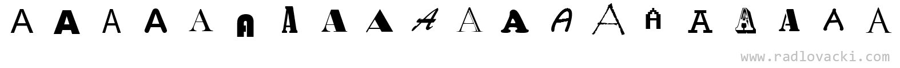
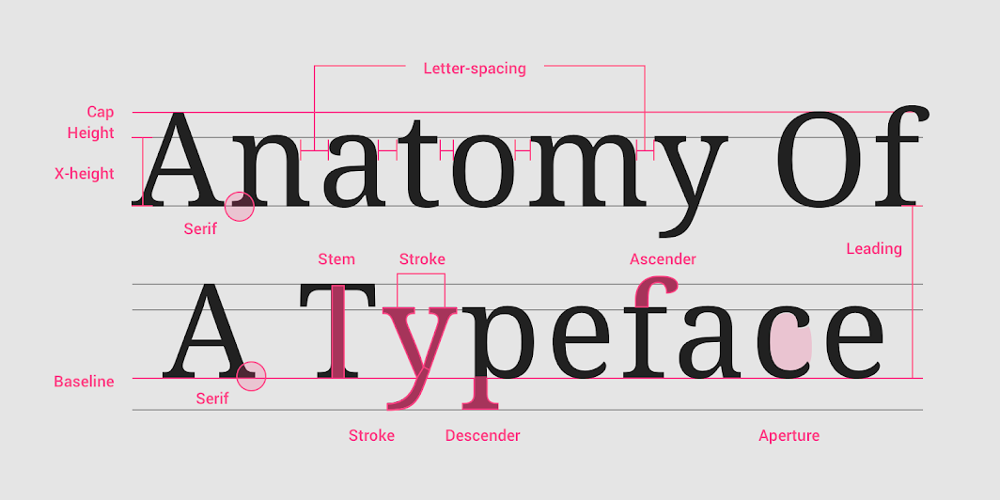
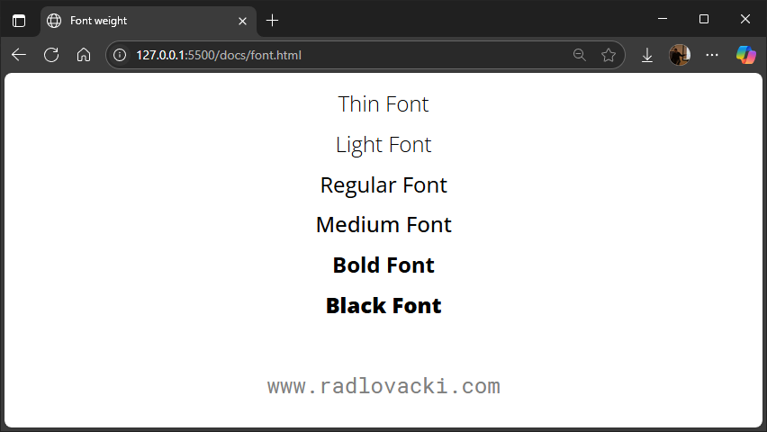
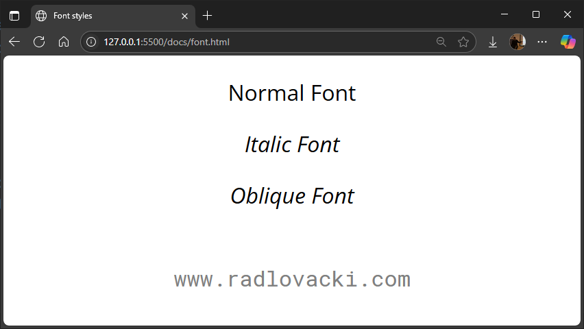
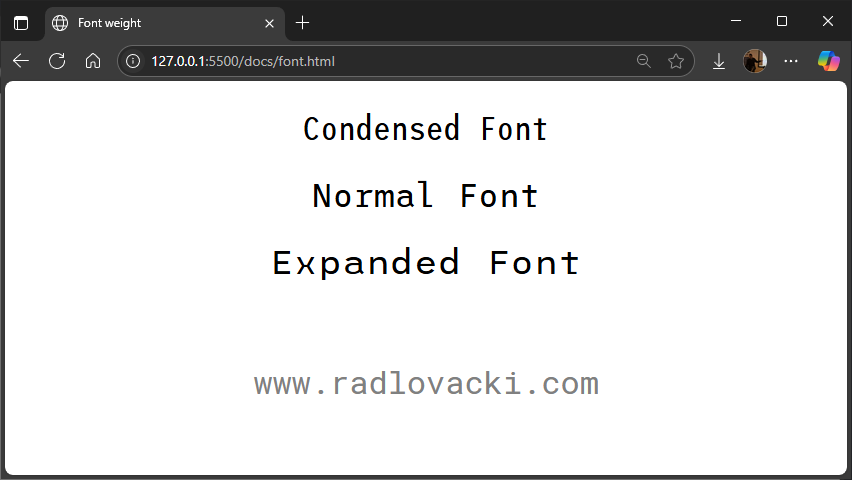
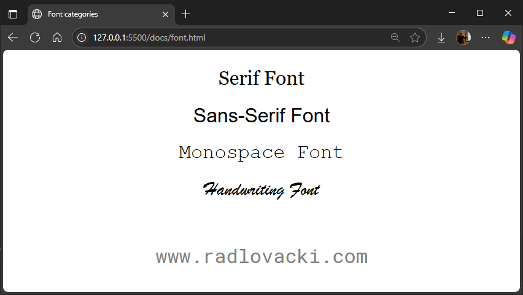

# Фонтови

## Основни појмови

Један **карактер** (енгл. *character*) представља основну јединицу писма једног
језика — то може бити слово, цифра, знак интерпункције, симбол и слично. **Скуп
карактера** (енгл. *character set*) је колекција свих карактера који се користе
за представљање текста у рачунарском систему. Сваком карактеру у скупу додељује
се нумеричка вредност (кôд). На пример:

* у ASCII скупу карактера додељују се 7-битне вредности,
* у UTF-8 скупу карактера додељују се вредности од 1 до 4 бајта итд.

Изглед текста у дигиталним производима највише зависи од визуелних особина
карактера, као што су облик, тежина, стил итд. **Глиф** (енгл. *glyph*) је
конкретна визуелна представа једног карактера са одређеним особинама. Један
карактер може имати више различитих глифова, у зависности од фонта који се
користи за његов приказ.

Сада морам да застанем и напоменем да су деценије коришћења канцеларијског
софтвера у којем се текст форматира одабиром ставки из менија "Font", довеле до
потпуне конфузије о основним појмовима типографије као што су тајпфејс,
типографска породица, фонтфејс и фонт. Ови појмови се сада често користе као
синоними, али имају потпуно различита значења.

**Тајпфејс** (енгл. *Typeface*) или типографски стил, представља основни дизајн
карактера, односно визуелни стил којим су карактери обликовани. Он дефинише
облик карактера, али не и конкретне варијације као што су тежина и стил.
Примери тајпфејса:

* **Arial**,
* **Times New Roman**,
* **Consolas** итд.

**Типографска породица** (енгл. *Type Family* или *Font Family*) представља
групу стилова и варијација једног тајпфејса. Ако је тајпфејс основни дизајн,
онда су сви његови стилови и тежине сматрају члановима исте типографске
породице. На пример, у **Arial** породици налазе се: **Arial Regular** (1),
**Arial Bold**, **Arial Bold Italic** и **Arial Italic**.
{ .annotate }

1. Постфикс Regular се често не наводи у називу основног стила тајпфејса -
подразумева се да је стил тајпфејса без наведеног постфикса Regular стил.
   { .annotate }

Свака од ових конкретних варијација представља један **фонтфејс** (енгл. *Font
Face*). На пример, **Arial Bold Italic** је један фонтфејс Arial тајпфејса.

**Фонт** (енгл. *Font*) је физичка датотека која садржи податке потребне за
приказивање једног фонтфејса.  На пример, фонтфејс **Arial Bold Italic**
имплементиран је у датотеци `arialbi.ttf`.

Да резимирамо све наведено на примеру тајпфејса **Times New Roman**. Он
обухвата четири фонтфејса: **Times New Roman Regular**, **Times New Roman
Bold**, **Times New Roman Bold Italic** и **Times New Roman Italic** који
заједно чине његову типографску породицу. Ови фонтфејси имплементирани су у
фонтовима: `Times.ttf`, `Timesbd.ttf`, `Timesbi.ttf` и `Timesi.ttf`.

## Карактеристике

Битне карактеристике приликом дизајна фонтова приказана су на следећој слици:

Када бираш фонт који ћеш користити у дигиталном производу, потребно је да
обратиш пажњу на његове визуелне и функционалне карактеристике. Оне утичу не
само на естетику текста, већ и на читљивост, прегледност и целокупан утисак
који интерфејс оставља на корисника.

**Тежина** (енгл. *Weight*) одређује дебљину линија од којих су глифови
сачињени. Уобичајено фонтови имају 4 или више тежина:

1. **Thin / Light** - танка,
2. **Normal (Regular)** - основна,
3. **Medium** - средња,
4. **Bold / Black** - дебела.

**Стил** (енгл. *Style*) фонта одређује нагиб и визуелни утисак глифова.
Уобичајени стилови су:

* **Normal (Roman)** – усправни карактери,
* **Italic** – искошени, курзивни изглед,
* **Oblique** – нагнути карактери који нису ручно дизајнирани као italic, већ
су "машински" накривљени.

**Ширина** (енгл. *Width / Stretch*) фонта одређује да ли фонт долази и у уским
или проширеним варијантама:

* **Condensed (Narrow)** – ужи изглед, штеди простор.
* **Standard** - нормалан изглед.
* **Expanded (Wide)** – шири изглед, може да нагласи значај.

**Висина** (енгл. *Size*) фонта означава величину глифова. Изражава се најчешће
у тачкама (енгл. *points* или *pt*) или пикселима (енгл. *pixels* или *px*).
Стварна физичка величина тачке варирала је кроз историју, али данас је једна
тачка еквивалентна $\frac{1}{72}$ инча у штампаном облику. Прегледачи немају
концепт физичке величине и, иако величина стварног пиксела варира, CSS дефинише
тачку као $1\frac{1}{3}$ пиксела.

## Формати

Формат фонта одређује како се фонт чува, учитава и користи у различитим
окружењима - оперативним системима, апликацијама, или веб прегледачима.
Различити формати фонтова развијани су у различито време и за различите сврхе.
Неки су прилагођени за рад у оперативним системима, док су други оптимизовани
за употребу на вебу.

Данас су у употреби следећи формати:

* **TrueType Font (TTF)**, садржи информације о облику глифова и њиховом начину
приказа и широко је подржан у свим оперативним системима и апликацијама. Чува
се у датотекама са екстензијом `.ttf`.
* **OpenType Font (OTF)**, заснива се на TrueType формату са напреднијим
типографским могућностима. Подржава велики број језика и писама. Чува се у
датотекама са екстензијом `.otf`.
* **Web Open Font Format (WOFF и WOFF2)**, развијен специјално за веб,
компресовани формати погодни за учитавање фонтова на веб страницама. брзо се
учитавају у савременим веб прегледачима. Нису погодни за "локално" коришћење.
Чувају се у датотекама са екстензијама `.woff` и `.woff2`.
* **Embedded OpenType (EOT)**, застарео формат за употребу у Internet
Explorer-у. Треба га избегавати.
* **Scalable Vector Graphics (SVG)**, користи се за приказ текста унутар
векторских цртежа. Чува се у датотекама са екстензијом `.svg`.

TTF и OTF фонтови се могу конвертовати у веб фонтове без губитака.

## Категоризација

Поред различитих формата датотека у којима се чувају, фонтови се деле и на
основу изгледа тајпфејса. Најчешћа је подела тајпфејса је на:

* **Серифне** (*Serif*) фонтове који имају серифе - мале украсе или линије на
крајевима карактера, као нпр. Times New Roman, Georgia и Garamond. Имају
формални, традиционални и класични изглед и добри су за штампане материјале и
дуже текстове.
* **Санс-серифне** (*Sans-serif*) фонтове који немају серифе, као нпр. Arial,
Calibri и Helvetica. Имају модеран и чист изглед, добру читљивост на екрану и
често се користе у дигиталним производима.

Поред серифних и санс-серифних фонтова истичу се:

* **Моноспејс** (*Monospace*) фонтови који имају све глифове исте ширине, као
нпр. Cascadia Mono, Consolas и Courier New. Корисни су за запис програмског
кода и у техничким апликацијама.
* **Скриптни** и **декоративни** фонтови који имитирају рукопис или имају
декоративни стил попут Comic Sans, Brush Script и Pacifico. Атрактивни су, али
су уједно тешко читљиви у дугим текстовима. Погодни су за наслове, логотипе и
друге кратке форме текстова.

