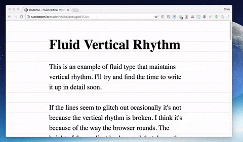

# Принципи коришћења фонтова

Фонтови имају кључну улогу у дизајну корисничког интерфејса. Они нису само
средство за приказ текста – они комуницирају емоцију, атмосферу, вредности
бренда и утичу на корисничко искуство. Прави избор фонта може учинити интерфејс
пријатнијим, јаснијим и лакшим за коришћење. У UI дизајну, фонт има три основне
улоге:

* **Обезбеђивање читљивости и разумљивости**: Најосновнија функција фонта је да
омогући лако читање текста. Добар фонт има довољан контраст у односу на
позадину, има јасне облике слова (без нејасних или сличних глифова) и омогућава
брзо уочавање информација (нпр. приликом читања наслова или менија).
* **Стварање хијерархије и структуре садржаја**: Различити фонтови, тежине,
величине и стилови користе се да би се направила визуелна хијерархија - односно
да би корисник брзо препознао шта је важно, шта је поднаслов, а шта је обичан
текст. На пример, велики bold фонт за наслове, italic за описе или напомене и
regular за основни садржај.
* **Преношење атмосфере и личности бренда**: Избор фонта може деловати да бренд
изгледа озбиљно или опуштено, модерно или традиционално, или технички или
емотивно.

> Најбољи фонт је онај који се не примећује — корисник треба да се фокусира на
> садржај приказан у интерфејсу, а не на облик карактера!

## Основни принципи одабира фонтова

**Читљивости и прегледности**. Избегавај "украсне" фонтове у дужем тексту. За
тело текста користи фонтове који добро изгледају у малим величинама. Води
рачуна да постоји довољан размак између глифова и између редова.

**Конзистентност**. Користи до 2 тајпфејса по интерфејсу. За хијерархију
користи различите варијације истог фонта, нпр. Regular, Bold, Italic итд.
Конзистентно користи величине: нпр. 32px за све наслове величине 1, 24px за све
наслове величине 2, 16px за текст итд. Примере упаривања фонтова од стране
искусних дизајнера можеш пронаћи на многим веб страницама:

* [Figma's 39 impressive font pairings to elevate your designs](https://www.figma.com/resource-library/font-pairings/)
* [Canva's ultimate guide to font combinations](https://www.canva.com/learn/the-ultimate-guide-to-font-pairing/)
* [Top 50 Google Font Pairings [Handpicked by Pro Designers]](https://www.pagecloud.com/blog/best-google-fonts-pairings)
* [fontpair.co](https://fontpair.co/)

**Подршка за више језика и писама**. Ако интерфејс треба да се приказује на
више језика, изабери фонт који подржава потребне алфабете (нпр. латиницу,
ћирилицу, грчко писмо, арапско писмо итд). Проверити да ли су сви глифови
естетски доследни у различитим писмима.

**Перформансе на вебу и мобилним уређајима**. Користи web-оптимизоване формате
фонтова (WOFF/WOFF2). Не користити велики број различитих фонтова јер могу да
успоре учитавање интерфејса. Размисли о коришћењу системских фонтова ако је
брзина учитавања критична. Рамисли и о дефинисању прилагодљиве величине
фонтова у односу на viewport.

**Контраст и приступачност**. Увек провери однос контраста текста и позадине.
Фонт треба да буде лако читљив и корисницима са слабим видом. Избегавај веома
светле или веома танке фонтове у дугим текстовима.
