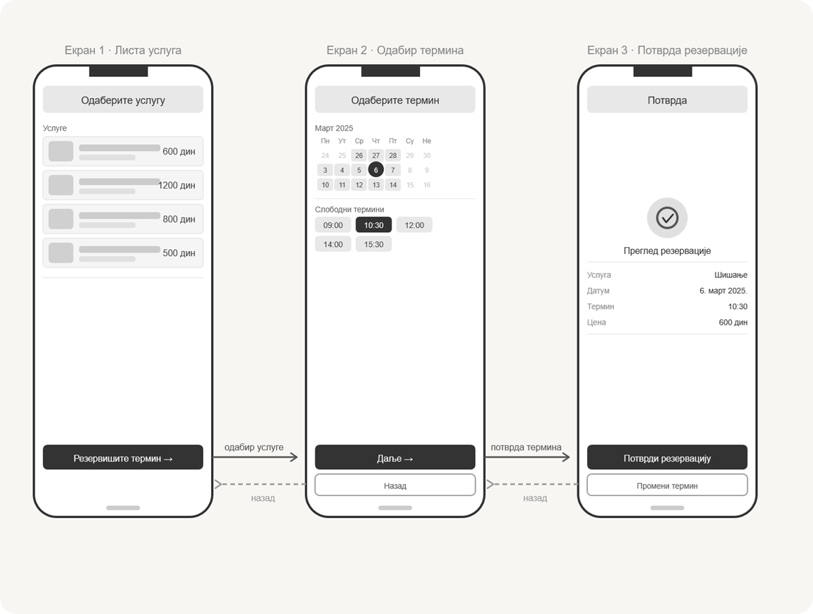

# Брзо прототипирање (вежба)

## Брзо прототипирање на папиру

**Дизајнира мобилну апликацију за резервацију термина у фризерском салону са
три екрана.**

* Узми 3 листа папира где ће сваки да представља један екран телефона
* Нацртај оквир телефона и попуни садржај (само контуре, без детаља)
* Екран 1: Почетни екран / листа услуга
* Екран 2: Детаљ термина / одабир термина
* Екран 3: Потврда резервације
* Стрелицама означи прелазе међу екранима

### Вршњачко оцењивање

Размени своју скицу са учеником који седи поред тебе. Дај му 2 позитивна
коментара и 1 предлог за побољшање.

## Израда Figma скелета интерфејса

Дигитализуј своју скицу као Figma wireframe. Користи само **нијансе сиве**
боје (#E0E0E0 за блокове, #333333 за текст).

* Креирај нови Figma пројекат, па додај 3 фрејма величине 390×844 (iPhone 14)
* Додај основне елементе: дугмад (Rectangle + Text), листе (Rectangle), иконе
(Circle, Star) итд.
* Повежи фрејмове стрелицама помоћу линија да покажеш пут корисника

## Могуће решење задатка

Скелет интерфејса могао би да изгледа овако:

Креирај нови дизајн, па у горњем левом углу кликни на назив фајла и преименуј
га у `Frizerski salon Wireframe`.

## Израда брзог Figma прототипа

### Корак 1 - креирање фрејмова

Један фрејм у Figma представљаће један екран телефона.

* У левом toolbar-у изабери алат Frame (F)
* У десном панелу, под Frame presets, изабери iPhone 14 - димензије 390×844
* Понови поступак још два пута за укупно три фрејма
* У десном панелу под Fill постави белу боју позадине #FFFFFF свих фремова
* Распореди фрејмове хоризонтално са 80px размаком између њих
* Преименуј их у `Екран 1 — Листа услуга`, `Екран 2 — Одабир термина` и
`Екран 3 — Потврда`

### Корак 2 - креирање заглавља

На врху сваког екрана постави заглавља - пасивни елемент који информише
корисника на којем екрану се налази.

* Изабери алат Rectangle (R)
* Нацртај правоугаоник 390х56px, постављен на врх фрејма (X: 0, Y: 0)
* Постави Fill на #F5F5F5, а у десном панелу под Corner radius унесите 0
(нема заобљења јер се наслања на ивице)
* Изабери алат Text (T), кликни унутар правоугаоника и укуцај назив екрана
(`Одаберите услугу`, `Одаберите термин` и `Потврда`)
* У десном панелу подеси: Font size 16, Font weight Medium (500), Alignment
Center и боја #333333
* Центрирај текст унутар правоугаоника - изабери оба елемента и користи Align
horizontal center и Align vertical center у десном панелу

## Корак 3 - креирање листе услуга

Сваки ред листе услуга представља засебну групу елемената.

* Алатом Rectangle нацртај правоугаоник 358х64px, X: 16, Y: 80
* Fill: #F5F5F5, Border (Stroke): #DDDDDD, debljina 1px, Corner radius: 8px
* Унутар тог правоугаоника додај мањи правоугаоник 56×56px за иконицу,
Fill: #D0D0D0, Corner radius: 6px, позиција X: 8 (релативно унутар родитеља)
* Десно од иконице додај два placeholder блока за текст:
  * Горњи: Rectangle 160×12px, Fill: #CCCCCC — представља назив услуге
  * Доњи: Rectangle 100×10px, Fill: #E0E0E0 — представља опис
* Крајње десно додај Text елемент са ценом `600 дин`, font size 14, weight
Medium, боја #444444
* Изабери све елементе унутар реда, кликни десним тастером → Group selection
(Ctrl+G), па преименуј групу у `Услуга 1`

Сада можеш да дуплираш редове:

* Изаберите групу `Услуга 1`
* Притисните Ctrl+D три пута да би добио укупно четири реда
* Распореди их вертикално са размаком 8px између редова
* Измени цене у осталим редовима (`1200 дин`, `800 дин` и `500 дин`)

Можеш изабрати сва четири реда и користити Tidy up (иконицу у десном панелу) да
их аутоматски равномерно распоредиш.

### Корак 4 - креирање дугмади

Примарно дугме (тамно):

* Алатом Rectangle нацртај правоугаоник 358x52px
* Постави га при дну фрејма: X: 16, Y: 776
* Fill: #333333, Corner radius: 12px
* Додајте Text унутар дугмета `Резервишите термин →`, font size 16, weight
Medium, боја #FFFFFF, центриран
* Групиши правоугаоник и текст (Ctrl+G), преименуј га у `btnРезервиши`
* Креирај и примарну дугмад на другом и трећем екрану на исти начин.

Секундарно дугме (бело са ивицом) треба да креираш на другом и трећем екрану:

* Исти поступак, али Fill: #FFFFFF, Stroke: #999999, debljina 1px
* Боја текста: #555555
* Поставите одмах испод примарног дугмета са размаком 8px

### Корак 5 - креирање календара

* Алатом Text упиши месец и годину `Март 2026`
* Алатом Text упиши називе дана у недељи у једном реду `Пн Ут Ср Чт Пт Су Не`,
Font size 12, боја #888888
* За сваки датум нацртај Rectangle 40×40px, Fill: #E8E8E8, Corner radius: 4px
* На сваки правоугаоник постави Text са редним бројем дана у месецу, font size
13, боја #555555
* За одабрани датум (нпр. 6) промени правоугаоник у Ellipse (O), Fill: #333333,
боја текста #FFFFFF
* За недоступне датуме постави Text без позадине, боја #CCCCCC
* Распоредите датуме у мрежу 7 колона користећи Auto Layout (Shift+A)
horizontal gap 4px, vertical gap 4px

Испод, алатком Text упиши `Слободни термини`, а испод прикажи термине:

* Rectangle 72×28px, Fill: #E8E8E8, Corner radius: 6px
* Text унутар: `09:00`, font size 13, боја #444444
* За одабрани термин: Fill #333333, текст #FFFFFF
* Дуплирај и распореди у ред са Auto Layout, gap 8px

### Корак 6 - екран за потврду резервације

Кружна иконица:

* Алатом Ellipse (O) нацртај круг 60×60px, Fill: #E0E0E0
* Унутар круга нацртај мањи круг 28×28px, Fill: none, Stroke: #555555,
debljina 2px
* Алатом Pen (P) нацртај квачицу унутар мањег круга

Редови са информацијама:

* Алатом Text додај лабелу: `Услуга`, font size 13, боја #888888
* Десно поравнато додај `Шишање`, font size 14, weight Medium, боја #333333
* Групиши и дуплирај за сваки ред (`Датум`, `Термин`, `Цена`)
* Између група додај Line (L) ширине 358px, боја #E0E0E0, debljina 1px

### Корак 7 — повезивање екрана стрелицама

Ово је кључни корак за приказ корисничког тока. Стрелице напред (тамне, пуне):

* Изаберите алат Line (L) и нацртај линију која полази са десне ивице првог, у
висини дугмета `Резервишите термин →`, до леве ивице другог екрана
* У десном панелу: боја #555555, debljina 1.5px
* Под End point изабери стрелицу (Triangle) за крај линије
* Изнад линије додај Text `одабир услуге`, font size 12, боја #555555
* Понови за стрелицу између другог и трећег екрана, у висини дугмета `Даље →`

Стрелице назад (испрекидане, сиве):

* Алатом Line нацртај линију у супротном смеру, у висини дугмета `Назад`
* Боја #999999, debljina 1.5px
* У десном панелу под Stroke кликни на три тачкице и изабери Dash, вредност 4,
Gap 3
* Под Start point изабери стрелицу
* Испод линије додај Text `назад`, font size 12, боја #999999
* Понови и за другу стрелицу

### Завршно уређивање

Изнад сваког фрејма додај Text `Екран 1 · Листа услуга`, итд., font size 14,
боја #888888. Пређи у Presentation mode (`\` или дугме ▶ горе десно) да видиш
коначан изглед
