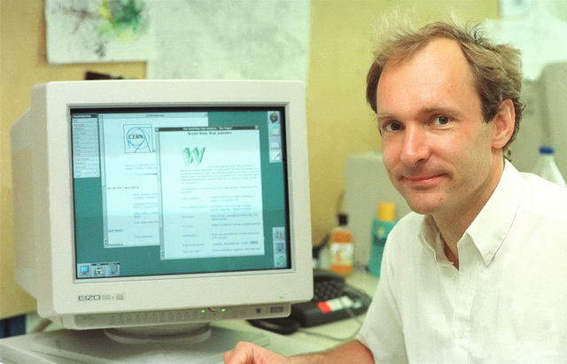
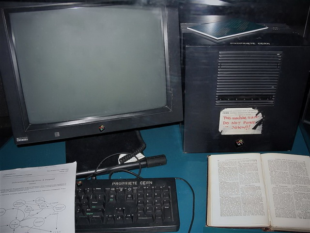

# Историјски развој Интернета и веба

## Развој Интернета

ARPANET (енгл. *Advanced Research Projects Agency Network*), рачунарска мрежа
америчког министарства одбране почела је са радом 29. октобра 1969. године.
Била је заснована на мрежном протоколу NCP (енгл. *Network Control Protocol*).
Седамдесетих година проширила се Северном Америком и Европом.

Јануара 1983. године NCP је замењен TCP/IP скупом протокола, а септембра 1984.
године ARPANET је подељен на војни и цивилни део мреже. Војни део мреже је
престао са радом почетком деведесетих година, а цивилни део постао је NSFNET
(енгл. *National Science Foundation Network*). NSFNET-у касније су се
придружиле и друге истраживачке и комерцијалне мреже, па је тај **скуп свих
повезаних мрежа** касније добио име Интернет (скраћено од *internetworking*).

Стандардизовати комуникацију између рачунара различитих произвођача, који имају
различиту мрежну опрему, на којима раде различити оперативни системи, у којима
се извршавају различите апликације је прилично сложен задатак. Овај задатак
решен је раздвајањем проблема у целине које се називају **слојеви**. Спајањем
слојева у једну целину добија се концептуална скица која дефинише како
комуникација треба да се одвија и на основу које се развијају мрежни протоколи.
Захваљујући слојевитој архитектури мрежних протокола различити системи могли су
да имплементирају TCP/IP скуп протокола и самим тим постану део Интернета. Више
о овоме учићеш у оквиру предмета *Рачунарске мреже и интернет сервиси* у трећем
разреду.

Деведесетих година почели су са радом и комерцијални Интернет сервис добављачи
(енгл. *ISP – Internet Service Providers*), који су корисницима омогућавали
приступ интернету путем јавне телефонске мреже. У почетку, корисницима
интернета били су доступни сервиси електронске поште, сервиса за размену
датотека и сервиса за даљинско управљање.

## Развој веба

Веб (енгл. *www - World Wide Web*) је изумео енглески програмер Тим Бернерс-Ли
(енгл. *Tim Berners-Lee*) у Швајцарској у Европској организацији за атомска
истраживања CERN.

Пројекат је започет 1989. године са циљем да олакша размену информација међу
научницима коришћењем хипертекст система. Пројекат је представљен 1990. године
у виду два програма:

* **веб-прегледача** WorldWideWeb, касније преименованог у Nexus и
* **веб-сервера** CERN httpd.

Тим је креирао систем међусобно повезаних хипертекстуалних докумената којима се
приступа помоћу веб прегледача, а које испоручује веб сервер. Сваки од тих
докумената могао је да садржи форматирани текст, линкове до других докумената,
табеле и слике. Звучи познато?

Овај изум широко је прихваћен широм света и убрзо је постао најзначајнији
и најкоришћенији сервис интернета **World Wide Web** скр. веб (енгл. **the
Web**). Веб је у свом најједноставнијем облику био систем међусобно повезаних
**веб страница**, где група веб страница на истом домену чини један **веб
сајт**. Садржаји на веб страницама били су статични, као листови књига или
часописа.

Како је веб растао, јавила се потреба за интерактивним и прилагодљивим
веб страницама. Увођењем програмских језика, као што су JavaScript на страни
клијента и PHP и ASP на страни сервера, омогућено је да се садржај веб странице
генерише, односно мења у складу са акцијама корисника. Ово је био почетак
динамичког веба популарно названог веб 2.0. Веб сајтови више нису били само
скупови докумената, већ су прерасли у интерактивне веб апликације.

Веб је имао, а и даље има, централну улогу у развоју информационог друштва и
примарни је алат који милијарде људи употребљава свакодневно на интернету. У
свом основном облику веб није имао много могућности за интеракцију – био је
само велика база информација са примитивним техникама за индексирање и
претраживање. Развојем програмских језика за веб програмирање, дошло је до
развоја веб апликација.

Веб апликације постале су незаобилазни део свакодневног приватног и пословног
живота људи. Користе се: за електронску пошту; за комуникацију порукама, гласом
или видеом; за имплементацију друштвених мрежа, портала, форума и веб сајтова;
за електронско и банкарско пословање; за пословање у организацијама,
администрацију и канцеларијске послове; за имплементацију сервиса јавне управе
итд. Тешко би било пронаћи неку људску делатност за коју не постоји веб
апликација, а још теже навести све делатности у којима се користе веб
апликације.

??? question "Заокружите тачне исказе. Интернет је:"

    1. **Интернет је светски систем умрежених рачунарских мрежа**
    2. Софтвер за преглед и приказ www страница се сматра Интернетом
    3. Подаци који „путују“ светском мрежом и скуп корисника заједно чине
    Интернет мрежу
    4. **Интернет чини њена хардверска компонента као и систем софтверских
    слојева који контролишу различите аспекте њене комуникационе
    инфраструктуре**
    
    (Питање 175. из Приручника за полагање матурског испита)
