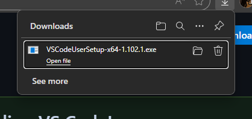

# Кôд едитори

## Кôд едитори vs. текст едитора

HTML документа су обичне текстуалне датотеке са екстензијом `.html`, па је
једноставан текст едитор (попут Notepad-а) све што ти је потребно за израду
HTML страница. Неко сматра да је коришћење једноставног текст едитора уједно и
најбоље решење за почетнике који тек уче HTML. Међутим, ја сматрам потпуно
супротно. Прилично је напорно користити текст едиторе за кодирање, било да је
реч о дескриптивном језику као што је HTML, или програмском језику као што је
C. Добро одабран кôд едитор је ултимативно оружје програмера. Кôд едитор није
само алат за писање кода већ алат који позитивно утиче на:

* ефикасност и продуктивност,
* квалитет кода и одржавања кода и
* креативност и иновације.

Повећање ефикасности и продуктивности подразумева:

* **Уштеду времена**: Модерни едитори нуде мноштво функција које штеде време,
као што су аутоматско довршавање кода, истицање синтаксе и фрагмената кода. Ове
функције значајно убрзавају развој.
* **Смањење грешака**: Провера грешака у реалном времену, отклањање грешака и
аутоматски предлози помажу ти да идентификујеш и решиш проблеме у самој фази
писања кода.
* **Побољшан ток рада**: Интеграција система за контролу верзија, гранање и
управљање имплементацијом значајно ће ти поједноставити задатак на којем радиш.

Побољшање квалитета кода и одржавања кода подразумева:

* **Доследно форматирање**: Аутоматизовано форматирање кода осигурава да твој
кôд буде чист и читљив. Чист и читљив кôд олакшава сарадњу и одржавање.
* **Рефакторисање кода**: Кôд едитори пружају алате за рефакторисање кода који
ти помажу да реструктурираш кôд без промене његових функција.
* **Сарадња**: Кôд едитори долазе са функцијама за сарадњу у реалном времену и
преглед кода.

Оснаживање креативности и иновација подразумева:

* **Проширивост**: Кôд едитори нуде додатке и екстензије који додају нове
функционалности. Тако можеш креирати прилагођено окружење које одговара твојим
специфичним потребама.
* **Брза израда прототипа**: Кôд едитори у себи поседују "живе" сервере, тако
да их не мораш покретати да би проверио да ли ти је кôд исправан.
**Учење и развој**: Кôд едитор су уједно и алат за учење, пружајући савете,
документацију и туторијале.

## Visual Studio Code

Без обзира да ли си потпуни почетник у веб развоју или програмер сениор који
развија изузетно комплексне веб апликације, овај кôд едитор ће вероватно бити
твој избор.

Visual Studio Code је са једне стране лаган, а са друге веома моћан кôд едитор
који је фаворит међу програмерима још од 2015. године. Развијен је као пројекат
отвореног кода у компанији Microsoft и има огромну активну заједницу. Много
програмера доприноси његовој богатој библиотеци проширења, што је и једна од
његових најбољих карактеристика.

Visual Studio Code **може да "учи" нове ствари** јер у њега можеш додавати
додатне алате, који се зову екстензије, како би радио са различитим типовима
кода. **Помаже приликом измене кода** тако што омогућава праћење промена помоћу
Git-а и решавање проблеме без напуштања самог едитора. **Проналази грешке у
коду** помоћу дебагера. Може та ти покаже **како ће да изгледа веб сајт** у
току развоја сајта на интегрисаном живом серверу. Такође, помоћите ти да **брже
пишеш код** давањем предлога.

### Преузимање и инсталација

Отвори страницу за преузимање на званичном сајту
[code.visualstudio.com](https://code.visualstudio.com/download). Ако на
рачунару имаш администраторске привилегије, у секцији **System Installer**
кликни на **x64**, у супротном, у секцији **User Installer** кликни на **x64**:

Када се преузимање заврши...

...отвори фолдер са преузетим инсталером, покрени га, прихвати услове коришћења:

### Прво покретање

## Остали кôд едитори

Поред Visual Studio Code едитора, током година развијено је мноштво кôд едитори
који се користе за веб развој, као на пример:

* Sublime Text,
* WebStorm,
* Atom,
* Brackets,
* Notepad++ итд.

Многи кôд едитори долазе у виду пробне верзије која је бесплатна и лимитирана,
док је за пуну верзију неопходно купити лиценцу или претплатити се.
