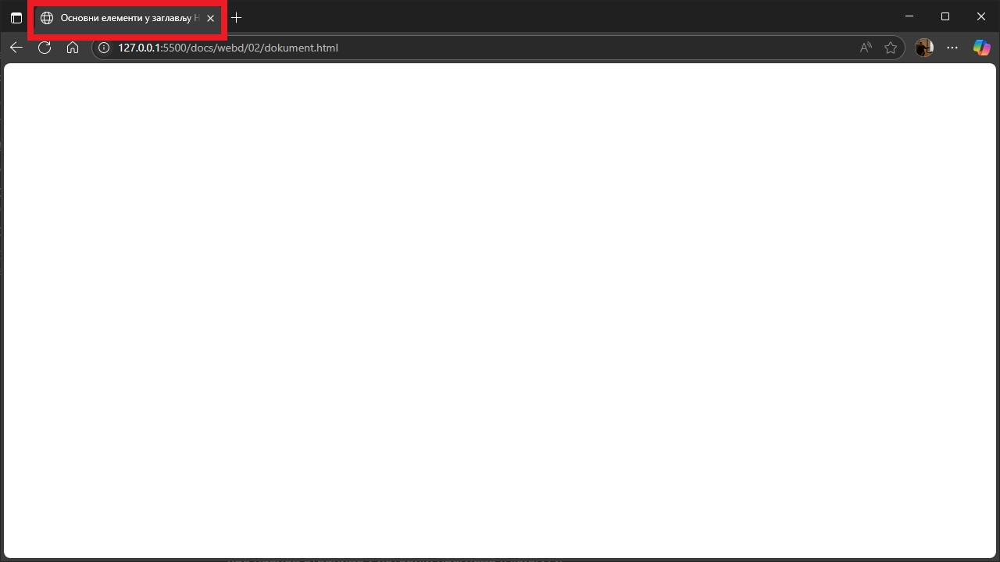

# Основни елементи у заглављу

## Елемент title

Елементом `<title>` дефинишеш наслов документа. Овај елемент је **обавезан** у
HTML документу, а један HTML документ може да садржи само један `<title>`
елемент. На пример:

```html hl_lines="5"
<!DOCTYPE html>
<html lang="sr">
    <head>
        <!-- Садржај заглавља HTML документа -->
        <title>Основни елементи у заглављу HTML докумената</title>
    </head>
    <body>
        <!-- Садржај тела HTML документа -->
    </body>
</html>
```

Садржај елемента `<title>` приказује се:

* као наслов у насловној линији прегледача или картици странице,
* као наслов странице када се страница дода у омиљене/означене странице
(*Favorites/Bookmarks*),
* као наслов странице у историји прегледа (*History*) и
* као наслов странице у резултатима претраге.



Наслов странице је веома важан за оптимизацију претраживача (енгл. *Search
Engine Optimization - SEO*), јер га користе алгоритми претраживача да би
одредили редослед приликом приказивања страница у резултатима претраге. Када
осмишљаваш садржај елемента `<title>` изабери дужи, описни наслов, односно,
избегавај наслове од једне или две речи. Претраживачи ће приказати око 50-60
знакова наслова, зато покушај да не користиш наслове дуже од тога. Немој да
користиш само листу речи - то може смањити позицију странице у резултатима
претраге. Покушај да наслов буде што тачнији и смисленији!

## Елемент style

Елемент `<style>` користи се за дефинисање стилова у једном HTML документу и
није обавезан. Између почетне и завршне ознаке елемента `<style>` наводи се CSS
којим се одређује како би HTML елементи требало да се приказују у прегледачу.
На пример:

```html hl_lines="5 6 7 8 9 10"
<!DOCTYPE html>
<html lang="sr">
    <head>
        <!-- Садржај заглавља HTML документа -->
        <style>
            p {                          /* стил текста у пасусу     */
                color: blue;             /* плава боја текста        */
                text-align: justify;     /* текст обострано поравнат */
            }
        </style>
        <title>Основни елементи у заглављу HTML докумената</title>
    </head>
    <body>
        <!-- Садржај тела HTML документа -->
    </body>
</html>
```

Стилове је боље дефинати у екстерним CSS датотекама, него у заглављима
појединачних HTML докумената, па овај `<style>` елемент у заглављу нећеш често
користити.

## Елемент link

Елемент `<link>` користи се за дефинисање везе између тренутног документа и
спољног ресурса - на пример, екстерног CSS-а или иконице странице (енгл.
*Favicon*). Он је празан елемент, а дефинисање веза са спољним ресурсима врши
се навођењем атрибута у ознаци.

У ознаци се обавезно наводи атрибут `rel` чијом се вредношћу одређује веза
између тренутног HTML документа и повезаног ресурса, а често се наводи и
атрибут `href` за одређивање локације повезаног документа. Овај елемент није
обавезан, а у једном HTML документу може се навести више пута.

### Повезивање са спољним CSS-ом

Спољна CSS датотека са дефинисаним стиловима прикључује се на следећи начин:

```html hl_lines="5"
<!DOCTYPE html>
<html lang="sr">
    <head>
        <!-- Садржај заглавља HTML документа -->
        <link rel="stylesheet" href="style.css">
        <title>Основни елементи у заглављу HTML докумената</title>
    </head>
    <body>
        <!-- Садржај тела HTML документа -->
    </body>
</html>
```

У датом примеру CSS датотека се налази у истом директоријуму као и HTML
документ. Ако се CSS датотека налази у неком другом директоријуму, онда пре
имена датотеке мораш да наведеш и одговарајућу путању, на пример:

```html
<link rel="stylesheet" href="/styles/style.css">
```

### Дефинисање Favicon иконице

Favicon (енгл. *favorite icon*) је мала иконица која се приказује у насловној
линији или картици веб-прегледача, поред наслова веб-странице. Такође се може
појавити у омиљеним/означеним страницама, историји прегледа и другим деловима
прегледача. Она представља визуелни идентитет веб-сајта и помаже кориснику да
лакше препозна и запамти сајт.

Формат иконице је обично **ICO**, **PNG** или **SVG**, али може бити и **JPEG**
или **GIF**. Величине иконице обично су 16x16, 32x32, 48x48, 64x64, 96x96
пиксела или веће. Најмања прихватљива величина је 16x16 пиксела, према
препоруци компаније Google 96x96 пиксела, а у употреби су и веће иконице за
Apple уређаје или неке друге платформе.

Иконицу можеш да додаш у заглављу HTML странице на следећи начин:

```html hl_lines="5"
<!DOCTYPE html>
<html lang="sr">
    <head>
        <!-- Садржај заглавља HTML документа -->
        <link rel="icon" href="favicon.ico">
        <title>Основни елементи у заглављу HTML докумената</title>
    </head>
    <body>
        <!-- Садржај тела HTML документа -->
    </body>
</html>
```

Веб прегледачи без проблема тумаче `.ico` фајлове, јер је `.ico` подразумевани
формат за иконице, па нема потребе да наводиш и `type` атрибут...

```html
<link rel="icon" href="favicon.ico" type="image/x-icon">
```

...али ако користиш неке друге формате, онда је пожељно да наведеш и атрибут
`type` који одговара формату. Ево неколико примера:

```html
<link rel="icon" href="favicon.png" type="image/png">
<link rel="icon" href="favicon.svg" type="image/svg+xml">
<link rel="icon" href="favicon.jpg" type="image/jpeg">
<link rel="icon" href="favicon.gif" type="image/gif">
```

У датим примерима иконице су се налазиле у истом директоријуму као и HTML
страница. Ако се иконица налази у неком другом директоријуму, онда пре имена
датотеке мораш да наведеш и одговарајућу путању...

```html
<link rel="icon" href="/images/favicon.ico">
```

...односно, ако се налази на интернету, онда мораш да наведеш комплетан URL до
датотеке:

```html
<link rel="icon" href="https://www.example.com/image.ico">
```

Прегледачи обично кеширају иконице HTML страница, па иако промениш иконицу,
стара може остати видљива још неко време. Решење је да, након промене иконице,
додаш параметар у вредност `href` атрибута, на пример:

```html
<link rel="icon" href="favicon.ico?v=2">
```

## Елемент meta

Елемент `<meta>` обично се користи за одређивање скупа знакова, описа странице,
кључних речи, аутора документа и подешавања приказног простора. Метаподаци се
не приказују на страници, већ их користе прегледачи, претраживачи и други веб
сервиси. Елемент `<meta>` је празан елемент, а дефинисање метаподатака врши се
навођењем атрибута у ознаци елемента. У следећем примеру...

```html hl_lines="5 6 7 8 9"
<!DOCTYPE html>
<html lang="sr">
    <head>
        <!-- Садржај заглавља HTML документа -->
        <meta charset="UTF-8">
        <meta name="description" content="Опис елемента meta у заглављу HTML странице">
        <meta name="keywords" content="HTML, head, meta">
        <meta name="author" content="Велимир Радловачки">
        <meta name="viewport" content="width=device-width, initial-scale=1.0">
        <title>Основни елементи у заглављу HTML докумената</title>
    </head>
    <body>
        <!-- Садржај тела HTML документа -->
    </body>
</html>
```

...атрибутом `charset` дефинисан је скуп знакова `UTF-8`, а `name` атрибутима
дефинисани су опис садржаја странице, кључне речи, аутор странице и видљиви део
странице.

Иако елемент `<meta>` није обавезан, увек наведи метаподатке о скупу знакова и
видљивом делу странице како би се сајт исправно приказивао на различитим
уређајима!

## Елемент script

Елемент `<script>` се користи за уграђивање извршног кода или података у HTML
документ, обично за уграђивање JavaScript кода...

```html hl_lines="8 9 10"
<!DOCTYPE html>
<html lang="sr">
    <head>
        <!-- Садржај заглавља HTML документа -->
        <meta charset="UTF-8">
        <meta name="viewport" content="width=device-width, initial-scale=1.0">
        <title>Основни елементи у заглављу HTML докумената</title>
        <script>
            alert("Добродошли на мој веб сајт!");
        </script>
    </head>
    <body>
        <!-- Садржај тела HTML документа -->
    </body>
</html>
```

...или референцирање на датотеку са JavaScript кодом:

```html hl_lines="8"
<!DOCTYPE html>
<html lang="sr">
    <head>
        <!-- Садржај заглавља HTML документа -->
        <meta charset="UTF-8">
        <meta name="viewport" content="width=device-width, initial-scale=1.0">
        <title>Основни елементи у заглављу HTML докумената</title>
        <script src="script.js"></script>
    </head>
    <body>
        <!-- Садржај тела HTML документа -->
    </body>
</html>
```

Елемент `<script>` може да се постави и у телу документа. О овоме ћеш учити
више у другом полугодишту.

## Елемент base

Елементом `<base>` одређује се основни URL и/или "мета" (енгл. *target*) за све
релативне URL-ове на страници. Ознака `<base>` мора имати атрибут `href` или
`target` или оба, а у једном HTML документу може бити само један `<base>`
елемент. На пример:

```html hl_lines="8"
<!DOCTYPE html>
<html lang="sr">
    <head>
        <!-- Садржај заглавља HTML документа -->
        <meta charset="UTF-8">
        <meta name="viewport" content="width=device-width, initial-scale=1.0">
        <title>Основни елементи у заглављу HTML докумената</title>
        <base href="https://www.radlovacki.com/" target="_blank">
    </head>
    <body>
        <!-- Садржај тела HTML документа -->
    </body>
</html>
```

Ако користиш елемент `<base>`, обавезно провери да ли то не ремети повезивање
других ресурса (слика, скрипти, линкова), јер ће се сви релативни линкови
односити на `href` из `<base>` елемента.

## Резиме

| Елемент    | Сврха                           | Да ли је обавезан?       |
|------------|---------------------------------|--------------------------|
| `<title>`  | Наслов странице                 | Да                       |
| `<meta>`   | Метаподаци                      | Не, али се препоручује   |
| `<style>`  | Интерни CSS стилови             | Не                       |
| `<link>`   | Спољни ресурси (CSS, Favicon)   | Не                       |
| `<script>` | Уметање скрипти                 | Не                       |
| `<base>`   | Основни URL за релативне путање | Не, и треба бити опрезан |
