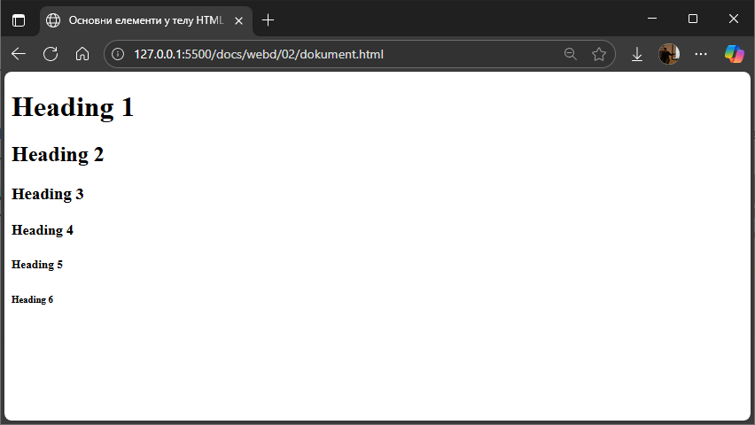

# Основни елементи у телу

## Наслови

HTML наслови дефинишу се ознакама од `<h1>` до `<h6>`. `<h1>` је главни највећи
наслов, док је `<h6>` најмањи. На пример, следећи кôд...

```html
<h1>Heading 1</h1>
<h2>Heading 2</h2>
<h3>Heading 3</h3>
<h4>Heading 4</h4>
<h5>Heading 5</h5>
<h6>Heading 6</h6> 
```

...приказаће се овако у прегледачу:



Можеш да приметиш да сваки наслов има своју подразумевану величину и да
прегледачи аутоматски додају мало празног простора (маргине) пре и после
наслова.

Наслови су важан елемент веб странице јер претраживачи користе наслове да
индексирају структуру и садржај страница. Корисници често листају странице и
читају само наслове, па је битно да они буду добро осмишљени. На крају, али не
и најмање важно је да користиш наслове како би јасно приказао структуру
документа. Немој никад да користиш наслове да учиниш текст ВЕЛИКИМ или
**подебљаним**.
