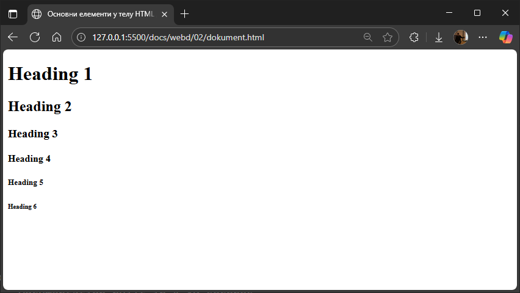
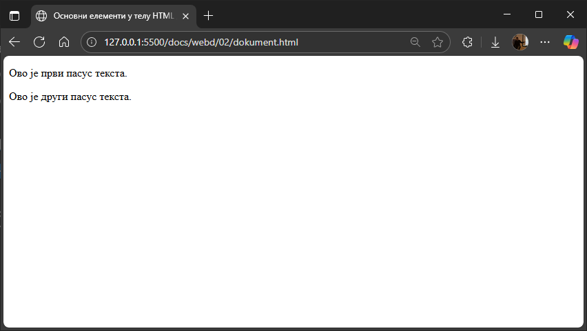
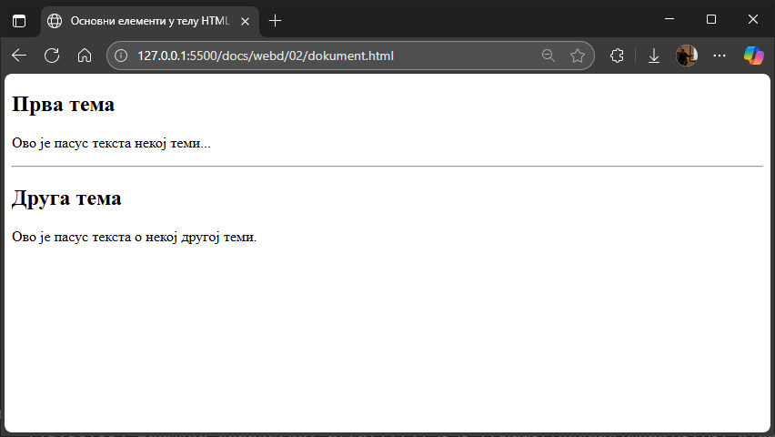
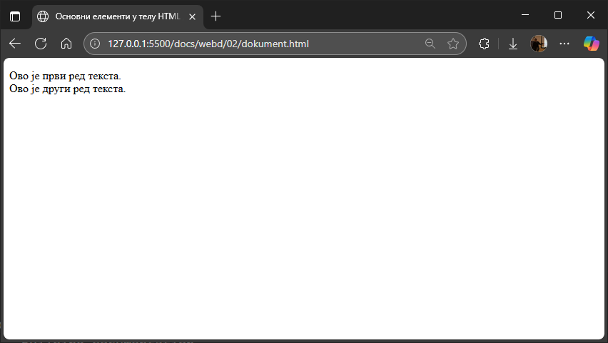
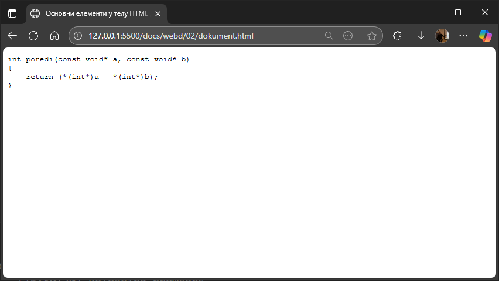

# Основни елементи у телу

## Наслови (Headings)

HTML наслови дефинишу се ознакама од `<h1>` до `<h6>`. `<h1>` је главни највећи
наслов, док је `<h6>` најмањи. На пример, следећи кôд...

```html
<h1>Heading 1</h1>
<h2>Heading 2</h2>
<h3>Heading 3</h3>
<h4>Heading 4</h4>
<h5>Heading 5</h5>
<h6>Heading 6</h6> 
```

...приказаће се овако у прегледачу:



Можеш да приметиш да сваки наслов има своју подразумевану величину и да
прегледачи аутоматски додају мало празног простора (маргине) пре и после
наслова.

Наслови су важан елемент веб странице јер претраживачи користе наслове да
индексирају структуру и садржај страница. Корисници често листају странице и
читају само наслове, па је битно да они буду добро осмишљени. На крају, али не
и најмање важно је да користиш наслове како би јасно приказао структуру
документа. Немој никад да користиш наслове да учиниш текст ВЕЛИКИМ или
**подебљаним**.

## Пасуси (Paragraphs)

HTML елемент `<p>` дефинише пасус. Пасус увек почиње у новом реду, а прегледачи
аутоматски додају мало празног простора (маргине) пре и после пасуса.

```html
<p>Ово је први пасус текста.</p><p>Ово је други пасус текста.</p>
```



## Хоризонталне линије (Horizontal Rules)

Ознака `<hr>` дефинише тематски прелом на HTML страници и најчешће се приказује
као хоризонтална линија. Ознака `<hr>` је празна ознака, што значи да нема
завршну ознаку. Елемент `<hr>` се користи за раздвајање садржаја унутар
странице — на пример, између два одељка текста или између различитих тема.

```html
<h2>Прва тема</h2>
<p>Ово је пасус текста некој теми...</p>
<hr>
<h2>Друга тема</h2>
<p>Ово је пасус текста о некој другој теми.</p>
```



## Преломи реда (Line Breaks)

HTML елемент `<br>` дефинише прелом реда. Ознака `<br>` је празна ознака, што
значи да нема завршну ознаку. Овај елемент се користи за прелазак у нови ред
без започињања новог пасуса (за разлику од `<p>`).

```html
<p>Ово је први ред текста.<br>Ово је други ред текста.</p>
```



## Преформатирани текст (Preformatted Text)

HTML елементом `<pre>` дефинише се преформатирани текст. Текст унутар елемента
`<pre>` се приказује моноспејс фонтом фиксне ширине (нпр. *Courier New*), тачно
онако како је написан у HTML коду, уз очување размака, празних редова и прелома
реда.

```html
<pre>int poredi(const void* a, const void* b)
{
    return (*(int*)a - *(int*)b);
}<pre>
```


