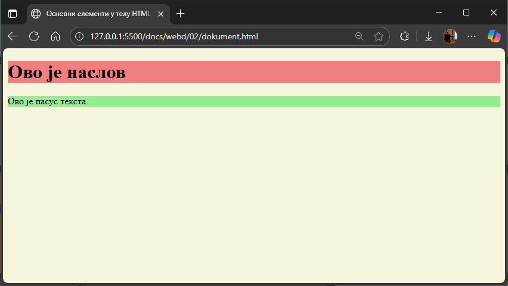
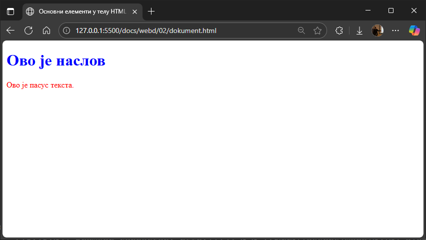
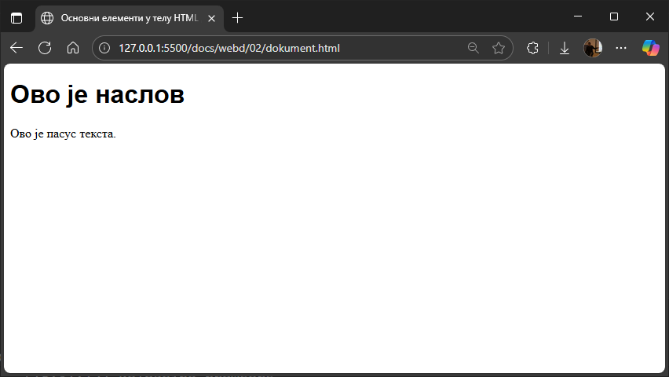
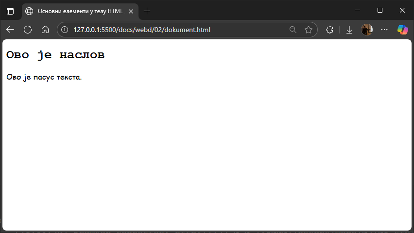
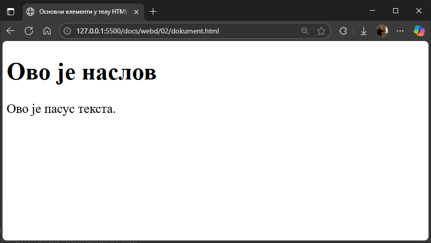
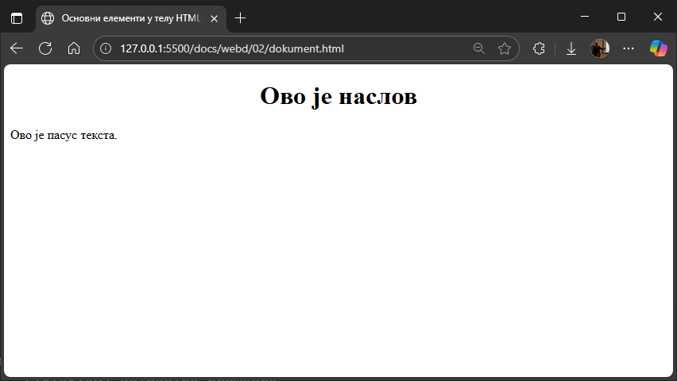

# Инлајн стилизација елемената

Атрибут `style` се користи за додавање стилова HTML елементима, као што су
боја, фонт, величина и др. Атрибут `style` има следећу синтаксу...

```html
<ознака style="својство:вредност;">
```

...где је `својство` CSS својство, а `вредност` CSS вредност.

Наравно, за један HTML елемент можеш наводити више парова `својство:вредност`
који се раздвајају карактером `;`.

```html
<ознака style="својство1:вредност1; својство2:вредност2;...својствоn:вредностn;">
```

Оваква стилизација елемената назива се **инлајн** (енгл. *inline*) стилизација.

НАПОМЕНА: Препоручује се да се стилови дефинишу у засебним `.css` датотекама.
Овај атрибут, као и елемент `<style>`, првенствено имају сврху да омогуће брзо
стилизовање, на пример за брзо тестирање изгледа елемента...

## Боја позадине (Background Color)

CSS својством `background-color` дефинише се боја позадине HTML елемента.

```html
<body style="background-color:beige;">
    <h1 style="background-color:lightcoral;">Ово је наслов</h1>
    <p style="background-color:lightgreen;">Ово је пасус текста.</p>
</body> 
```



Више о бојама учићеш у предмету [Дизајн интерфејса](../../uiux/index.md).

## Боја текста (Text Color)

CSS својством `color` дефинише се боја текста HTML елемента:

```html
<h1 style="color:blue;">Ово је наслов</h1>
<p style="color:red;">Ово је пасус текста.</p>
```



## Породица фонта (Font Family)

CSS својством `font-family` дефинише се типографска породица тј. породица
фонта која ће се користити за HTML елемент. Као вредност може да се наведе
одређенa породица фонта...

```html
<h1 style="font-family:Arial;">Ово је наслов</h1>
<p style="font-family:Times New Roman;">Ово је пасус текста.</p>
```



...или генеричко име за категорију фонтова...

```html
<h1 style="font-family:monospace;">Ово је наслов</h1>
<p style="font-family:cursive;">Ово је пасус текста.</p>
```



...или оба:

```html
<h1 style="font-family:Helvetica, sans-serif;">Ово је наслов</h1>
<p style="font-family:Georgia, serif;">Ово је пасус текста.</p>
```


Значи, својством `font-family` може да се одреди листа фонтова, од највишег до
најнижег приоритета. Избор фонта се врши један по један знак, тако да ако
доступни фонт нема глиф за потребан знак, испробавају се други фонтови. Када је
фонт доступан само у неким стиловима, варијантама или величинама, та својства
такође могу утицати на то која се породица фонтова бира.

Више о фонтовима такође ћеш учити у предмету
[Дизајн интерфејса](../../uiux/index.md).

## Величина текста (Text Size)

CSS својством `font-size` дефинише се величина текста HTML елемента.

```html
<h1 style="font-size:300%;">Ово је наслов</h1>
<p style="font-size:160%;">Ово је пасус текста.</p>
```



## Поравнање текста (Text Alignment)

CSS својством `text-align` дефинише се хоризонтално поравнање текста HTML
елемента.

```html
<h1 style="text-align:center;">Ово је наслов</h1>
<p style="text-align:left;">Ово је пасус текста.</p>
```


