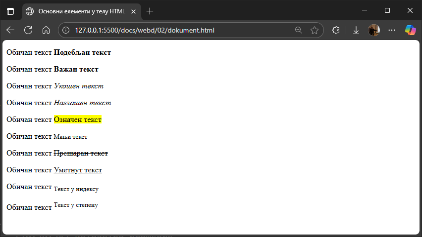

# Форматирање текста

HTML садржи неколико елемената за дефинисање текста посебног типа:

* `<b>` - Подебљани текст
* `<strong>` - Важан текст
* `<i>` - Курзив
* `<em>` - Наглашени текст
* `<mark>` - Означен текст
* `<small>` - Мањи текст
* `<del>` - Обрисан текст
* `<ins>` - Уметнут текст
* `<sub>` - Текст у индексу
* `<sup>` - Текст у степену

```html
<p>Обичан текст <b>Подебљан текст</b></p>
<p>Обичан текст <strong>Важан текст</strong></p>
<p>Обичан текст <i>Укошен текст</i></p>
<p>Обичан текст <em>Наглашен текст</em></p>
<p>Обичан текст <mark>Означен текст</mark></p>
<p>Обичан текст <small>Мањи текст</small></p>
<p>Обичан текст <del>Прешаран текст</del></p>
<p>Обичан текст <ins>Уметнут текст</ins></p>
<p>Обичан текст <sub>Текст у индексу</sub></p>
<p>Обичан текст <sup>Текст у степену</sup></p>
```



НАПОМЕНА: Елеменат `<u>` се раније често користио за подвлачење текста - данас
се његова употреба не препоручује, из следећих разлога:

* Нема семантичко значење - савремени стандарди подстичу семантичко означавање,
тј. употребу тагова који описују шта текст представља, а не само како изгледа.
* Може збунити кориснике - подвучени текст је визуелни сигнал за хипервезу.
* Ако је потребно подвлачити текст само због изгледа, то се може урадити помоћу
CSS-а, а не HTML-а: `<p style="text-decoration: underline;">Пасус текста.</p>`.
* Према HTML5 стандарду, елемент `<u>` се и даље може користити, али за текст
који треба издвојити без наглашавања...
