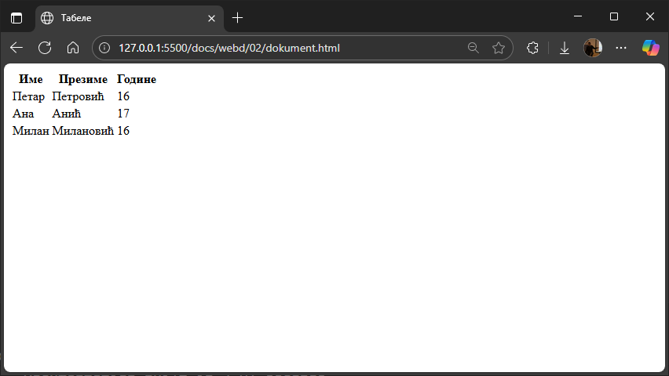
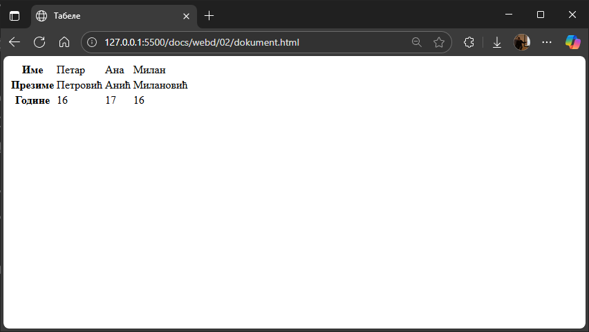
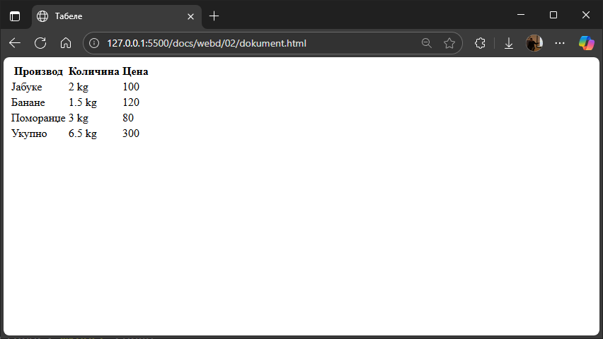
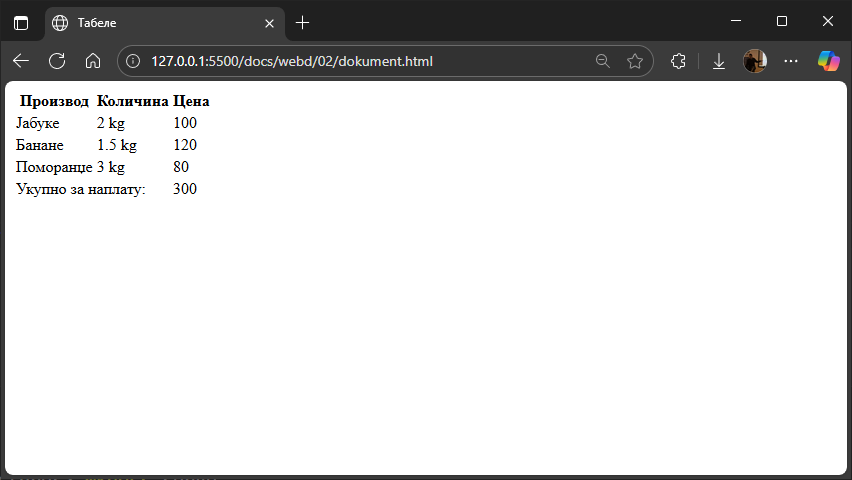
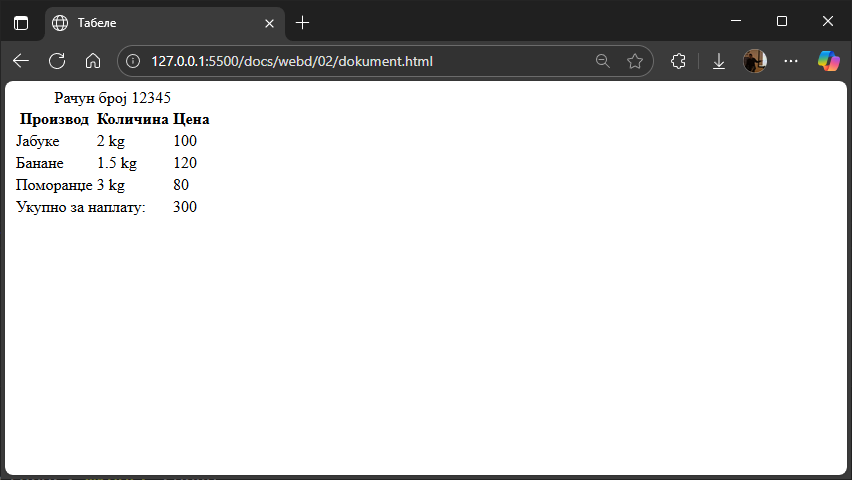
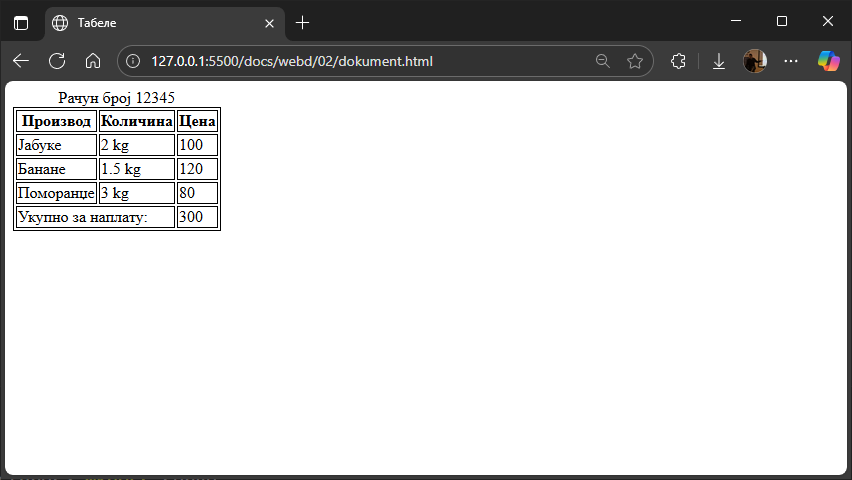
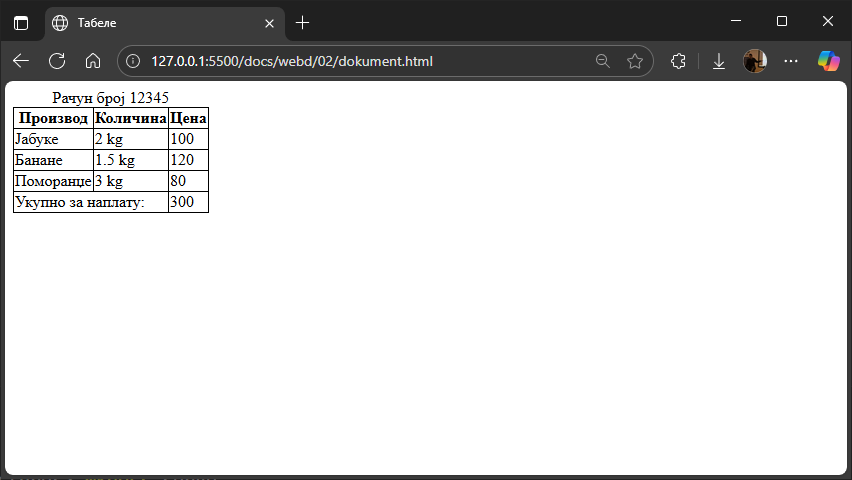
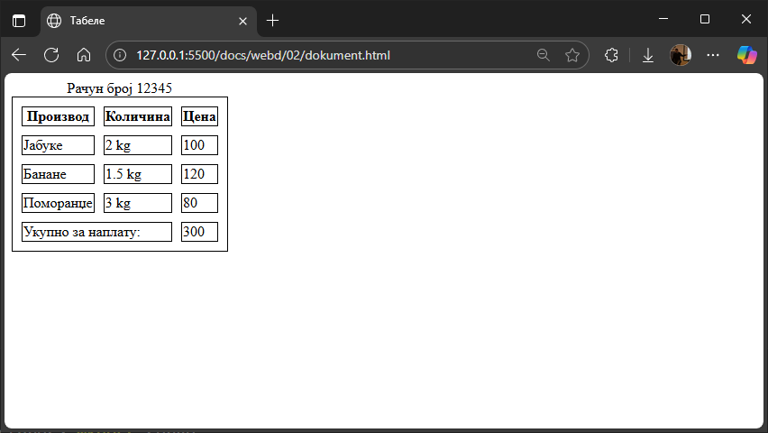
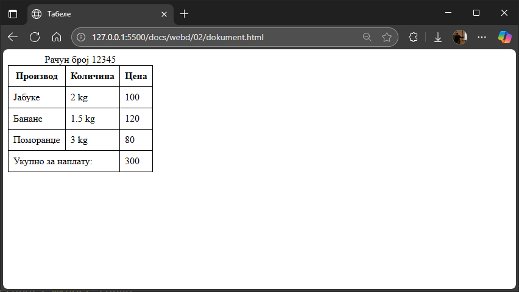
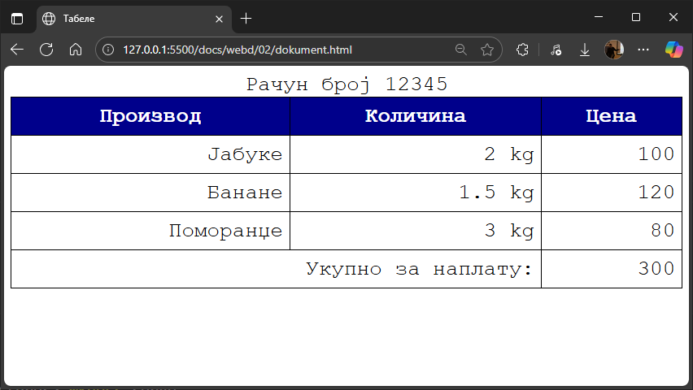

# Табеле

Табеле су значајне јер омогућавају структурирано приказивање података у
табеларном облику и побољшавају семантику и приступачност странице. У прошлости
су се користиле за распоређивање елемената на страници (тзв. *layout tables*) -
данас се та пракса сматра застарелом.

## Основни елементи `table`, `tr`, `th` и `td`

* елемент [`<table>`](https://developer.mozilla.org/en-US/docs/Web/HTML/Reference/Elements/table)
окружује целу табелу.
* елемент [`<tr>`](https://developer.mozilla.org/en-US/docs/Web/HTML/Reference/Elements/tr)
(*Table Row*) дефинише један ред у табели. Сваки ред треба да садржи једну или
више ћелија.
* елементи [`<th>`](https://developer.mozilla.org/en-US/docs/Web/HTML/Reference/Elements/th)
(*Table Header*) се користе за унос назива колона или редова у заглављу табеле,
који ће подразумевано бити приказани задебљано и центрирано.
* елементи [`<td>`](https://developer.mozilla.org/en-US/docs/Web/HTML/Reference/Elements/td)
(*Table Data*) се користе за унос података у ћелије табеле.

На пример:

```html
<table>
    <tr>
        <th>Име</th>
        <th>Презиме</th>
        <th>Године</th>
    </tr>
    <tr>
        <td>Петар</td>
        <td>Петровић</td>
        <td>16</td>
    </tr>
    <tr>
        <td>Ана</td>
        <td>Анић</td>
        <td>17</td>
    </tr>
    <tr>
        <td>Милан</td>
        <td>Милановић</td>
        <td>16</td>
    </tr>
</table>
```

Овај код ће генерисати табелу са три колоне и четири реда, где се заглавље
табеле налази се у првом реду (`Име`, `Презиме`, `Године`).

Значи, `<th>` и `<td>` су елементи који садрже стварне податке у табели. Они су
ћелије у којима се приказује текст или други садржај. `<table>` је контејнер за
целу табелу - његова граница уоквирује целу структуру. `<tr>` елемент је
контејнер за `<th>` или `<td>` ћелије у једном реду.



У следећем примеру биће генерисана табела са четири колоне и три реда, а
заглавље табеле биће дефинисано у првој колони:

```html
<table>
    <tr>
        <th>Име</th>
        <td>Петар</td>
        <td>Ана</td>
        <td>Милан</td>
    </tr>
    <tr>
        <th>Презиме</th>
        <td>Петровић</td>
        <td>Анић</td>
        <td>Милановић</td>
    </tr>
    <tr>
        <th>Године</th>
        <td>16</td>
        <td>17</td>
        <td>16</td>
    </tr>
</table>
```



**Напомена:** Табелу можеш креирати без `<th>` елемената, али се то не
препоручује из више разлога: губи се семантичко значење; погоршава се
приступачност јер се читачи екрана ослањају на семантичку разлику приликом
тумачења садржаја табеле; погоршава се читљивост и самим тим отежава одржавање
кода; погоршава се SEO јер ће претраживачи теже разумети садржај табеле.

## Структурирање табела елементима `thead`, `tbody` и `tfoot`

За бољу семантику и флексибилност у стилизовању, табеле се могу поделити на три
дела:

* [`<thead>`](https://developer.mozilla.org/en-US/docs/Web/HTML/Reference/Elements/thead)
(*Table Head*) групише садржај заглавља табеле и обично садржи редове са `<th>`
елементима.
* [`<tbody>`](https://developer.mozilla.org/en-US/docs/Web/HTML/Reference/Elements/tbody)
(*Table Body*) групише садржај тела табеле тј. главног дела табеле у којем се
налазе подаци.
* [`<tfoot>`](https://developer.mozilla.org/en-US/docs/Web/HTML/Reference/Elements/tfoot)
(*Table Foot*) групише садржај подножја табеле који се често користи за
збирове, напомене или друге податке који могу да се налазе на дну табеле.

На пример:

```html
<table>
    <thead>
        <tr>
            <th>Производ</th>
            <th>Количина</th>
            <th>Цена</th>
        </tr>
    </thead>
    <tbody>
        <tr>
            <td>Јабуке</td>
            <td>2 kg</td>
            <td>100</td>
        </tr>
        <tr>
            <td>Банане</td>
            <td>1.5 kg</td>
            <td>120</td>
        </tr>
        <tr>
            <td>Поморанџе</td>
            <td>3 kg</td>
            <td>80</td>
        </tr>
    </tbody>
    <tfoot>
        <tr>
            <td>Укупно</td>
            <td>6.5 kg</td>
            <td>300</td>
        </tr>
    </tfoot>
</table>
```



## Спајање ћелија атрибутима `rowspan` и `colspan`

Понекад је потребно да једна ћелија заузима простор више колона или редова. За
то се користе атрибути colspan и rowspan.

* [`colspan`](https://developer.mozilla.org/en-US/docs/Web/API/HTMLTableCellElement/colSpan)
одређује колико колона ће ћелија заузимати.
* [`rowspan`](https://developer.mozilla.org/en-US/docs/Web/API/HTMLTableCellElement/rowSpan)
одређује колико редова ће ћелија заузимати.

На пример:

```html
<table>
    <thead>
        <tr>
            <th>Производ</th>
            <th>Количина</th>
            <th>Цена</th>
        </tr>
    </thead>
    <tbody>
        <tr>
            <td>Јабуке</td>
            <td>2 kg</td>
            <td>100</td>
        </tr>
        <tr>
            <td>Банане</td>
            <td>1.5 kg</td>
            <td>120</td>
        </tr>
        <tr>
            <td>Поморанџе</td>
            <td>3 kg</td>
            <td>80</td>
        </tr>
    </tbody>
    <tfoot>
        <tr>
            <td colspan="2">Укупно за наплату:</td>
            <td>300</td>
        </tr>
    </tfoot>
</table>
```



## Дефинисање наслова табеле елементом `caption`

Елемент
[`<caption>`](https://developer.mozilla.org/en-US/docs/Web/HTML/Reference/Elements/caption)
дефинише наслов табеле и увек треба да буде прва ознака унутар `<table>`
елемента. Она пружа кратак опис садржаја табеле, што може да буде корисно за
приступачност.

На пример:

```html
<table>
    <caption>Рачун број 12345</caption>
    <thead>
        <tr>
            <th>Производ</th>
            <th>Количина</th>
            <th>Цена</th>
        </tr>
    </thead>
    <tbody>
        <tr>
            <td>Јабуке</td>
            <td>2 kg</td>
            <td>100</td>
        </tr>
        <tr>
            <td>Банане</td>
            <td>1.5 kg</td>
            <td>120</td>
        </tr>
        <tr>
            <td>Поморанџе</td>
            <td>3 kg</td>
            <td>80</td>
        </tr>
    </tbody>
    <tfoot>
        <tr>
            <td colspan="2">Укупно за наплату:</td>
            <td>300</td>
        </tr>
    </tfoot>
</table>
```



## CSS својства табела

Иако HTML пружа структуру табеле, CSS је тај који јој даје визуелни изглед.
Помоћу CSS-а се могу контролисати ивице, позадине, размаци, поравнање текста и
многа друга својства табела, чинећи их читљивијим и естетски привлачнијим.

### Основно стилизовање табела

Први корак у стилизовању табела најчешће је додавање ивица и размака, којих,
како си у претходним примерима приметио, подразумевано нема.

Својство **ивица** [`border`](https://developer.mozilla.org/en-US/docs/Web/CSS/border)
примењују се на елементе `<table>`, `<th>` и `<td>`. Подразумевано, ивице се
приказују као двоструке (одвојене). На пример:

```css
table, th, td {
    border: 1px solid black;
}
```



Наведене вредности представљају скуп вредности
[`border-width`](https://developer.mozilla.org/en-US/docs/Web/CSS/border-width),
[`border-style`](https://developer.mozilla.org/en-US/docs/Web/CSS/border-style)
и [`border-color`](https://developer.mozilla.org/en-US/docs/Web/CSS/border-color).

Двоструке ивице можеш спојити својством
[`border-collapse`](https://developer.mozilla.org/en-US/docs/Web/CSS/border-collapse)
на `<table>` елементу. На пример:

```css
table {
    border-collapse: collapse;
}
th, td {
    border: 1px solid black;
}
```



Када својство `border-collapse` није постављено на `collapse`, размак између
ћелија табеле можеш контролисати својством
[`border-spacing`](https://developer.mozilla.org/en-US/docs/Web/CSS/border-spacing).
На пример:

```css
table {
    border: 1px solid black;
    border-collapse: separate;
    border-spacing: 10px;
}
th, td {
    border: 1px solid black;
}
```



Својством
[`border-radius`](https://developer.mozilla.org/en-US/docs/Web/CSS/border-radius)
можеш да дефинишеш заобљене углове ивица. На пример:

```css
th, td {
    border: 1px solid black;
    border-radius: 10px;
}
```


Остала својства у вези ивица можеш пронаћи у
[документацији](https://developer.mozilla.org/en-US/docs/Web/CSS/border).

Својством **размак** `padding` можеш да дефинишеш размаке око HTML елемента, па
тако и око податка у ћелији. На пример:

```css
table {
    border-collapse: collapse;
}
th, td {
    border: 1px solid black;
    padding: 8px;
}
```



Размаке можеш да дефинишеш и лево, десно, горе и доле од елемента својствима
`padding-left`, `padding-right`, `padding-top` и `padding-bottom`.

Поред ових својстава, над табелама можеш примењивати и својства која си до
сада научио приликом рада са текстом и бојама. На пример:

```css
table {
    border-collapse: collapse;
    font-family: monospace;
    font-size: xx-large;
    width: 100%;
}
th {
    border: 1px solid black;
    padding: 8px;
    color: white;
    background-color: darkblue;
    
}
td {
    border: 1px solid black;
    padding: 8px;
    text-align: right;
}
```



Постоји још много својстава која су специфична за табеле. Својством
[`empty-cells`](https://developer.mozilla.org/en-US/docs/Web/CSS/empty-cells)
одређује се да ли ће ћелије без садржаја бити приказане (`show`) или сакривене
(`hide`). Својством
[table-layout](https://developer.mozilla.org/en-US/docs/Web/CSS/table-layout)
контролише како се израчунава ширина колона табеле - ширина колона се може
аутоматски прилагодити садржају (`auto`), или се фиксира на основу ширине првог
реда табеле или експлицитно задате ширине `<th>` и `<td>` елемената (`fixed`).
Својством
[caption-side](https://developer.mozilla.org/en-US/docs/Web/CSS/caption-side)
одређује се положај наслова табеле у односу на табелу (`top` или `bottom`).
